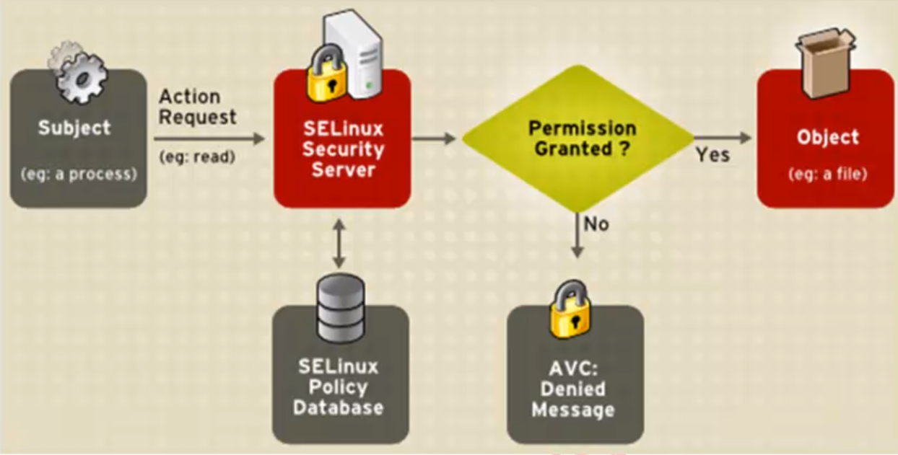

# Linux
# 1.简介

## 1.1.UNIX发展史

（1)1965年,美国麻省理工学院(MIT)、通用电气公司(GE)及AT&T的贝尔实验室联合开发 Multics工程计划,其目标是开发一种交互式的具有多道程序处理能力的分时操作系统,但因 Multics追求的目标过于庞大复杂,项目进度远远落后于计划,最后贝尔实验室宣布退出。

(2)1969年,美国贝尔实验室的肯・汤普森在DECPDP-7机器上开发出了UNIX系统

(3)1971年,肯・汤普森的同事丹尼斯里奇发明了C语言;1973年,UNIX系统的绝大部
分源代码用C语言重写,这为提高UNIX系统的可移植性打下基础。

## 1.2.UNIX主要发型版本

| 操作系统   | 公司                           | 平台                             |
| ---------- | ------------------------------ | -------------------------------- |
| AIX        | IBM                            | PowerPC                          |
| UX         | HP                             | PA-RISC                          |
| Solaris    | SUN                            | SPARC                            |
| Linux、BSD | Red Hat Linux、Ubuntu、FreeBSD | IA（Intel、AMD、Cyrix、RISE...） |

## 1.3.Linux发展史

Linux系统诞生于1991年,由芬兰大学生李纳斯( Linus Torvalds)和后来陆续加入的众多
爱好者共同开发完成。
Linux-是自由软件,源代码开放的UNIX

## 1.4.Linux版本

- 内核版	www.kernel.org

  - RHEL6.X	2.6.x
  - RHEL7.X	3.10.x

- 发行版

  - RedHat系列
    - 个人版：Fedora
    - 服务器版：RHEL（RedHat Enterprise Linux）
  - Debian系列

  

## 1.5.Linux平台常用的开源软件

- Apache	web服务器
- Nginx       web服务器
- MYSQL     数据库( Sqlserver, Oracle)
- PHP          脚本语言
- Samba     Linux和 windows之间的内网文件服务器
- Mongodb NOSQL数据库  redis
- Python      脚本语言
- Ruby          脚本语言
- Sphinx      中文分词

## 1.6.LAMP

Linux+Apache+Mysql+PHP

# 2.安装

### VMware虚拟机安装与使用

### 三种网络连接模式的区别

| 连接方式 | 连接网卡     | 是否能连接本机 | 是否能连接局域网 | 是否能连接公网 |
| -------- | ------------ | -------------- | ---------------- | -------------- |
| 桥接     | 本地真实网卡 | 可以           | 可以             | 可以           |
| NAT      | VMnet8       | 可以           | 不能             | 可以           |
| 仅主机   | VMnet1       | 可以           | 不能             | 不能           |

### 系统分区：

MBR分区表：最大支持2.1TB硬盘,最多支持4个分区

- ​	主分区:最多只能有4个。

- ​	扩展分区:
  - 最多只能有1个
  - 主分区加扩展分区最多有4个。
  - 不能写入数据,只能包含逻辑分区
- 逻辑分区

GPT分区表(全局唯一标示分区表)：GPT支持9.4ZB硬盘(1ZB=1024EB,1EB=1024PB,1PB=1024TB
理论上支持的分区数没有限制,但 windows限制128个主分区

### 格式化：

格式化(高级格式化)又称逻辑格式化,它是指根据用户选定的文件系统(如FAT16、FAT32、NTFS、EXT2、EXT3、EXT4、XFS等),在磁盘的特定区域写入特定数据,在分区中划出一片用于存放文件分配表、目录表等用于文件管理的磁盘空间。

### 硬件设备文件名：

| 硬件              | 设备文件名           |
| ----------------- | -------------------- |
| IDE硬盘           | /dev/hd[a-d]         |
| SCSI/SATA/USB硬盘 | /dev/sd[a-p]         |
| 光驱              | /dev/cdrom或/dev/sr0 |
| 软盘              | /dev/fd[0-1]         |
| 打印机（25针）    | /dev/lp[0-2]         |
| 打印机（USB）     | /dev/usb/lp[0-15]    |
| 鼠标              | /dev/mouse           |

### 分区设备文件名：

设备文件名

- /dev/hda1（IDE硬盘接口）
- /dev/sda1（SCSI硬盘接口、SATA硬盘接口）sd代表sata接口a代表第一块硬盘（b则代表第二块以此类推）,1代表第一个主分区，主分区有四个，如果是5则代表第一个逻辑分区

### 挂载：

相当于Windows的盘符，使用已经存在的空目录作为挂载点

#### 必须分区：

- /（根分区）
- swap分区（交换分区）
  - 如果真实内存小于4GB，swap为内存的两倍
  - 如果真实内存大于4GB，swap和内存一致
  - 实验环境，不大于2GB

#### 推荐分区：

/boot（启动分区，1GB）

#### 常用分区：

/home（用于文件服务器）

/www（用于Web服务器）

/data（用于存放数据）

# 3.常见的注意事项

## 3.1.Linux严格区分大小写

## 3.2.Linux一切皆文件

## 3.3.Linux不靠扩展名区分文件类型

但是有一些特殊文件类型建议写上扩展名，方便管理员使用命令。

压缩包：.gz，.tar.gz，.zip，.bz2等

软件包：.rpm

程序文件：shell脚本用.sh

网页文件：.html，.php等

## 3.4.Linux中所有的存储设备都必须在挂载之后才能使用

## 3.5.Windows下的程序不能直接在Linux中使用

## 3.6.Linux目录结构

| 目录名            | 作用                                                         |
| ----------------- | ------------------------------------------------------------ |
| /bin/             | 存放系统命令的目录,普通用户和超级用户都可以执行。是/usr/bin/目录的软链接 |
| /sbin/            | 存放系统命令的目录,只有超级用户才可以执行。是/usr/sbin/目录的软链接 |
| /usr/bin          | 存放系统命令的目录,普通用户和超级用户都可以执行              |
| /usr/sbin/        | 放系统命令的日录,只有超级用户才可以执行                      |
| /boot/            | 系统启动目录,保存与系统启动相关的文件,如内核文件和启动引导程序(grub) |
| /dev/             | 设备文件保存位置                                             |
| /etc/             | 配置文件保存位置。系统内所有采用默认安装方式(rpm安装)的服务配置文件<br/>全部保存在此目录中,如用户信息、服务的启动脚本、常用服务的配置文件等 |
| /home/            | 普通用户的家目录。在创建用户时,每个用户要有一个默认登录和保存自己数据的位置,就是用户的家目录,所有普通用户的宿主目录是在/home/下建立一个和用户名相同的目录。如用户user1的家目录就是/home/user1 |
| /lib/             | 系统调用的函数库保存位置。是/usr/lib/的软链接                |
| /lib64/           | 64位函数库保存位置。是/usr/lib64/的软链接                    |
| /lost+found/      | 当系统意外崩溃或机器意外关机,而产生一些文件碎片放在这里。当系统启动的过程中fsck工具会检查这里,并修复已经损坏的文件系统。这个目录只在每个分区中出现,例如/lost+found就是根分区的备份恢复日录,/boot/lost+found就是/boot分区的备份恢复目录 |
| /media/           | 挂载目录。系统建议是用来挂载媒体设备的,如软盘和光盘          |
| /mnt/             | 挂载目录。早期 Linux中只有这一个挂载目录,并没有细分。现在系统建议这个目录用来挂载额外的设备,如U盘、移动硬盘和其他操作系统的分区 |
| /misc/            | 挂载目录。系统建议用来挂我NFS服务的共享目录。                |
| /opt/             | 第三方安装的软件保存位置。这个目录是放置和安装其他软件的位置,手工安装的源码包软件都可以安装到这个目录中。 |
| /proc/            | 虚拟文件系统。该目录中的数据并不保存在硬盘上,而是保存到内存中。主要保存系统的内核、进程、外部设备状态和网络状态等。如/proc/cpuinfo是保存CPU信息的,/proc/ devices是保存设备驱动的列表的,/proc/filesystems是保存文件系统列表的，/proc/net是保存玩过协议信息的 |
| /sys/             | 虚拟文件系统。和/proc/目录相似,该目录中的数据都保存在内存中,主要保存与内核相关的信息 |
| /root/            | root的宿主目录。普通用户宿主目录在/home/下,root宿主目录直接在“/"下 |
| /run/             | 系统运行时产生的数据,如ssd,pid等相关数据。/var/run/是此目录的软链接 |
| /srv/             | 服务数据目录。一些系统服务启动之后,可以在这个目录中保存所需要的数据 |
| /tmp/             | 临时目录。系统存放临时文件的目录,在该目录下,所有用户都可以访问和写入<br/>我们建议此日录中不能保存重要数据,最好每次开机都把该目录清空 |
| /usr/             | 系统软件资源目录。注意usr不是user的缩写,而是“ UNIX Software Resource的缩写,所以不是存放用户数据的目录,而是存放系统软件资源的目录。系统中安装的软件大多数保存在这里 |
| /selinux/         | linux增强安全组件保存位置（NSA开发）                         |
| /usr/lib/         | 应用程序调用的函数库保存位置                                 |
| /usr/local/       | 手工安装的软件保存位置。我们一般建议源码包软件安装在这个位置 |
| /usr/share/       | 应用程序的资源文件保存位置,如帮助文档、说明文档和字体目录    |
| /usr/src/         | 源码包保存位置。我们手工下载的源码包和内核源码包都可以保存到这里。不过我们更习惯把手工下载的源码包保存到/usr/ local/src/日录中,把内核源码保存到usr/src/ kernels/目录中 |
| /usr/src/kernels/ | 内核源码保存位置                                             |
| /var/             | 动态数据保存位置。主要保存缓存、日志以及软件运行所产生的文件 |
| /var/www/html/    | RPM包安装的 Apache的网页主目录                               |
| /var/lib/         | 程序运行中需要调用或改变的数据保存位置。如MSQL的数据库保存在/var/lib/ mysql/目录中 |
| /var/log/         | 系统日志保存位置                                             |
| /var/run/         | 一些服务和程序运行后,它们的PID(进程ID)保存位置。是/run/目录的软链接 |
| /var/spool/       | 放置队列数据的目录。就是排队等待其他程序使用的数据,比如邮件队列和打印队列 |
| /var/spool/mail/  | 新收到的邮件队列保存位置。系统新收到的邮件会保存在此目录中   |
| /var/spool/cron/  | 系统的定时任务队列保存位置。系统的计划任务会保存在这里       |

## 3.7.服务器注意事项

远程服务器不能关机只能重启，重启前终止正在执行的服务

重启命令：shutdown -r now,重启前执行几次sync命令，同步数据

不要在服务器访问高峰运行高负载命令

远程配置防火墙时不要把自己剔出服务器

防火墙：基本功能是数据包过滤（IP、MAC地址、端口号、协议类型、数据包中的数据）

预防防火墙配置出错，先写一个系定时任务让它每5分钟清空一下防火墙规则就算写错了也还有反悔
的机会,等测试没有问题了再删除这个系统定时任务

指定合理的密码规范并定期更新

合理分配权限

定期备份重要数据和日志

备份的基本原则：不要把鸡蛋放在同一个篮子里

# 4.常用命令

## 4.1.命令的基本格式

### 4.1.1.命令提示符

```
[root@localhost ~]# 
```

- []:这是提示符的分隔符号,没有特殊含义。
- root:显示的是当前的登录用户。
- @:分隔符号,没有特殊含义
- localhost:当前系统的简写主机名(完整主机名是 localhost. localdomain)
- ~:代表用户当前所在的目录,此例中用户当前所在的目录是家目录
- #:命令提示符。超级用户是#,普通用户是$

### 4.1.2.命令的基本格式

```
[root@localhost ~]# 命令 [选项] [参数]
```

这里以ls命令为例

```
[root@localhost ~]# ls [选项] [文件名或目录名]
```

选项：

​	-a:	显示所有文件

​	--color=when：支持颜色输出，when的值默认是always(总显示颜色),也可以是never(从不显示颜色)和auto(自动)

​	-d：显示目录信息，而不是目录下的文件

​	-h：人性化显示文件大小（以k或者m显示文件大小）

​	-i：显示文件的i节点号

​	-l：长格式显示

```shell
[root@yifeng ~]# ls -l
total 56936
-rw-r--r-- 1 root root    36022 Nov  5 16:02 10125.txt
-rw-r--r-- 1 root root    25054 Nov  5 16:33 14236.txt
-rw-r--r-- 1 root root 10982406 Oct  7 18:21 apache-tomcat-9.0.27.tar.gz
-rw-r--r-- 1 root root     2424 Oct 19 05:57 docker-ce.repo
-rw-r--r-- 1 root root    74048 Oct 31 15:06 flags.txt
drwxr-xr-x 3 root root     4096 Nov 25 15:56 img1
drwxr-xr-x 2 root root     4096 Nov 26 10:59 img2
-rw-r--r-- 1 root root 16840899 Nov  5 16:31 jvm-monitor-1.0-SNAPSHOT.jar
-rw-r--r-- 1 root root  2567597 Nov 12 16:30 master
-rw------- 1 root root  1466880 Nov 21 15:27 myimages.gz
-rw------- 1 root root     7455 Nov  6 17:01 nohup.out
-rw-r--r-- 1 root root 26270756 Sep 16 09:48 probe.war
```

下面来解读长格式显示的文件信息

- 第一列：文件的权限信息
- 第二列：引用计数。文件的引用计数代表该文件的硬链接个数,而目录的引用计数代表该目录
  有多少个一级子目录
- 第三列：所有者,也就是这个文件属于哪个用户。默认所有者是文件的建立用户
- 第四列：所属组。默认所属组是文件建立用户的有效组,一般情况下就是建立用户的所在组
- 第五列：大小。默认单位是字节。
- 第六列：文件修改时间。文件状态修改时间或文件数据修改时间都会更改这个时间,注意这
  时间不是文件的创建时间。
- 第七列：文件名。

选项：调整命令的功能

参数：命令的操作对象，如果省略参数是因为有默认参数。

## 4.2.目录操作命令

### 4.2.1.ls命令

显示目录信息

### 4.2.1.cd命令

切换目录

绝对路径：以根目录为开始

相对路径：以当前目录为开始

cd命令的简化用法

| 符号 | 作用               |
| ---- | ------------------ |
| ~    | 代表用户的家目录   |
| -    | 代表上次所在的目录 |
| .    | 代表当前目录       |
| ..   | 代表上级目录       |

### 4.2.2.pwd

显示当前所在目录

### 4.2.3.mkdir

创建目录

-p递归创建目录

mkdir abc/def

### 4.2.4.rmdir

删除目录，如果目录下面有子目录则不能删除

### 4.2.5.rm

删除文件或目录

-rf 忽略提示而且不管是否有子目录

extundelete：此软件可以恢复被删除的文件

## 4.3.文件操作命令

### 4.3.1.touch命令

创建空文件或修改文件时间

### 4.3.2.stat命令

查看文件基本信息

```shell
[root@yifeng ~]# stat apache-tomcat-9.0.27.tar.gz 
  File: ‘apache-tomcat-9.0.27.tar.gz’
  Size: 10982406  	Blocks: 21456      IO Block: 4096   regular file
Device: fd01h/64769d	Inode: 393372      Links: 1
Access: (0644/-rw-r--r--)  Uid: (    0/    root)   Gid: (    0/    root)
Access: 2019-10-31 15:16:08.000000000 +0800
Modify: 2019-10-07 18:21:21.000000000 +0800 #数据修改时间
Change: 2019-10-31 15:16:08.867777384 +0800 #状态修改时间
 Birth: -
```

### 4.3.3.cat命令

查看文件内容

-n显示行号

-A显示所有的隐藏符号

适合查看小文件

### 4.3.4.more命令

分页显示文件内容

空格键：向下翻页

b：向上翻页

回车键：向下滚动一行

/字符串：搜索指定的字符串

q：退出

### 4.3.5.less

分行显示文件内容

空格键：向下翻页

b：向上翻页

N：显示行号

m：显示百分比

### 4.3.6.head命令

显示文件头

n：显示多少行

### 4.3.7.tail命令

显示文件尾

n：显示多少行

f：监听文件新增内容输出到控制台不退出

### 4.3.8.ln命令

链接文件

```
ln [选项] 原文件 目标文件
```

选项：

-s：建立软连接文件。不加-s则建立硬链接文件

-f：强制。如果目标文件已经存在，则删除目标文件后再建立链接文件

硬链接：

```
ln /root/abc /tmp/
```

软链接：

```
ln -s /root/abc /tmp/
```

两者的特征：

硬链接的特征：

源文件和硬链接文件拥有相同的 Inode和 Block
修改任意一个文件,另一个都改变
删除任意一个文件,另一个都能使用
硬链接标记不清,很难确认硬链接文件位置,不建议使用
硬链接不能链接目录
硬链接不能跨分区

软链接特征：

软链接和源文件拥有不同的 Inode和 Block
两个文件修改任意一个,另一个都改变
删除软链接,源文件不受影响:删除源文件,软链接不能使用
删软链接没有实际数据,只保存源文件的 Inode,不论源文件多大,软链接大小不变

软链接的权限是最大权限lrwxrwxrwx,但是由于没有实际数据,最终访问时需要参考源文件权限
软链接可以链接日录
软链接可以跨分区
软链接特征明显,建议使用软连接，写路径时一定要写绝对路径

### 4.3.9.cp命令

复制文件或目录

-r：递归复制

-a：复制后的文件跟原文件一模一样

### 4.3.10.mv命令

移动或者重命名文件

# 5.权限管理

## 5.1.权限介绍

```shell
[root@yifeng ~]# ll
total 56936
-rw-r--r-- 1 root root    36022 Nov  5 16:02 10125.txt
-rw-r--r-- 1 root root    25054 Nov  5 16:33 14236.txt
-rw-r--r-- 1 root root 10982406 Oct  7 18:21 apache-tomcat-9.0.27.tar.gz
-rw-r--r-- 1 root root        0 Dec  9 15:48 def
-rw-r--r-- 1 root root     2424 Oct 19 05:57 docker-ce.repo
-rw-r--r-- 1 root root    74048 Oct 31 15:06 flags.txt
drwxr-xr-x 3 root root     4096 Nov 25 15:56 img1
```

第一位代表文件类型：

“-”：普通文件

"b"：块设备文件，这是一种特殊设备文件,存储设备都是这种文件,如分区文件 /dev/sda1就是这种文件

"c"：字符设备文件。这也是特殊设备文件,输入设备一般都是这种文件,如鼠标、键盘等

"d"：目录文件

"l"：软链接文件

"p"：管道符文件

"s"：套接字文件

第2到4位代表所有者权限：

r：代表read，读取权限

w：代表write，写权限

x：代表execute，执行权限

第5到7位代表所属组权限：

第8到10位代表其他用户权限：

## 5.2.权限命令

### 5.2.1.chmod

修改文件的权限模式

命令格式

```
chmod [选项] 权限模式 文件名
-R:递归设置权限，也就是给子目录中所有文件设置权限
chmod命令的权限模式的格式是"[ugoa][+-=][perms]"，也就是“[用户身份][赋予方式][权限]”的格式
```

用户身份：

​	u：代表所有者（user）

​	g：代表所属组（group）

​	o：代表其他人（other）

​	a：代表所有身份（all）

赋予方式：

​	+：赋予权限

​	-：收回权限

​	=：设置权限

权限：

​	r：读取权限

​	w：写权限

​	x：执行权限

数字权限：

数字权限的赋予方式更加简单，只需要数字数字代表的含义即可

​	4：代表r读取权限

​	2：代表w写权限

​	1：代表x执行权限

如果赋予的权限是7则代表所有权限（4+2+1），6则代表读写权限（4+2），以此类推

常用权限：

644：这是文件的基本权限，代表所有者拥有读写权限，而所属组和其他人拥有只读权限

755：这是文件的执行权限和目录的基本权限，所有者拥有读写执行权限，而所属组和其他人拥有读和执行权限

777：这是最大权限。在实际生产服务器中要尽力避免给文件或目录赋予这样的权限，这会造成一定的安全隐患

### 5.2.2.chown

修改文件和目录的所有者和所属组

```
chown [选项] 所有者:所属组 文件或目录
选项
	-R递归设置所有者
chown -R user1:user1 abc
```

chown

普通用户可以修改所有者是自己的文件的权限

普通用户不能修改文件的所有者，哪怕自己是这个文件的所有者也不行。

### 5.2.3.chgrp

修改文件和目录的所属组

```
chgrp [选项] 所属组 文件或目录
chgrp -R root abc
```

## 5.3.权限的作用

读、写、执行权限对文件和目录的作用是不同的。

权限对文件的作用：

​	读(r)：可以读取文件中的数据，可以执行cat、more、less、head、tail等文件查看命令

​	写(w)：可以修改文件中的数据，可以执行vim echo等命令。注意：对文件有写权限，是不能删除文件本身的，只能修改文件中的数据，如果要想删除文件，则需要对文件的上级目录拥有写权限

​	执行(x)：可以运行文件。

权限对目录的作用：

​	读：可以查看目录下的内容，比如执行ls命令

​	写：可以修改目录下的数据，可以在目录中新建、删除、复制、剪切子文件或子目录，可以执行touch、rm、cp、mv命令

​	执行：目录是不能运行的，目录拥有执行权限代表可以进入目录，比如可以执行cd命令。

目录的可用权限：

0：任何权限都不赋予

5：基本的目录浏览和进入权限

7：所有权限

## 5.4.umask权限

查看系统的umask权限

```shell
[root@yifeng tmp]# umask
0022
[root@yifeng tmp]# umask -S
u=rwx,g=rx,o=rx
```

umask权限的计算方法：

对文件来讲，新文件的默认最大权限是666，没有执行权限

对目录来讲，新建目录的默认最大权限是777.

# 6.帮助命令

## 6.1.man命令

格式：

```
man [选项] 命令
选项：
	-f：查看命令拥有哪个级别的帮助
	-k：查看和命令相关的所有帮助
```

man命令的快捷键

| 快捷键   | 作用                                        |
| -------- | ------------------------------------------- |
| 上箭头   | 向上移动一行                                |
| 下箭头   | 向下移动一行                                |
| PgUp     | 向上翻一页                                  |
| PgDn     | 向下翻一页                                  |
| g        | 移动到第一页                                |
| G        | 移动到最后一页                              |
| /字符串  | 从当前页向下搜索字符串                      |
| ?/字符串 | 从当前页向上搜索字符串                      |
| n        | 当搜索字符串时，可以使用n键找到下一个字符串 |
| N        | 当搜索字符串时，使用N键反向查询字符串       |

man -f 命令 或 whatis 命令 可以查看命令拥有哪个级别的帮助

man -k 命令 或 aprops命令 可以查看和命令相关的所有帮助

## 6.2.info命令

info命令的帮助信息是一套完整的资料,每个单独命令的帮助信息只是这套完整资料中的某个小章节。

| 快捷键 | 作用                                    |
| ------ | --------------------------------------- |
| 上箭头 | 向上移动一行                            |
| 下箭头 | 向下移动一行                            |
| PgUp   | 向上翻一页                              |
| PgDn   | 向下翻一页                              |
| Tab    | 在有"*"符号的节点间进行切换             |
| 回车   | 进入有"*"符号的子页面，查看详细帮助信息 |
| u      | 进入上一层信息                          |
| n      | 进入下一小节信息                        |
| p      | 进入上一小节信息                        |
| ？     | 查看帮助信息                            |
| q      | 退出                                    |

## 6.3.help命令

help只能获取shell内置命令的帮助

功能描述:显示 Shell F内置命令的帮助。可以使用type命令来区分内置命令与外部命令

## 6.4.--help选项

```
ls --help
```

# 7.搜索命令

## 7.1.whereis命令

whereis是搜索系统命令的命令,也就是说, whereis命令不能搜索普通文件,而只能搜索系统命令。 whereis命令的基本信息如下。

```shell
[root@yifeng ~]# whereis ls
ls: /usr/bin/ls /usr/share/man/man1/ls.1.gz
```

## 7.2.which命令

which也是搜索系统命令的命令。和whereis命令的区别在于：

whereis命令可以在查找到二进制明亮的同时，查找到帮助文档的位置

而which命令在查找到二进制明亮的同时，如果这个命令有别名，则还可以找到别名命令

```shell
[root@yifeng ~]# which cp
alias cp='cp -i'
	/usr/bin/cp
```

## 7.3.locate命令

搜索普通文件

优点：按照数据库搜索，搜索速度快，消耗资源小。数据库位置/var/lib/mlocate/mlocate.db

缺点：只能按照文件名来搜索文件，而不能执行更复杂的搜索，比如按照权限、大小、时间等搜索文件

```shell
updatedb #强制更新数据库
```

locate配置文件：

```shell
[root@yifeng ~]# vim /etc/updatedb.conf 
#配置文件生效
PRUNE_BIND_MOUNTS = "yes" 
#禁止搜索这些文件系统类型
PRUNEFS = "9p afs anon_inodefs auto autofs bdev binfmt_misc cgroup cifs coda configfs cpuset debugfs devpts ecryptfs exofs fuse fuse.sshfs fusectl gfs gfs2 gpfs hugetlbfs inotifyfs iso9660 jffs2 lustre mqueue ncpfs nfs nfs4 nfsd pipefs proc ramfs rootfs rpc_pipefs securityfs selinuxfs sfs sockfs sysfs tmpfs ubifs udf usbfs fuse.glusterfs ceph fuse.ceph"
#禁止搜索带有这些扩展名的文件
PRUNENAMES = ".git .hg .svn"
#禁止搜索这些系统目录
PRUNEPATHS = "/afs /media /mnt /net /sfs /tmp /udev /var/cache/ccache /var/lib/yum/yumdb /var/spool/cups /var/spool/squid /var/tmp /var/lib/ceph"
```

## 7.4.find命令

查找文件或目录

### 7.4.1.按照文件名搜索

```
find 搜索路径 [选项] 搜索内容
选项：
	-name 按照文件名搜索
	-iname 按照文件名搜索，不区分大小写
	-inum 按照inode号搜索
find . -name abc
```

### 7.4.2.按照文件大小搜索

```
find 搜索路径 [选项] 搜索内容
选项：
	-size [+|-]大小：按照指定大小搜索文件
find . -size 25k #查找等于25k的所有文件
find . -size +25k #查找大于25k的所有文件
find . -size -25k #查找小于25k的所有文件
```

这里的"+"的意思是搜索比指定大小还要大的文件，“-”则相反

### 7.4.3.按照修改时间搜搜

```
find 搜索路径 [选项] 搜索内容
选项：
	-atime [+|-]时间：按照文件访问时间搜索
	-mtime [+|-]时间：按照文件数据修改时间搜索
	-ctime [+|-]时间：按照文件状态修改时间搜索
find . -mtime +5
```

以mtime为例来说明+-的意思：

-5：代表5天内修改的文件

5：代表前5天到前6天这一天修改过的文件

+5：代表6天前修改的文件

### 7.4.4.按照权限搜索

```
find 搜索路径 [选项] 搜索内容
选项：
	-perm 权限模式 查找文件权限刚好等于"权限模式"的文件
	-perm -权限模式 查找文件权限全部包含"权限模式"的文件
	-perm +权限模式 查找文件权限包含"权限模式"的任意一个文件的权限
find . -perm 644
```

### 7.4.5.按照所有者所属组搜索

```
find 搜索路径 [选项] 搜索内容
选项：
	-uid 用户id 按照用户ID查找所有者是指定ID的文件
	-gid 组id   按照用户组ID查找所属组是指定ID的文件
	-user 用户名 按照用户名查找所有者是指定用户的文件
	-group 组名  按照组名查找所属组是指定用户组的文件
	-nouser		查找没有所有者的文件
find . -user root
```

### 7.4.6.按照文件类型搜索

```
find 搜索路径 [选项] 搜索内容
选项：
	-type d	查找目录
	-type f	查找普通文件
	-type l	查找软链接文件
find . -type d
```

### 7.4.7.逻辑运算符

```
find 搜索路径 [选项] 搜索内容
选项：
	-a:	and逻辑与
	-o：	or逻辑或
	-not：逻辑非
find . -size +1k -a -type f #当前目录下搜索大于1k的文件（不包含目录）
find . -size +20k -o -size -5k #查找当前目录下文件大小大于20k和小于5k的所有文件和目录
```

### 7.4.8.其他选项

-exec

```
find 搜索路径 [选项] 搜索内容 -exec 命令2 {} \;
把find命令的结果交给由"-exec"调用的命令2来处理{}就代表find命令的查找结果
find . -size +5k -a -type f -exec ls -lh {} \;
```

-ok

和exec差不多，只不过是交互式的，在你执行命令时会询问

```
find /tmp/log -mtime +10 -ok rm -rf {} \;
```

## 7.5.grep命令

grep的作用是在文件中提取和匹配符合条件的字符串行。

```
grep [选项] "搜索内容" 文件名
选项：
	-i	忽略大小写
	-n	输出行号
	-v	反向查找
grep "abc" abc
```

find和grep的区别：

1)find命令
find命令用于在系统中搜索符合条件的**文件名**,如果需要模糊查询,则使用通配符进行匹配。搜索时文件名是完全匹配的(find命令可以通过- regex选项,把匹配规则转为正则表达式規则,但是不建议如此)。
2)grep命令
grep命令用于在文件中搜索符合条件的**字符串**,如果需要模制查询,则使用正则表达式进行匹配。搜索时字符串是包含匹配的。

通配符与正则表达式的区别

通配符：用于区别文件名，完全匹配

| 通配符 | 作用                                                         |
| ------ | ------------------------------------------------------------ |
| ?      | 匹配一个任意字符                                             |
| *      | 匹配0个或多个任意字符，也可以是任意内容                      |
| []     | 匹配括号中任意一个字符。[abc]代表一定匹配一个字符或者是a或者是b或者是c |
| [-]    | 匹配括号中任意一个字符，-代表一个范围，[a-z]代表匹配一个小写字母 |
| [^]    | 逻辑非，表示匹配不是括号内的一个字符，[0-9]代表匹配一个不是数字的字符 |

```
find . -name "abc*" #查找abc开头的所有文件或目录
```

正则表达式：用于匹配字符串，包含匹配

| 正则符 | 作用                                                         |
| ------ | ------------------------------------------------------------ |
| ?      | 匹配前一个字符重复0次或1次                                   |
| *      | 匹配前一个字符重复0次或任意多次                              |
| []     | 匹配括号中任意一个字符。[abc]代表一定匹配一个字符或者是a或者是b或者是c |
| [-]    | 匹配括号中任意一个字符，-代表一个范围，[a-z]代表匹配一个小写字母 |
| [^]    | 逻辑非，表示匹配不是括号内的一个字符，[0-9]代表匹配一个不是数字的字符 |
| ^      | 匹配行首                                                     |
| $      | 匹配行尾                                                     |

```
grep "aaa*" abc
grep "^ab*" abc
```

## 7.6.管道符

命令格式：命令1 | 命令2

命令1的正确输出作为命令2的操作对象

```
ll /etc/ | more #分屏查看etc目录下的所有文件
ll /etc | grep yum #搜索etc目录下名字包含yum的文件
netstat -tuln | grep 80 #查看包含80端口的端口是否开启
netstat -an | grep ESTABLISHED #查看所有远程连接服务器的客户端
netstat -an | grep ESTABLISHED | wc -l #统计正在连接的客户端的数量
```

## 7.7.命令的别名

命令的别名就是给命令取一个简单易记的名字，方便管理员的习惯

```
#查看系统所有别名
[root@yifeng ~]# alias
alias cp='cp -i'
alias egrep='egrep --color=auto'
alias fgrep='fgrep --color=auto'
alias grep='grep --color=auto'
alias l.='ls -d .* --color=auto'
alias ll='ls -l --color=auto'
alias ls='ls --color=auto'
alias mv='mv -i'
alias rm='rm -i'
alias which='alias | /usr/bin/which --tty-only --read-alias --show-dot --show-tilde'
设置临时别名，重启后失效
alias ser="service network restart" #用ser就可以重启网络服务，注意避免跟系统命令重复，因为系统会优先使用别名的命令
要想永久生效，需要写入环境变量配置文件~/.bashrc，这个文件是用户的环境变量配置文件，因为别名是为了方便用户的操作，每个人的习惯可能不一样，所以不需要将其写入系统的环境变量中，只需写入用户的环境变量中即可。
vim .bashrc
然后加入自己的别名就可以永久生效了
```

## 7.8.常用快捷键

| 快捷键 | 作用                     |
| ------ | ------------------------ |
| Tab键  | 命令或文件补全           |
| ctrl+A | 把光标移动到命令行开头   |
| ctrl+E | 把光标移动到命令行结尾   |
| ctrl+C | 强制终止当前的命令       |
| ctrl+L | 清屏，相当于clear命令    |
| ctrl+U | 删除或剪切光标之前的命令 |
| ctrl+Y | 粘贴ctrl+U的内容         |

# 8.压缩和解压缩命令

在Linux中可以识别的常见压缩格式有十几种,比如“.zip”，“.gz”，“.bz2”，“.tar”，“.tar”，".tar.bz2"，“.tar.gz”等

## 8.1.".zip"格式

打包：

```
zip [选项] 压缩包名 源文件或源目录
选项：
	-r：	压缩目录
```

```shell
[root@yifeng ~]# zip log.zip 10125.txt 14236.txt 
  adding: 10125.txt (deflated 92%)
  adding: 14236.txt (deflated 88%)
```

解打包

```
unzip [选项] 压缩包名
选项：
	-d：	指定解打包位置
```

```shell
[root@yifeng ~]# unzip -d /tmp/ log.zip 
Archive:  log.zip
  inflating: /tmp/10125.txt          
  inflating: /tmp/14236.txt  
```

## 8.2.".gz"格式

".gz"格式是Linux中最常用的压缩格式使用gzip命令进行打包

```
gzip [选项] 源文件名
选项：
	-c：	将压缩数据输出到标准输出中，可以用于保留源文件
	-d：	解压缩
	-r：	压缩目录
gzip 10125.txt #会删除源文件
gzip -d 10125.txt.gz #解压缩
#缺点不会压缩目录，只会将目录里面的每个文件都打成压缩包
```

## 8.3.".bz2"格式

不能压缩目录

```
bzip2 [选项] 源文件名
选项：
	-d：	解压缩
	-k：	压缩时，保留源文件
	-v：	显示压缩的详细信息
bzip2 -k 14236.txt 
bzip2 -d 10125.txt.bz2
```

## 8.4.“.tar”格式

  打包：

```
tar [选项] [-f 压缩包名] 源文件或目录 
选项：
	-c：	打包
	-f：	指定压缩包的文件名。
	-v：	显示打包文件过程
tar -cvf test.tar abc abc1 up.txt test #打包不会压缩文件
```

解打包：

```
tar [选项] 压缩包
选项：
	-x：	解压缩
	-f：	指定压缩包的文件名。
	-v：	显示解压缩文件过程
	-t：	测试，就是不解压缩，只是查看包中有哪些文件
tar -xvf test.tar
```

## 8.5.“.tar.gz”和“.tar.bz2”格式

使用tar命令直接打包压缩，命令格式如下：

```
tar [选项] 压缩包名 源文件或目录
选项：
	-z： 压缩和解压缩".tar.gz"格式
	-j：	压缩和解压缩".tar.bz2"格式
```

```
# .tar.gz
tar -zcvf test.tar.gz abc abc1 up.txt test #打包并压缩
tar -zxvf test.tar.gz #解压缩
tar -zxvf test.tar.gz -C /tmp #指定解压缩位置
tar -zxvf test.tar.gz -C /tmp up.txt #指定解压缩位置并只解压指定文件
# .tar.bz2
tar -jcvf test.tar.bz2 abc abc1 up.txt test #打包并压缩
tar -jxvf test.tar.bz2
```

# 9.关机和重启命令

## 9.1.sync数据同步

刷新文件系统缓冲区，将内存中的数据保存到硬盘中

```
sync
```

## 9.2.shutdown命令

关机和重启，最安全的重启命令

```
shutdown [选项] 时间 [警告信息]
选项：
	-c：	取消已经执行的shutdown命令
	-h：	关机
	-r：	重启
shutdown -r now #立刻重启
shutdown -r 05:30 #在下一个05:30重启
```

## 9.3.reboot命令

重启，也是安全的

```
reboot
```

## 9.4.halt和poweroff命令

关机命令，这两个命令不会完整关闭和保存系统的服务，不建议使用

```
halt
poweroff
```

## 9.5.init命令

init是修改Linux运行级别的命令，也可以用于关机和重启，但是并不安全，不建议使用

```
init 0 #关机
init 6 #重启
```

# 10.网络命令

## 10.1.配置IP地址

```
vim /etc/sysconfig/network-scripts/ifcfg-eth0
```

重启网络服务

```
service network restart
```

在使用桥接模式进行上网的时候，可能会重启网络服务失败。这时可能是由于IP地址冲突了，尝试换一个IP，如果还是不行，可能就是UUID冲突，这种情况一般出现在我们克隆镜像或者是复制镜像后悔出现这种情况。

解决办法

```
#编辑网络配置文件
vim /etc/sysconfig/network-scripts/ifcfg-eth0
#删除MAC地址行
HWADDR=52:54:00:69:96:0e
#删除MAC地址和UUID绑定文件
rm -rf /etc/udev/rules.d/70-persistent-net.rules
#重启
reboot
```

## 10.2.ifconfig命令

查看本机所有的网络信息

```
ifconfig
```

## 10.3.ping命令

查看和目标网址是否能连通

```
ping [选项] IP
选项：
	-b：	后面加入广播地址，用于对整个网段进行探测
	-c次数：	用于指定ping的次数
	-s字节：	指定探测包的大小
ping -b -c 10 192.168.1.255
```

## 10.4.netstat命令

输出网络连接、路由表、接口统计、伪装连接和组播成员

```
netstat [选项]
选项：
	-a：		列出所有网络状态，包括Socket程序
	-c秒数：  指定每隔几秒刷新一次网络状态
	-n：	    使用IP地址和端口号显示，不使用域名与服务名
	-p：		显示PID和程序名
	-t：		显示使用TCP协议端口的连接状况
	-u：		显示使用UDP协议端口的连接状况
	-l：		仅显示监听状态的连接
	-r：		显示路由表
```

```
#查询本机所有开启的端口
netstat -tuln
#查询本机所有开启的端口和哪些服务占用了端口
netstat -tuln
#查看所有端口
netstat -an
```

## 10.5.write命令

向其他用户发送消息

```
write user1 pts/1
hello
I will be in 5 minutes to restart,please save your data
#向在pts/1（远程终端1）登录的user1用户发送信息，使用“Ctrl+D”快捷键保存发送的数据
```

首先使用w命令查看当前连接的所有终端

```
w
```

登录终端：

​	本地字符终端	tty1-6	alt+F1-6（切换）

​	本地图形终端	tty7		ctrl+alt+F7（按住3秒，需要安装启动图形界面）

​	远程终端			pts/0-255

示例：

发送端：

```
[root@yifeng ~]# write root pts/5
hello world
```

接收端：

```
[root@yifeng ~]# 
Message from root@yifeng on pts/6 at 15:06 ...
hello world
EOF
```

## 10.6.wall命令

给所有登录的用户发送信息，包括自己

```
wall "I will be in 5 minutes to restart,please save your data"
```

示例：

发送端：

```
[root@yifeng ~]# wall "I will be in 5 minutes to restart,please save your data"
[root@yifeng ~]# 
Broadcast message from root@yifeng (pts/5) (Thu Dec 12 15:08:47 2019):

I will be in 5 minutes to restart,please save your data
```

接收端：

```
[root@yifeng ~]# 
Broadcast message from root@yifeng (pts/5) (Thu Dec 12 15:08:47 2019):

I will be in 5 minutes to restart,please save your data
```

## 10.7.mail命令

mail命令是linux的邮件终端命令，用于向其他用户发送邮件

发送邮件：

```
mail user1
Subject: hello  #邮件标题
Nice to meet you!	#邮件内容
.				#使用"."结束邮件输入
```

我们收到的邮件都保存着哎“/var/spool/mail/用户名”中，每个用户都有一个以自己的用户名命名的邮箱。

```
mail -s "test mail" user1 < /root/test.log
选项：
	-s：	指定邮件标题
#把/root/test.log文件的内容发送给user1用户
```

查看邮件内容：

```
mail
#可以看到已经接收到的邮件列表，“N”代表未读邮件，已读的前面不会有N，之后的数字是邮件的编号，输入编号就可以查看对应编号的邮件内容
```

# 11.系统痕迹命令

## 11.1.w命令

w命令是显示系统中正在登陆的用户信息的命令,这个命令查看的痕迹日志是/var/run/utmp。这个命令的基本信息如下:

```
[user1@yifeng root]$ w
 15:29:47 up 42 days, 1 min,  2 users,  load average: 0.99, 0.96, 0.95
USER     TTY      FROM             LOGIN@   IDLE   JCPU   PCPU WHAT
root     pts/5    182.138.125.232  14:59    3.00s  0.23s  0.00s w
root     pts/6    182.138.125.232  14:16    4:51   0.15s  0.15s -bash
```

第一行信息，内容如下：

| 内容                           | 说明                                                         |
| ------------------------------ | ------------------------------------------------------------ |
| 15:29:47                       | 系统当前时间                                                 |
| up 42 days                     | 系统的运行时间，本机已经运行了42天                           |
| 2 users                        | 当前登录了两个用户                                           |
| load average: 0.99, 0.96, 0.95 | 系统在之前1分钟、5分钟、15分钟的平均负载。如果CPU是单核的，则这个值操作1就是高负载的，如果是4核的操作4就是高负载（这个平均负载完全是依据个人经验来判断的，一般认为不应该操作服务器CPU的核数） |

第二行信息，内容如下：

| 内容   | 说明                                                         |
| ------ | ------------------------------------------------------------ |
| USER   | 当前登录的用户                                               |
| TTY    | 登录的终端类型：<br />本地字符终端	tty1-6	alt+F1-6（切换）<br />本地图形终端	tty7		ctrl+alt+F7（按住3秒，需要安装启动图形界面）<br />远程终端			pts/0-255 |
| FROM   | 登录的IP地址，如果是本地终端则是空                           |
| LOGIN@ | 登录时间                                                     |
| IDLE   | 用户闲置时间                                                 |
| JCPU   | 所有的进程占用的CPU时间                                      |
| PCPU   | 当前进程占用的CPU时间                                        |
| WHAT   | 用户正在进行的操作                                           |

## 11.2.who命令

who命令和w命令类似，查看正在登录的用户，但是显示的内容更简单。也是查看/var/run/utmp日志文件

```
[user1@yifeng root]$ who
root     pts/5        2019-12-12 14:59 (182.138.125.232)
root     pts/6        2019-12-12 14:16 (182.138.125.232)
```

## 11.3.last命令

last命令是查看系统所有登录过得用户信息，包括之前登录的用户，包括系统的重启记录。查看/var/log/wtmp文件

```shell
[user1@yifeng root]$ last
root     pts/5        182.138.125.232  Thu Dec 12 14:59   still logged in   
root     pts/6        182.138.125.232  Thu Dec 12 14:16   still logged in   
root     pts/5        182.138.125.232  Thu Dec 12 10:00 - 14:57  (04:57)    
root     pts/6        182.138.125.232  Wed Dec 11 14:33 - 17:00  (02:26)    
root     pts/5        182.138.125.232  Wed Dec 11 11:02 - 15:24  (04:21)    
root     pts/6        182.138.125.85   Tue Dec 10 14:53 - 17:02  (02:09)    
root     pts/5        182.138.125.85   Tue Dec 10 14:45 - 17:01  (02:16)    
root     pts/5        182.138.125.85   Tue Dec 10 10:03 - 14:41  (04:38)    
root     pts/5        182.138.125.85   Mon Dec  9 14:37 - 17:00  (02:22)    
root     pts/5        182.138.125.85   Fri Dec  6 15:06 - 16:59  (01:53)    
root     pts/5        182.138.125.85   Thu Dec  5 15:35 - 17:08  (01:33)    
root     pts/5        182.138.125.165  Tue Dec  3 15:31 - 16:46  (01:15)    
root     pts/6        182.138.125.243  Tue Nov 26 15:24 - 17:01  (01:36)    
root     pts/5        182.138.125.243  Tue Nov 26 15:24 - 17:01  (01:37)    
root     pts/5        182.138.125.243  Tue Nov 26 11:02 - 15:22  (04:20)    
root     pts/4        182.138.125.243  Tue Nov 26 10:52 - 15:22  (04:30)    
root     pts/5        182.138.125.243  Mon Nov 25 15:09 - 16:59  (01:50)    
root     pts/4        182.138.125.243  Mon Nov 25 15:09 - 16:59  (01:50)    
root     pts/3        182.139.86.141   Mon Nov 25 10:00 - 14:42  (04:42)    
root     pts/2        182.139.86.141   Mon Nov 25 09:59 - 14:42  (04:43)    
root     pts/1        110.184.114.73   Fri Nov 22 15:49 - 16:59  (01:10)    
root     pts/0        110.184.114.73   Fri Nov 22 15:40 - 16:59  (01:19)    
root     pts/4        110.184.114.73   Fri Nov 22 10:08 - 16:59  (06:51)    
root     pts/3        110.184.114.73   Fri Nov 22 09:53 - 16:59  (07:05)    
root     pts/4        110.184.114.73   Thu Nov 21 15:26 - 17:00  (01:34)    
root     pts/3        110.184.114.73   Thu Nov 21 15:02 - 17:17  (02:15)    
root     pts/2        110.184.114.73   Thu Nov 21 14:55 - 17:17  (02:22)    
root     pts/1        110.184.114.73   Thu Nov 21 14:44 - 17:16  (02:32)    
root     pts/0        110.184.114.73   Thu Nov 21 14:40 - 17:16  (02:36)    
root     pts/3        110.184.114.4    Wed Nov 20 14:03 - 17:00  (02:57)    
root     pts/2        110.184.114.4    Wed Nov 20 14:03 - 17:00  (02:57)    
root     pts/1        110.184.114.4    Wed Nov 20 11:04 - 14:29  (03:25)    
root     pts/0        110.184.114.4    Wed Nov 20 10:20 - 14:07  (03:46)    
root     pts/0        110.184.114.4    Tue Nov 19 14:29 - 17:01  (02:31)    
root     pts/0        110.184.115.139  Fri Nov 15 09:51 - 16:58  (07:07)    
root     pts/0        110.184.115.139  Thu Nov 14 09:48 - 16:59  (07:11)    
root     pts/3        110.184.115.139  Wed Nov 13 16:54 - 17:01  (00:06)    
root     pts/2        110.184.115.139  Wed Nov 13 16:28 - 17:01  (00:33)    
root     pts/1        110.184.115.139  Wed Nov 13 16:25 - 18:38  (02:13)    
root     pts/0        110.184.115.139  Wed Nov 13 11:26 - 18:35  (07:09)    
root     pts/1        110.184.115.139  Tue Nov 12 14:56 - 17:03  (02:07)    
root     pts/0        110.184.115.139  Tue Nov 12 11:21 - 17:03  (05:41)    
root     pts/1        110.184.115.139  Wed Nov  6 15:54 - 17:02  (01:08)    
root     pts/0        110.184.115.139  Wed Nov  6 15:39 - 17:02  (01:23)    
root     pts/2        182.139.87.88    Tue Nov  5 16:06 - 16:53  (00:47)    
root     pts/1        182.139.87.88    Tue Nov  5 15:45 - 16:54  (01:08)    
root     pts/0        182.139.87.88    Tue Nov  5 15:41 - 17:01  (01:20)    
root     pts/1        182.139.87.88    Mon Nov  4 12:23 - 15:40  (03:16)    
root     pts/0        182.139.87.88    Mon Nov  4 12:09 - 14:31  (02:22)    
root     pts/0        182.139.87.88    Fri Nov  1 14:15 - 16:59  (02:43)    
root     pts/0        182.139.87.88    Thu Oct 31 15:28 - 17:01  (01:32)    
reboot   system boot  3.10.0-862.el7.x Thu Oct 31 15:27 - 15:44 (42+00:16)  
root     pts/0        182.139.87.88    Thu Oct 31 14:45 - crash  (00:42)    
root     pts/0        171.221.0.110    Wed Oct 30 22:13 - 22:53  (00:39)    
reboot   system boot  3.10.0-862.el7.x Wed Oct 30 22:13 - 15:44 (42+17:30)
```

## 11.4.lastlog命令

查看所有用户的登录情况

```shell
[user1@yifeng root]$ lastlog
Username         Port     From             Latest
root             pts/5    182.138.125.232  Thu Dec 12 14:59:43 +0800 2019
bin                                        **Never logged in**
daemon                                     **Never logged in**
adm                                        **Never logged in**
lp                                         **Never logged in**
sync                                       **Never logged in**
shutdown                                   **Never logged in**
halt                                       **Never logged in**
mail                                       **Never logged in**
operator                                   **Never logged in**
games                                      **Never logged in**
ftp                                        **Never logged in**
nobody                                     **Never logged in**
systemd-network                            **Never logged in**
dbus                                       **Never logged in**
polkitd                                    **Never logged in**
libstoragemgmt                             **Never logged in**
rpc                                        **Never logged in**
ntp                                        **Never logged in**
abrt                                       **Never logged in**
sshd                                       **Never logged in**
postfix                                    **Never logged in**
chrony                                     **Never logged in**
tcpdump                                    **Never logged in**
syslog                                     **Never logged in**
nginx                                      **Never logged in**
user1            pts/5                     Thu Dec 12 15:22:09 +0800 2019
user2                                      **Never logged in**
```

## 11.5.lastb命令

lastb命令是查看错误登录的信息的，查看的是/var/log/btmp痕迹日志

```shell
[user1@yifeng root]$ lastb
lastb: /var/log/btmp: Permission denied
```

# 12.挂载命令

## 12.1.mount命令

查看所有挂载的设备

```
mount
```

mount -a检测系统的配置文件/etc/fstab是否有错（不一定能检测出所有错误）

## 12.2.光盘挂载

```
#挂载
mount -t iso9660 /dev/cdrom /mnt/cdrom/
#用完之后记得卸载
umount /dev/sr0
umount /mnt/cdrom
#因为设备文件名和挂载点已经连接到一起，卸载哪一个都可以
```

## 12.3.挂载U盘

查询硬盘

```
fdisk -l
```

挂载

```
mount -t vfat /dev/sdb4 /mnt/usb/
mount -t vfat -o iocharset=utf8 /dev/sdb4 /mnt/usb/ #支持中文
```

卸载

```
umount /mnt/usb/
```

## 12.4.挂载NTFS分区

Linux驱动加载顺序

- 驱动直接放入系统内核之中。这种驱动主要是系统启动加载必须的驱动,数量较少。
- 驱动以模块的形式放入硬盘。大多数驱动都已这种方式保存,保存位置在/lib/modules/3.10.0-862.el7.x86_64/kernel/中
- 驱动可以被 Linux识别,但是系统认为这种驱动一般不常用,默认不加载。如果需要加载这种驱动,需要重新编译内核,而NTFS文件系统的驱动就属于这种情况
- 硬件不能被Linux内核识别,需要手工安装驱动。当然前提是厂商提供了该硬件针对 Linux的驱动,否则就需要自己开发驱动了

使用NTFS-3G安装NTFS文件系统模块

下载NTFS-3G插件

官网下载地址：https://www.tuxera.com/community/open-source-ntfs-3g/

在编译安装前，要保证gcc编译器已经安装

```
#解压源码包
tar -zxvf ntfs-3g-ntfsprogs-2013.1.13.tgz
#进入解压目录
cd ntfs-3g-ntfsprogs-2013.1.13
#编译准备
./configure
#编译
make
#安装
make install
```

挂载

```
mount -t ntfs-3g /dev/sdb1 /mnt/win
```

# 13.vim编辑器

vim是一个全屏幕纯文本编辑器，是vi编辑器的增强版。

## 13.1.vim的工作模式

命令模式：主要是使用快捷键的模式，命令模式按以下键就可以进入输入模式了

| 命令 | 作用                   |
| ---- | ---------------------- |
| a    | 在光标所在的字符后插入 |
| A    | 在光标所在行尾插入     |
| i    | 在光标所在的字符前插入 |
| I    | 在光标所在的行行首插入 |
| o    | 在光标下插入新行       |
| O    | 在光标上插入新行       |

在命令模式输入ZZ也可以保存退出

输入模式：输入模式主要用于输入数据，输入模式按esc即可进入命令模式

编辑模式（末行模式）：在命令模式时输入“:”即可进入

```
:w	保存不退出
	:w 新文件名	把文件另存为新文件
:q	不保存退出
:wq	保存退出
:!	强制
	:q!	强制不保存退出，用于修改文件之后，不保存数据退出
	:wq! 强制保存退出，当文件的所有者或者root用户，对文件没有写权限的时候，强制写入数据使用
```

## 13.2.命令模式

### 13.2.1.移动光标

**上下左右移动光标：**

```
上、下、左、右方向键	移动光标

h、j、k、l	移动光标
```

**把光标移动到文件头或尾：**

```
gg	移动到文件头

G	移动到文件尾(shift + g)
```

**移动到行首或行尾：**

```
^	移动到行首

$	移动到行尾
```

**移动到指定行：**

```
:n	移动到第几行
```

### 13.2.2.删除或剪切

**删除字母：**

```
x	删除单个字母

nx	删除n个字母
```

**删除整行或剪切：**

```
dd	删除单行

ndd	删除多行

:n1,n2d	删除指定范围的行
```

这里的删除既是删除也是剪切。删除的内容放入了剪切板，如果不粘贴就是删除，如果粘贴就是剪切。粘贴方法如下：

```
p	粘贴到光标后
P(大) 粘贴到光标前
```

**从光标所在的行删除到文件尾：**

```
dG	从光标所在行删除到文件尾
```

如果把光标移动到行首，那么就是删除整个文档了。

### 13.2.3.复制

```
yy	复制单行
nyy	复制多行
```

复制之后的粘贴，依然是使用p或者P

### 13.2.4.撤销

```
u	撤销
ctrl+r	反撤销
```

u键能一直撤销到文件打开的状态，类似Windows下的“ctrl+z”键的作用

“ctrl+r”能一直反撤销到最后一次操作状态，类似Windows下“ctrl+y”键作用

### 13.2.5.替换

```
r	替换光标所在的字符
R	从光标所在处开始替换字符 按esc结束
```

### 13.2.6.查找

```
/查找内容	从光标所在行向下查找
?查找内容	从光标所在行向上搜索
n		   下一个
N		   上一个
```

### 13.2.7.替换

```
:1,10s/old/new	替换1到10行的所有old为new
:%s/old/new/g	替换整个文件的old为new
```

利用这个功能，注释shell脚本的前十行（前十行行首加#）

```
:1,10s/^/#/g	注释1到10行
:1,10s/^#//g	取消注释
```


## 13.3.编辑模式

在vim中的末行模式中设置

| 设置参数                           | 含义                                                         |
| ---------------------------------- | ------------------------------------------------------------ |
| :set nu<br />:set nonu             | 显示与取消行号                                               |
| :syntax on<br />:syntax off        | 是否依据语法显示相关的颜色帮助。                             |
| :set hlsearch<br />:set nohlsearch | 设置是否将查找的字符串高亮显示。默认高亮显示                 |
| :set ruler<br />:set noruler       | 设置是否显示右下角的状态栏。默认是显示                       |
| :set showmode<br />:set noshowmode | 设置是否在左下角显示“--INSERT--”之类的状态栏，默认显示       |
| :set list<br />:set nolist         | 设置是否显示隐藏字符(Tab键用"^I"表示，回车用"$"表示)，默认是nolist |

vim支持更多的参数设置，可以通过“set all”查看

这些设置都是临时生效的，要想永久生效需要手工建立配置文件"~/.vimrc"，把你需要的参数写入配置文件

补充: Windows下回车符在 Linux中是用“^M$”符号显示,而不是“$”符。这样会导致 Windows下编辑的程序脚本,无法在 Linux中执行。这时可以通过命令“dos2unix”,把 Windows格式转为 Linux格式,当然反过来“unix2dos”命令就是把 Linux格式转为 Windows格式。这两个命令默认没有安装,需要手工安装才能使用。

## 13.4.vim使用技巧

### 13.4.1.在vim中导入其他文件内容或命令结果

导入其他文件内容

```
:r 文件名	把文件内容导入光标位置
```

在vim中执行系统命令

```
:!命令	在vim中执行系统命令
```

导入命令结果

```
:r !命令	在vim中执行系统命令，并把命令结果导入光标所在行
```

### 13.4.2.设定快捷键

```
map 快捷键 快捷键执行的命令	自定义快捷键
```

```
:map ^P I#<ESC> 按“ctrl+p”时，在行首加入注释
:map ^B ^x 	按“ctrl+b”时，删除行首第一个字母
```

注意：^P快捷键不能手工输入，需要执行ctrl+v+p来定义，或者ctrl+v然后ctrl+p。^B快捷键也是一样

### 13.4.3.字符替换

```
:ab 源字符串	目标字符串	
```

用mymail代替yifeng@qq.com

```
:ab mymail yifeng@qq.com
```

### 13.4.4.多文件打开

```
vim -o abc bcd
vim -O abc bcd
-o	小写o会上下分屏打开两个文件
-O	大写O会左右分屏打开两个文件
```

这样同时打开两个文件，在很多情况下可以方便操作。如果是“-o”上下打开两个文件，可以通过先按“ctrl+w”，再按“上下箭头”的方式在两个文件之间切换

如果是“-O”左右打开两个文件，可以通过先按“ctrl+w”，再按“左右箭头”的方式在两个文件之间切换

# 14.软件包管理

## 14.1.软件包分类

### 14.1.1.软件包分类

- 源码包

- 二进制包

### 14.1.2.源码包

将程序的源代码打包而形成的压缩包

源码包的优点：

- 开源，如果有足够的能力，可以修改源代码
- 可以自由选择所需功能
- 软件是编译安装，所以更加适合系统，更加稳定效率更高
- 卸载方便

缺点：

- 安装过程步骤较多
- 编译过程时间较长，比二进制安装时间长
- 因为是编译安装，一旦报错很难解决

### 14.1.2.二进制包

**二进制包分类：**

- DPKG包：是由 Debian Linux所开发出来的包管理机制，通过DPKG包, Debian Linux就可以进行软件包管理。主要应用在Debian和Ubuntu中。
- RPM包：是由 Red Hat公司所开发的包管理系统。功能强大,安装、升级、查询和卸载都简单和方便。目前很多 Linux都在使用这种包管理方式,包括 Fedora、Cent0S、SuSE等。

**特点：**

RPM包的优点：

- 包管理系统简单,只通过几个命令就可以实现包的安装、升级、查询和卸载
- 安装速度比源码包安装快的多

RPM包的缺点：

- 经过编译,不再可以看到源代码
- 功能选择不如源码包灵活
- 依赖性。有时我们会发现需要安装软件包a时需要先安装b和c,而安装b时需要安装d和e。这时需要先安装d和e,再安装b和c,最后才能安装a包。

**RPM包依赖**：

树形依赖：a-->b-->c

环形依赖：a-->b-->c-->a

模块依赖：函数库依赖，依赖其他包

函数库依赖查询网站：www.rpmfind.net

## 14.2.rpm安装

### 14.2.1.rpm包命名规则

```
httpd-2.2.15-15.e16.centos.1.i686.rpm
```

httpd：软件包名

2.2.15：软件版本

15：软件发布的次数

e16：软件发行商。e16是RedHat公司发布，适合RHEL6.x和Centos6.x下使用

i686：适合的硬件平台。RPM包可以在不同的硬件平台安装,选择适合不同CPU的软件版本,可以最大化的发挥CPU性能,所以出现了所谓的i386(386以上计算机都可以安装)、i586(586以上的计算机都可以安装)、i686(奔腾II以上计算机都可以安装,目前所有的CPU都是奔腾II以上,所以这个软件版本居多)、x86_64(64位CPU可以安装)和noarch(没有硬件限制)等文件名了。

rpm：rpm包的扩展名

包全名：如果是安装未安装的软件包，则使用包全名，需要注意绝对路径

包名：如果操作的是已经安装的软件包，则使用包名即可，系统会产生RPM包的数据库(/var/lib/rpm)，而且可以在任意目录下操作

### 14.2.2.rpm包安装

```
rpm -ivh 包全名
选项：
	-i	install安装
	-v	显示安装详细信息
	-h	打印显示安装进度
```

- --nodeps 不检测依赖性，安装软件时会检测依赖性,确定所需的底层软件是否安装。如果没有安装则会报错。如果我不管依赖性,想强行安装,可以使用这个选项。注意这样不检测依赖性安装的软件基本是不能使用的,所以不建议这样做
- --replacefiles 替换文件安装。如果安装软件包,可是包中部分文件已经存在,那么正常安装时候,会报错“某个文件已经存在”从而导致软件无法安装,使用这个选项可以忽视这个报错,而覆盖安装
- --replacepkgs 替换软件包安装。如果软件包已经安装,此选项可以把软件包重复装一遍
- --force 强制安装。不管是否已经安装,都重新安装。就是--replacefiles和--replacepkgs的组合
- --test 测试安装。不会实际安装，只是检测一下依赖性
- --prefix 指定安装路径。为安装软件指定安装路径,而不使用默认安装路径。注意：如果指定了安装路径,软件没有安装到系统默认路径中的话,系统会找不到这些安装的软件,需要进行手工配置才能被系统识别。所以rpm包我们一般都采用默认路径安装。

rpm包建议安装在默认路径中（作者决定的）：

- 默认安装位置是系统习惯的位置
- rpm包管理系统是有卸载命令的（数据库记录安装位置）

### 14.2.3.rpm包升级

```
rpm -Uvh 包全名
选项：
	-U	升级安装，如果没有安装过，系统直接安装。如果安装过旧的版本，则升级到新版本
rpm -Fvh 包全名
选项：
	-F	升级安装，如果没有安装过，则不会安装。必须安装有较旧版本，才能升级
```

### 14.2.4.卸载

```
rpm -e 包名
选项：
	--nodeps	不检测依赖性
	-e			卸载
```

### 14.2.5.查询

查询软件包是否存在

```
rpm -q 包名
选项：
	-q	查询
```

查询系统中所有安装包

```
rpm -qa
选项：
	-a	所有
```

查询指定的软件包，通过管道符

```
rpm -qa|grep httpd
```

查询软件包的详细信息

```
rpm -qi 包名
rpm -qi httpd
```

查询软件包的详细信息，软件包只是下载下来但并没有安装

```
rpm -qip 包全名
选项：
	-p	查询没有安装的软件包
```

查询软件包中的文件列表

```
rpm -ql 包名
选项：
	-l	列出软件包中所有文件列表和软件所安装的目录
```

同样利用-p参数可以查看未安装的包打算安装到哪里

```
rpm -qlp 包名
```

查询系统文件属于哪个包

```
rpm -qf 文件名
rpm -qf /usr/bin/python
```

查询软件包所依赖的软件包

```
rpm -qR 包名
选项：
	-R	查询软件包的依赖包
```

### 14.2.6.验证

```
rpm -Va
选项：
	-Va 校验本机已经安装的所有软件包
```

```
rpm -V 已安装的包名
选项：
	-V	校验指定RPM包中的文件
```

```
rpm -Vf 系统文件名
选项：
	-Vf	校验某个系统文件是否被修改
```

验证举例

```
rpm -V httpd
S.5....T.	c	/etc/httpd/conf/httpd.conf
验证内容	文件类型	文件名
```

验证内容的详细说明：

- S	文件大小是否改变
- M   文件的类型或文件的权限(rwx)是否被改变
- 5    文件MD5校验和是否改变（可以看成文件内容是否改变）
- D   设备的主从代码是否改变
- L    文件路径是否改变
- U   文件的属组（所有者）是否改变
- G   文件的属组是否改变
- T    文件的修改时间是否改变

文件类型详细说明：

- c	配置文件
- d    普通文档
- g    “鬼”文件（ghost file），很少见，就是该文件不应该被这个rpm包包含
- l    授权文件（license file）
- r    描述文件（read me）

**数字证书：**

特点：

- 首先必须找到原厂的公钥文件,然后进行安装
- 在安装RPM包时,会去提取RPM包中的证书信息,然后和本机安装的原厂证书进行验证
- 如果验证通过,则允许安装:如果验证不通过,则不允许安装并警告

数字证书导入

```
rpm --import 证书文件
```

### 14.2.7.rpm包中文件的提取

cpio命令：

```
#备份
cpio -o[vcB] > [文件|设备]
选项：
	-o：	copy-out模式，备份
	-v：	显示备份过程
	-c：	使用较新的portable format存储方式
	-B：	设定输入输出块为5120bytes，而不是模式的512bytes
```

```
#还原
cpio -i[vcdu] < [文件|设备]
选项：
	-i：	copy-in模式，还原
	-v：	显示还原过程
	-c：	使用较新的portable format存储方式
	-d：	还原时自动新建目录
	-u：	自动使用较新的文件覆盖旧的文件
```

例子：

利用find命令找到文件备份

```
find /etc -print | cpio -ocvB > /root/etc.cpio
#利用find指定要备份/etc/目录，使用>导出到etc.cpio文件
```

恢复：

```
cpio -idvcu < /root/etc.cpio
```

提取rpm包中的文件：

```
rpm2cpio 包全名 | cpio -idv . 文件绝对路径
```

```
rpm2cpio /mt/cdrom/packages/httpd-2.2.15-53.el6.centos.x8664.rpm | cpio -idv . /etc/httpd/conf/httpd.conf

```

## 14.3.rpm在线安装（yum安装）

### 14.3.1.yum源文件解析

yum源配置文件保存在/etc/yum.repos.d/目录中，文件的扩展名一定是“*.repo”

```shell
[root@yifeng ~]# ll /etc/yum.repos.d/
total 24
-rw-r--r-- 1 root root  614 Oct 30 21:52 CentOS-Base.repo
-rw-r--r-- 1 root root  230 Oct 30 21:52 CentOS-Epel.repo
-rw-r--r-- 1 root root 2640 Nov 19 15:53 docker-ce.repo
-rw-r--r-- 1 root root 1050 Sep 18 07:25 epel.repo
-rw-r--r-- 1 root root 1149 Sep 18 07:25 epel-testing.repo
-rw-r--r-- 1 root root  398 Nov 13 16:26 nginx.repo
```

使用vim来查看这个yum源配置文件的内容

```
[extras]
gpgcheck=1
gpgkey=http://mirrors.tencentyun.com/centos/RPM-GPG-KEY-CentOS-7
enabled=1
baseurl=http://mirrors.tencentyun.com/centos/$releasever/extras/$basearch/
name=Qcloud centos extras - $basearch
[os]
gpgcheck=1
gpgkey=http://mirrors.tencentyun.com/centos/RPM-GPG-KEY-CentOS-7
enabled=1
baseurl=http://mirrors.tencentyun.com/centos/$releasever/os/$basearch/
name=Qcloud centos os - $basearch
[updates]
gpgcheck=1
gpgkey=http://mirrors.tencentyun.com/centos/RPM-GPG-KEY-CentOS-7
enabled=1
baseurl=http://mirrors.tencentyun.com/centos/$releasever/updates/$basearch/
name=Qcloud centos updates - $basearch
```

- [extras],[os],[updates]：容器名称，放在[]里面
- name：容器说明，自定义
- mirrorlist：镜像站点
- baseurl：yum源服务器地址
- enabled：此容器是否是生效。默认enabled=1，可以不写，如果想让它不生效必须写成enabled=0
- gpcheck：如果为1则表示RPM的数字证书生效，0则不生效。
- gpgkey：数字证书的公钥文件保存位置

### 14.3.2.搭建本地光盘yum源

第一步挂载光盘

```
mkdir /mnt/cdrom
mount /dev/cdrom /mnt/cdrom/
```

第二步让默认的yum源失效

```
cd /etc/yum.repos.d
mv CentOS-Base.repo CentOS-Base.repo.bak
```

第三步：修改光盘yum源配置文件CentOS-Media.repo

```
vim CentOS-Media.repo
baseurl = file:///mnt/cdrom
gpcheck=1
enbaled=1
```

### 14.3.2.yum命令

查询：

列出yum源服务器上所有可装的软件包列表

```
yum list
```

列出包含某个包的yum源

```
yum list httpd
```

搜索包含某个关键字的所有包

```
yum search httpd
```

查询指定包的详细信息

```
yum info httpd
```

安装

```
yum -y install 包名
选项：
	install	安装
	-y		自动回答yes。如果不加-y，那么每个安装的软件都需要手工回答yes
yum -y install gcc
```

升级：

```
yum -y update 包名
yum -y update #升级所有软件包
```

卸载：

```
yum remove 包名
```

### 14.3.3.yum组管理命令

查询可用的管理组

```
yum grouplist
```

查询软件组内包含的软件

```
yum groupinfo 软件组名
yum groupinfo "Basic Web Server"
```

安装软件组

```
yum groupinstall 软件组名
yum -y groupinstall "Basic Web Server"
```

卸载软件组

```
yum groupremove 软件组名
yum -y groupremove "Basic Web Server"
```

## 14.4.源码包安装

### 14.4.1.安装

- 下载源码包
- 解压
- ./configure 编译前准备
  - 在安装之前需要检测系统环境是否符合安装要求
  - 定义需要的功能选项。比如可以通过“./configure --prefix=安装路径”来指定安装路径
  - 把系统环境的检测结果和定义好的功能写入Makefile文件，后续的编译和安装依赖这个文件的内容
- make 编译
- make clean 清空编译内容（非必须，用于清除编译报错的时候生成的文件）
- make install 安装

使用yum安装和源码安装httpd的区别

yum安装：

```
配置文件：	/etc/httpd/conf/httpd.conf
网页位置：	/var/www/html
日志位置：	/var/log/httpd/
启动方法：	service httpd start
```

源码安装：

```shell 
#安装APR：
wget https://mirrors.tuna.tsinghua.edu.cn/apache/apr/apr-1.6.5.tar.gz
tar -zxvf apr-1.6.5.tar.gz
cd apr-1.6.5/
./configure --prefix=/usr/local/apr
make
make install
#安装APR-util
yum -y install expat-devel
wget https://mirrors.tuna.tsinghua.edu.cn/apache/apr/apr-util-1.6.1.tar.gz
tar -zxvf apr-util-1.6.1.tar.gz
cd apr-util-1.6.1/
./configure --prefix=/usr/local/apr-util -with-apr=/usr/local/apr/bin/apr-1-config
make
make install
#安装pcre
yum -y install gcc-c++
wget http://jaist.dl.sourceforge.net/project/pcre/pcre/8.43/pcre-8.43.tar.gz
tar -zxvf pcre-8.43.tar.gz
cd pcre-8.43/
./configure --disable-shared --with-pic --prefix=/usr/local/pcre
make
make install
#安装httpd
wget http://mirrors.tuna.tsinghua.edu.cn/apache//httpd/httpd-2.4.41.tar.gz
tar -zxvf httpd-2.4.41.tar.gz
cd httpd-2.4.41/
./configure --prefix=/usr/local/apache --with-apr=/usr/local/apr --with-apr-util=/usr/local/apr-util --with-pcre=/usr/local/pcre
make
make install

配置文件：	/usr/local/apache/conf/httpd.conf
网页位置：	/usr/local/apache/htdocs/
日志位置：	/usr/local/apache/logs/
启动方法：	/usr/local/apache/bin/apachectl start
```

### 14.4.2.打入补丁

补丁的生成

```
diff 选项 old new
#比较old和new文件的不同
选项：
	-a	将任何文档当做文本文档处理
	-b	忽略空格造成的不同
	-B	忽略空白行造成的不同
	-I	忽略大小写造成的不同
	-N	当比较两个目录时，如果某个文件只在一个目录中，则在另一个目录中视作空文件
	-r	当比较目录时，递归比较子目录
	-u	使用统一的输出格式
```

例子：

```shell
vim old.txt
111
222
333
vim new.txt
111
222
333
444
555
diff -Naur old.txt new.txt > pat.txt
cat pat.txt
--- old.txt	2019-12-16 17:58:00.995772081 +0800
+++ new.txt	2019-12-16 17:58:30.620773109 +0800
@@ -1,3 +1,5 @@
 111
 222
 333
+444
+555
```

+代表new新增的内容

打入补丁

```
patch -pn < 补丁文件
选项：
	pn	n为数字。代表按照补丁文件中的路径，指定更新文件的位置
```

```shell
[root@yifeng ~]# patch -p0 <  pat.txt 
patching file old.txt
[root@yifeng ~]# cat old.txt 
111
222
333
444
555
```

## 14.5.脚本安装

将需要安装的软件包用命令写出来，安装时只需执行脚本程序即可。

优点：安装简单

缺点：必须使用脚本中的版本路径等，局限性大

# 15.用户管理

## 15.1.用户相关文件

### 15.1.1./etc/passwd 用户信息文件

```
vim /etc/passwd
root:x:0:0:root:/root:/bin/bash
daemon:x:2:2:daemon:/sbin:/sbin/nologin
user1:x:1000:1000::/home/user1:/bin/bash
```

第一列：用户名

第二列：密码位

第三列：用户ID

- 0	超级用户UID，如果用户UID为0，代表这个账号是管理员账号。如果将普通用户的用户id改为0，那么它就成为了超级用户
- 1-499    系统用户
- 500-65535    普通用户UID

第四列：组ID GID添加用户时，如果不指定用户所属的初始组，那么会建立和用户名相同的组

第五列：用户说明

第六列：用户的家目录

第七列：登录shell  /bin/bash

### 15.1.2./etc/shadow 密码文件

```shell
vim /etc/shadow
root:$1$BDVjPufX$2KUbrwg8PkoMcDqN07xSF/:18199:0:99999:7:::
bin:*:17632:0:99999:7:::
daemon:*:17632:0:99999:7:::
nginx:!!:18213::::::
user1:$1$5hJ.75dS$4t3zOkElp0IPPkawZ7uom0:18240:0:99999:7:::
```

第一列：用户名

第二列：加密后的密码

第三列：密码最近更改时间1970年1月1日为标准时间（18240表示1970年1月1日之后的18240天）

​	时间戳转日期

```
[root@yifeng ~]# date -d "1970-01-01 18240 days"
Tue Dec 10 00:00:00 CST 2019
```

日期转时间戳

```
[root@yifeng ~]# echo $(($(date --date="2019/12/10" +%s)/86400+1))
18240
```

第四列：两次密码修改的时间间隔（和第三列的时间相比）

第五列：密码有效期（和第三列相比）

第六列：密码修改到期前的警告天数（和第5列相比），比如有效期180天，警告天数为7天，那么从173天开始每次登陆都会提示

第七列：密码过期后的宽限天数（和第5列相比，默认-1,表示无限时间）

第八列：密码失效时间，同样需要使用时间戳来表示

第九列：保留

### 15.1.3./etc/group 组信息文件

```shell
vim /etc/group
root:x:0:
docker:x:991:
user1:x:1000:
```

第一列：组名

第二列：组密码位

第三列：GID

第四列：此组中支持的其他用户，附加组是此组的用户


初始组：每个用户只能有一个，初始组只能有一个，一般都是和用户名相同的组作为初始组

附加组：每个用户可以属于多个附加组。要把用户加入组，都是加入附加组

### 15.1.4./etc/gshadow 组密码文件

如果我给用户组设定组管理员并给该用户组设定了组密码,组密码就保存在这个文件当中。组管理员就可以利用这个密码管理这个用户组了。

```
vim /etc/gshadow
root:::
```

### 15.1.5.用户的家目录

/home/用户名

### 15.1.6.用户邮箱目录

/var/spool/mail目录中，如user1就在/var/spool/mail/user1文件中

### 15.1.7.用户模板目录

新建用户自动生成的东西，来自于/etc/skel/目录中。

## 15.2.用户管理命令

### 15.2.1.useradd

```
useradd 选项 用户名
选项：
	-u	550 指定用户的uid
	-g	组名	指定初始组,一般不指定，使用默认的即可
	-G  组名	指定附加组
	-c	说明	添加说明
	-d	目录	手工指定家目录
	-s	shell	/bin/bash
```

```
useradd -u 550 -c "test user" -d /test2 -s /bin/bash test2
cat /etc/passwd
test2:x:550:1003:test user:/test2:/bin/bash
```

**useradd的默认值：**

useradd添加用户时参考的默认文件主要有两个，分别是/etc/default/useradd和/etc/login.defs

1./etc/default/useradd

```shell
[root@yifeng ~]# cat /etc/default/useradd
# useradd defaults file
GROUP=100
HOME=/home
INACTIVE=-1
EXPIRE=
SHELL=/bin/bash
SKEL=/etc/skel
CREATE_MAIL_SPOOL=yes
```

- GROUP=100,建立用户时的默认组，，目前没有采用这个机制，都是使用的私有用户组机制。
- HOME=/home，家目录的位置
- INACTIVE=-1，密码过期之后的宽限天数，也就是/etc/shadow的第七个字段，-1表示永不过期，建议将其改成0或者其他正数。
- EXPIRE=，密码的失效时间，也就是/etc/shadow的第八个字段，这个一般不设置。
- SHELL=/bin/bash，用户的默认shell
- SKEL=/etc/skel，新建用户时在家目录所生成的模板文件
- CREATE_MAIL_SPOOL=yes，是否创建邮箱文件

2./etc/login.defs

```
MAIL_DIR        /var/spool/mail
PASS_MAX_DAYS   99999
PASS_MIN_DAYS   0
PASS_MIN_LEN    8
PASS_WARN_AGE   7

UID_MIN                  1000
UID_MAX                 60000
SYS_UID_MIN               201
SYS_UID_MAX               999

GID_MIN                  1000
GID_MAX                 60000
SYS_GID_MIN               201
SYS_GID_MAX               999
CREATE_HOME     yes

UMASK           077

USERGROUPS_ENAB yes

ENCRYPT_METHOD MD5

MD5_CRYPT_ENAB yes
```

- MAIL_DIR，新建用户时默认的邮箱位置
- PASS_MAX_DAYS，密码的有效期，也就是/etc/shadow的第五个字段。
- PASS_MIN_DAYS，两次密码的修改时间间隔，也就是/etc/shadow的第四个字段
- PASS_MIN_LEN，密码的最小长度，目前已经被pam模块取代。
- PASS_WARN_AGE，密码修改到期前的警告天数，也就是/etc/shadow的第六个字段
- UID_MIN，普通用户的最小uid
- UID_MAX，普通用户的最大uid
- SYS_UID_MIN，系统用户的最小uid
- SYS_UID_MAX，系统用户的最大uid
- GID_MIN，普通组的最小gid
- GID_MAX，普通组的最大gid
- SYS_GID_MIN，系统组的最小gid
- SYS_GID_MAX，系统组的最大gid
- CREATE_HOME，创建用户时是否自动创建家目录
- UMASK，家目录的usmask值
- USERGROUPS_ENAB，使用命令userdel删除用户时，是否删除用户的初始组
- ENCRYPT_METHOD，用户的密码使用SHA512散列模式加密
- MD5_CRYPT_ENAB，开启MD5加密

### 15.2.2.设定密码

```
passwd [选项] 用户名
选项：
	-l：	暂时锁定用户。仅root用户可用
	-u：	解锁用户。仅root用户可用
	--stdin：	可以通过管道符输出的数据作为用户的密码。主要在批量添加用户时使用
```

```
echo "123" | passwd --stdin user1
#更改user1的密码
```

通过命令把密码的修改日期归零，（shadow的第三个字段），这样用户一登录就要修改密码

```
chage -d 0 user1
```

设置之后登陆user1之后就会出现提示

```
[user2@yifeng root]$ su user1
Password: 
You are required to change your password immediately (root enforced)
Changing password for user1.
(current) UNIX password: 
```

### 15.2.3.用户信息修改

usermod命令是修改已经添加用户的信息的，

```
usermod [选项] 用户名
选项：
	-u UID：
	-d 家目录：
	-c 用户说明：
	-g 初始组名：
	-G 附加组名：
	-s shell：
	-e 日期：
	-L：	临时锁定用户
	-U：	解锁用户
```

```
#将用户user2，user3加入到user1组中。
usermod -G user1 user2
usermod -G user1 user3
cat /etc/group
user1:x:1000:user2,user3
```

修改用户名，不建议修改

```
usermod -l 新名 旧名
```

### 15.2.4.删除用户

```
userdel [选项] 用户名
选项：
	-r	删除用户的同时删除用户的家目录
userdel -r test1
```

### 15.2.4.切换用户

su命令可以切换成不同的用户身份

```
su [选项] 用户名
选项：
	-：	选项只使用“-”代表连带用户的环境变量一起切换
	-c：	仅执行一次命令，而不切换用户身份
su - user1
```

## 15.3.组管理命令

### 15.3.1.添加组

```
groupadd [选项] 组名
选项：
	-g GID：	指定组ID
```

### 15.3.2.删除组

```
groupdel 组名
```

### 15.3.3.把用户添加进组或从组中删除：gpasswd

```
gpasswd [选项] 组名
选项：
	-a 用户名：	把用户加入组
	-d 用户名：	把用户从组中删除
注意：如果当前组是作为某个用户的初始组，那么就不能删除
```

### 15.3.4.改变有效组：newgrp

用户user2同时属于user1和user2组，由于user2的初始组是user2，所以当我们新建一个文件的时候，文件的所属组是user2，那么如果我们想让它变成user1就可以使用这个命令

```
newgrp user1
```

这时我们再次新建文件的时候，文件的所属组就是user1了。

# 16.权限管理

## 16.1.ACL权限

ACL：用于解决用户对文件身份不足的问题的

缺点：一旦递归之后，不可避免的会出现权限溢出

```
查看根分区是否开启了ACL权限
dumpe2fs -h /dev/vda1
...
Default mount options:    user_xattr acl
...
```

如果没有开启，手工开启分区的ACL权限

```
mount -o remount,acl /
#重新挂载根分区，并加入acl权限
```

也可以通过修改/etc/fstab文件，永久开启ACL权限

```shell
vim /etc/fstab
UUID=21dbe030-aa71-4b3a-8610-3b942dd447fa   /     ext4     noatime,acl,user_xattr 1 1
mount -o remount
```

ACL命令：

```
#查询文件的acl权限
getfacl	文件名
getfacl /www
#设置acl权限
setfacl 选项 文件名
选项：
	-m	设定acl权限
	-b	删除acl权限
	-x:用户	删除单个用户的acl权限
	
setfacl -m u:用户名:权限 文件名
setfacl -m g:组名:权限 文件名

#给www目录赋予user1用户读写执行的权限
setfacl -m u:user1:rwx /www
#给www目录赋予user2组读执行的权限
setfacl -m g:user2:5 /www
#递归赋予某个目录的acl权限，使用-R参数
setfacl -m u:test:rx -R /www/html #只针对已经存在的文件生效，如果是授权后新建的则不起作用
setfacl -m d:u:test:rx -R /www/html #只针对以后新建的文件生效，如果是授权前新建的则不起作用
```

最大有小权限mask

```
[root@yifeng www]# getfacl ghi 
# file: ghi
# owner: root
# group: root
user::rw-
user:test2:r-x			#effective:r--
group::rwx			#effective:rw-
mask::rw-
other::---
```

在上面的命令结果中，test2权限为r-x，mask为rw-，两个相与得到的值才是test2的实际有效权限r--。

修改mask权限

```
setfacl -m m:rwx  /www
```

删除acl权限

```
#删除指定用户和用户组的acl权限
setfacl -x u:test /www
#删除文件的所有acl权限
setfacl -b /www
```

## 16.2.sudo权限

给普通用户赋予部分管理员权限

/sbin/,/usr/sbin/ 目录下命令只有超级用户才能使用

赋予的权限越详细，普通用户得到的权限越小

赋予的权限越简单，普通用户得到的权限越大

```
#sudo配置文件
visudo
root    ALL=(ALL)       ALL
%users  localhost=/sbin/shutdown -h now
```

说明：

- 用户名，给哪个用户赋予命令，组名前面加%
- 用户可以管理的IP地址，all代表所有
- 可使用身份，all代表所有包括root，也可以不写
- 授权命令，绝对路径

例子1：

赋予user1重启命令

```
user1 ALL=/sbin/shutdown -h now
```

使用user1登录，然后输入sudo -l查看sudo权限列表

```
User user1 may run the following commands on yifeng:
    (root) /sbin/shutdown -r now
```

例子2：

授权aa用户可以添加其他用户

```
aa ALL=/usr/sbin/useradd
```

授权aa用户可以修改密码

```
aa ALL=/usr/bin/passwd
#这种方式有极大的风险，aa用户可以修改root用户的密码，所以这种方式千万别用，所以应该排除修改root用户密码
aa ALL=/usr/bin/passwd [A-Za-z]*, !/usr/bin/passwd "", !/usr/bin/passwd root
#应该使用这种方式，让aa不能修改root用户的密码
```


## 16.3.文件特殊权限SetUID，SetGID，Sticky BIT

### 16.3.1.SetUID

SetUID的定义：

- 只有可以执行的二进制程序才能设定SUID权限
- 命令执行者要对该程序拥有x（执行）权限
- 命令执行者在执行该程序时获得该程序文件属主的身份
- SetUID权限只在该程序执行过程中有效，也就是说身份改变只在程序执行过程中有效

```shell
[root@yifeng init.d]# ll /usr/bin/passwd 
-rwsr-xr-x. 1 root root 27832 Jun 10  2014 /usr/bin/passwd
[root@yifeng init.d]# ll /etc/shadow
---------- 1 root root 972 Dec 17 15:18 /etc/shadow
```

危险的SetUID

```
[root@yifeng ~]# chmod u+s /usr/bin/vim
[root@yifeng ~]# ll /usr/bin/vim
-rwsr-xr-x. 1 root root 2294256 Apr 11  2018 /usr/bin/vim
#这样设置之后，普通用户也可以编辑所有文件
```

设定文件特殊权限

- 4代表SUID

- 2代表SGID

- 1代表SBIT

  ```
  #赋予SUID权限
  chmod 4755 abc  
  #赋予SGID权限
  chmod 2755 abc  
  #SBIT只对目录有效
  mkdir test
  chmod 1755 test/  
  #或者单个设定
  chmod u+s,g+s,o+t abc
  ```

### 16.3.2.SetGID

既可以针对执行文件，也可以针对目录文件，

针对文件时，SGID的含义如下：

- 只有可以执行的二进制程序才能设定SGID权限
- 命令执行者要对该程序拥有x（执行）权限
- 命令执行者在执行该程序时，组身份升级为该程序文件的所属组
- SetGID权限只在该程序执行过程中有效，也就是说身份改变只在程序执行过程中有效

```
[root@yifeng ~]# ll /usr/bin/locate 
-rwx--s--x. 1 root slocate 40520 Apr 11  2018 /usr/bin/locate
```

针对目录时，含义如下：

- 普通用户必须对此目录拥有r和x权限，才能进入此目录
- 普通用户在此目录中的有效组会变成此目录的有效组
- 若普通用户对此目录拥有w权限时，新建的文件的默认组是这个目录的属组

### 16.3.3.Sticky BIT

sticky bit粘着位，只能针对目录，作用如下：

- 粘着位目前只对目录有效
- 普通用户对该目录拥有w和x权限，即普通用户可以在此目录拥有写入权限
- 如果没有粘着位，因为普通用户拥有w权限，所以可以删除此目录下所有文件，包括其他用户建立的文件。一旦赋予了粘着位，除了root可以删除所有文件，普通用户就算拥有w权限，也只能删除自己建立的文件，但是不能删除其他用户建立的文件。

/tmp目录就拥有SBIT权限。在此目录下面除了root用户外，其他的用户都只能删除自己新建的文件。

## 16.4.文件系统属性chattr权限

命令格式

```
chattr [+-=] [选项] 文件或目录
选项：
	+：	增加权限
	-：	删除权限
	=：	等于某权限
    i：	如果对文件设置i属性，那么不允许对文件进行删除、改名，也不能添加和修改数据，如果对目录设置i属性，		  那么只能修改目录下的数据，但不允许建立和删除文件
    a:	 如果对文件设置a属性，那么只能在文件中增加数据，但是不能删除也不能修改数据，如果对目录设置a属性，		   那么只允许在目录中建立和修改文件，但是不允许删除
    e：   Linux中绝大多数的文件都默认拥有e属性。表示该文件是使用ext文件系统进行存储的，而且不能使			 用“chattr -e”命令取消e属性

[root@yifeng tmp]# chattr +i aaa
[root@yifeng tmp]# lsattr aaa
----i--------e-- aaa
```

查看文件的系统属性：

```
lsattr 文件或目录名
lsattr abc
#查看目录
lsattr -d aaa
```

# 17.文件系统管理

## 17.1硬盘结构

### 17.1.1.逻辑结构

磁道（Tracks）：磁盘在格式化时被划分成许多同心圆，这些同心圆轨迹叫做磁道（Track）

扇区（Selectors）：操作系统以扇区（Sector）形式将信息存储在硬盘上，每个扇区包括512个字节的数据和一些其他信息

柱面（Cylinder）：所有盘面上的同一磁道构成一个圆柱，通常称做柱面（Cylinder），每个圆柱上的磁头由上而下从“0”开始编号

### 17.1.2.硬盘接口

IDE接口

SATA接口

SCSI接口

光纤通道

SAS

## 17.2.文件系统

### 17.2.1.Linux文件系统的特性

- super block（超级块）：记录整个文件系统的信息，包括 block与 inode的总量，已经使用的 inode和 block的数量，未使用的 inode和 block的数量，block与 inode的大小，文件系统的挂载时间，最近一次的写入时间，最近一次的磁盘检验时间等。

  ```
  #查看分区的基本信息
  dumpe2fs -h /dev/vda1 
  #查看块组的信息
  dumpe2fs /dev/vda1 
  ```

  

- data block（数据块，也称作block）：用来实际保存数据的(柜子的隔断)， block的大小(1KB、2KB或4KB)和数量在格式化后就已经决定，不能改变，除非重新格式化(制作柜子的时候，隔断大小就己经决定，不能更改,除非重新制作柜)。每个 blcok只能保存一个文件的数据，要是文件数据小于ー个block块,那么这个 block的剩余空间不能被其他文件占据；要是文件数据大于ー个 block块,则占用多个 block块。 Windows中磁盘碎片整理工具的原理就是把一个文件占用的多个 block块尽量整理到一起,这样可以加快读写速度。

- inode（i节点）：用来记录文件的权限(r、w、x)，文件的所有者和属组,文件的大小，文件的状态改变时间( ctime)，文件的最近一次读取时间( atime)，文件的最近一次修改时间( mtime)，文件的数据真正保存的 block编号。每个文件需要占用一个 inode

## 17.2.2.Linux常见文件系统

| 文件系统 | 描述                                                         |
| -------- | :----------------------------------------------------------- |
| ext      | Linux中最早的文件系统,由于在性能和兼容性上具有很多缺陷,现在已经很少使用 |
| ext2     | 是ext文件系统的升级版本, Red Hat Linux7.2版本以前的系统默认都是ext2文件系统。于1993年发布,支持最大16TB的分区和最大2TB的文件 |
| ext3     | 是ext2文件系统的升级版本,最大的区别就是带日志功能,以便在系统突然停止时提高文件系统的可靠性。支持最大16TB的分区和最大2TB的文件 |
| ext4     | 是ext3文件系统的升级版。ext4在性能、伸缩性和可靠性方面进行了大量改进。ext4的变化可以说是翻天覆地的,比如向下兼容ext3、最大1EB文件系统和16TB文件、无限数量子目录、 Extents连续数据块概念、多块分配、延迟分配、持久预分配、快速FSCK日志校验、无日志模式、在线碎片整理、 inode増强、默认启用 barrier等。它是Cent0S6.x的默认文件系统 |
| xfs      | XFS最早针对IRIX操作系统开发,是一个高性能的日志型文件系统,能够在断电以及操作系统崩溃的情况下保证文件系统数据的一致性。它是一个64位的文件系统,后来进行开源并且移植到了 Linux操作系统中,目前 Centos7.x将XFS+LVM作为默认的文件系统。据官方所称,XFS对于大文件的读写性能较好 |

## 17.3.常用的硬盘管理命令

### 17.3.1.df命令

```
df [选项]
选项：
	-a：	显示特殊文件系统，这些文件系统几乎都是保存着内存中。如/proc，因为是挂载在内存中，所以占用量是0
	-h：	智能显示单位
	-T：	多出了文件系统类型一列
```

### 17.3.2.du命令

```
du [选项] [目录或文件名]
选项：
	-a：	显示每个子文件的磁盘占用量。默认只统计子目录的磁盘占用量
	-h：	智能显示文件大小的单位
	-s：	统计占用总量，而不列出子目录和子文件的占用量
```

du和df的区别：du是用于统计文件大小的，统计的文件大小是准确的；df是用于统计空间大小的，统计的剩余空间是准确的。

lsof | grep deleted 查看被删除的文件，然后一个进程一个进程的手工kill也是可以的

### 17.3.3.fsck文件系统修复命令

```
fsck -y /dev/sdb1
#自动修复
```

### 17.3.4.显示磁盘状态dumpe2fs

```
dumpe2fs [-h] /dev/vda1
```

### 17.3.5.查看文件的详细时间stat

```
state 文件名
[root@yifeng ~]# stat abc
  File: ‘abc’
  Size: 148       	Blocks: 8          IO Block: 4096   regular file
Device: fd01h/64769d	Inode: 393462      Links: 1
Access: (4744/-rwsr--r--)  Uid: ( 1000/   user1)   Gid: ( 1000/   user1)
Access: 2019-12-13 15:17:45.641940084 +0800 #访问时间
Modify: 2019-12-13 15:17:45.641940084 +0800 #数据修改时间
Change: 2019-12-17 16:33:37.566058682 +0800 #状态修改时间
 Birth: -
```

### 17.3.6.判断文件类型file

```
#判断文件类型
file 文件名
[root@yifeng ~]# file abc
abc: setuid , ASCII text
#判断命令类型
type 命令名
[root@yifeng ~]# type ls
ls is aliased to `ls --color=auto'

```

### 17.3.7.fdisk命令

```
fdisk -l #查看所有硬盘分区
```

```
fdisk /dev/sdb 进行磁盘分区（分区还没有分区号）
```

```
fdisk 交互指令说明
选项：
	a：	设置可引导标记
	b：	编辑bsd磁盘标签
	c：	设置DOS操作系统兼容标记
	d：	删除一个分区
	l：	显示已知文件系统类型。82位Linux swap分区，83为Linux分区
	m：	显示帮助菜单
	n：	新建分区
	o：	建立空白DOS分区表
	p：	显示分区列表
	q：	不保存退出
	s：	新建空白SUN磁盘标签
	t：	改变一个分区的系统ID
	u：	改变显示记录单位
	v：	验证分区表
	w：	保存退出
	x：	附加功能（仅专家）
```

分区

```
n--p主----1分区号----1起始柱面----分区大小+100M----W
n--e扩展----2分区号----124起始柱面----1024柱面(所有剩余空间都分配给扩展分区)
n--1逻辑----不用指定分区号-----124起始柱面------+100M(指定大小)-----w
```

格式化：

```
mkfs -t ext4 /dev/sdb1
mkfs -t ext4 /dev/sdb5
#mkfs不能调整分区的默认参数，要调整则需要时会用mke2fs
```

```
mke2fs [选项] 分区设备文件名
选项：
	-t 文件系统：	指定格式化成哪个文件系统
	-b 字节：	指定block块的大小
	-i 字节：	指定“字节/inode”的比例，也就是多少个字节分配一个inode
	-j：	建立带有ext3日志功能的文件系统
	-L 卷标名：	给文件系统设置卷标名，就不使用e2label命令设定了
```

挂载：

```
mkdir /disk1
mkdir /disk5

mount /dev/sdb1 /disk1
mount /dev/sdb5 /desk5
```

查看：

```
mount	查看所有已经挂载的分区和光盘
fdisk -l 查看系统分区
df		查看分区占用百分比
```

自动挂载：

修改分区自动挂载文件

```
vim /etc/fstab
```

```
UUID=21dbe030-aa71-4b3a-8610-3b942dd447fa     /       ext4    noatime,acl,user_xattr 1 1
```

第一列：设备文件名（或者是设备文件的UUID）

第二列：挂载点

第三列：文件系统

第四列：挂载选项

第五列：1是否可以被备份 	0不备份	1每天备份	2不定期备份

第六列：1是否检测磁盘fsck	0不检测	1启动时检测	2启动后检测

### 17.3.8./etc/fstab/文件修复

```
#先挂载为读写模式
mount -o remount,rw /
#然后修改fstab文件
```

### 17.3.9.parted命令分区

parted命令只能格式化ext2文件系统，如果需要使用其他格式，则只有在分区之后使用mkfs格式化成其他文件系统。硬盘超过2T以上用这个，支持GPT分区。

# 18.高级文件系统

## 18.1.磁盘配额

内核支持磁盘配额

```shell
[root@yifeng ~]# grep QUOTA /boot/config-3.10.0-862.el7.x86_64 
CONFIG_NETFILTER_XT_MATCH_QUOTA=m
CONFIG_XFS_QUOTA=y
CONFIG_QUOTA=y
CONFIG_QUOTA_NETLINK_INTERFACE=y
CONFIG_PRINT_QUOTA_WARNING=y
# CONFIG_QUOTA_DEBUG is not set
CONFIG_QUOTA_TREE=y
CONFIG_QUOTACTL=y
CONFIG_QUOTACTL_COMPAT=y
```

系统中安装了quota工具

```
[root@yifeng ~]# rpm -qa | grep quota
quota-nls-4.01-17.el7.noarch
```

概念：

- 用户配额和组配额
- 磁盘容量限制和文件个数限制
- 软限制和硬限制
- 宽限时间

如果用户的空间占用数处于软限制和硬限制之间,统会在用户登陆时警告用户磁盘将满,这个时间就是宽限时间,默认是7天。如果达到了宽限时间,用户的磁盘占用量还超过软限制,那么软限制就会升级为硬限制。

```
#开启分区磁盘配额功能
mount -o remount,usrquota,grpquota /disk
#重新挂载/disk分区，并加入用户和用户组的磁盘配额功能
#如果想要永久生效则需要修改/etc/fstab文件
```

```
quotacheck [选项] [分区名]
选项：
	-a：自动扫描/etc/mtab文件中所有启用磁盘配额功能的分区，如果加入此参数，后面就不用加分区名
	-c：	不管原有的配置文件，重新扫描并建立新的配置文件
	-u：	建立用户配额的配置文件，也就是生成aquota.user文件
	-g：	建立组配额的配置文件，会生成aquota.group文件
	-v：	显示扫描过程
	-m：	强制以读写方式扫描文件系统，一般扫描根分区时使用
	-f：	强制扫描文件系统，并写入新的配置文件，一般扫描新添加的硬盘分区时使用
quotacheck -avug
#需要关闭SELinux，否则会报错
setenforce 0 #临时关闭
setenforce 1 #开启
#永久关闭
vim /etc/selinux/config
```

设置用户和组的配额限制

```
equota [选项] [用户名或组名]
选项:
	-u:	用户名
	-g：	设定组配额
	-t：	设定宽限时间
	-p：	复制配额限制
equota -u user1
```

启动配额

```
quotaon -avu
```

关闭配额

```
quotaoff -a
```

查询

```
quota -uvs user1
#查看文件系统配额
repquota -avus
```

```
#建立testfile文件，指定大小为60MB
dd if=/dev/zero of=/disk/testfile bs=1M count=60
```

复制配额

```
#复制user1的配额到user2
edquota -p user1 -u user2
```

修改宽限时间

```
edquota -t
```

非交互式设定用户磁盘配额

```
setquota -u 用户名 容量软限制 容量硬限制 个数软限制 个数硬限制 分区名
set -u user4 10000 20000 5 8 /disk
#设定用户在/disk分区的容量软限制为10MB，硬限制20MB，文件个数软限制5个，硬限制8个
```

## 18.2.LVM逻辑卷管理

### 18.2.1.基本概念

LVM是Logical Volume Manager的简称，是一种可以动态扩容缩容逻辑卷管理

- 物理卷（PV，Physical Volume）：就是真正的物理硬盘或分区
- 卷组（VG，Volume Group）：将多个物理卷合起来就组成了卷组,组成同一个卷组的物理卷可以是同一个硬盘的不同分区,也可以是不同硬盘上的不同分区。我们可以把卷组想象为个逻辑硬盘。
- 逻辑卷（LV，Logical Volume）：卷组是一个逻辑硬盘,硬盘必须分区之后才能使用,这个分区我们称作逻辑巻。逻辑卷可以格式化和写入数据。我们可以把逻辑卷想象成为分区。
- 物理扩展（PE，Physical Extension）：PE是用来保存数据的最小单元,我们的数据实际上都是写入PE当中,PE的大小是可以配置的,默认是4MB。

### 18.2.2.建立LVM的步骤

- 首先需要把物理硬盘分成分区,当然也可以是整块物理硬盘。
- 然后把物理分区建立成为物理卷(PV),也可以直接把整块硬盘都建立为物理卷
- 接下来把物理卷整合成为卷组(VG)。卷组就已经可以动态的调整大小了,可以把物理分区加入卷组,也可以把物理分区从卷组中删除
- 最后就是把卷组再划分成为逻辑卷(LV),当然逻辑卷也是可以直接调整大小的。我们说逻辑卷可以想象成为分区,所以也需要格式化和挂载。

### 18.2.3.物理卷管理

硬盘分区：

创建方式就是使用 fdisk交互命令,不过需要注意的是分区的系统ID不再是 Linux默认的分区ID号83了,而要改成LVM的ID号8e。

建立物理卷：

```
pvcreate 设备文件名
#将硬盘建立成物理卷
pvcreate /dev/sdb
#将分区建立成物理卷
pvcreate /dev/sdb5
pvcreate /dev/sdb6
pvcreate /dev/sdb7
```

查看物理卷：

```
pvscan
```

更详细的信息查看

```
pvdisplay
```

删除物理卷：

```
pvremove /dev/sdb7
```

### 18.2.4.卷组管理

建立卷组：

```
vgcreate [选项] 卷组名 物理卷名
选项：
	-s PE大小：指定PE的大小，单位可以是MB，GB，TB等。如果不写默认4MB
```

```
#将物理卷sdb5和sdb6加入卷组scvg，scvg的PE大小为8MB
vgcreate -s 8MB scvg /dev/sdb5 /dev/sdb6
```

查看卷组：

```
vgscan
```

更详细的查看

```
vgdisplay
```

卷组扩容：

```
#将物理卷sdb7扩容到scvg卷组中
cgextend scvg /dev/sdb7
```

卷组缩容：

```
#从卷组scvg中删除sdb7物理卷
vgreduce scvg /dev/sdb7
#删除所有未使用的物理卷
vgreduce -a
```

删除卷组：

```
vgremove scvg
```

卷组删除之后才能删除物理卷

### 18.2.5.逻辑卷管理

建立逻辑卷：

```
lvcreate [选项] [-n 逻辑卷名] 卷组名
选项：
	-L 容量：指定逻辑卷大小
	-l 个数：按照PE个数指定逻辑卷大小，如设置为10则大小为10*4MB
	-n 逻辑卷名：指定逻辑卷名
```

```
#在卷组scvg中建立一个名叫userlv大小为1.5G的逻辑卷
lvcreate -L 1.5G -n userlv scvg
```

建立逻辑卷之后，格式化然后挂载就可以使用了

```
#格式化
mkfs -t ext4 /dev/scvg/userlv
#挂载
mkdir /disklvm
mount /dev/scvg/userlv /disklvm/
#要想永久生效，必须要在fstab中加入这个逻辑卷
```

调整逻辑卷大小：

```
lvresize [选项] 逻辑卷设备文件名
选项：
	-L 容量：调整的容量大小，+代表增加空间，-代表减少空间，直接写容量代表指定逻辑卷大小为给定值
	-l 个数：按照PE个数调整逻辑卷大小
```

```
#调整逻辑卷大小为4GB
lvresize -L 4GB /dev/userlv
#增加2GB
lvresize -L +2GB /dev/userlv
#减少1GB
lvresize -L -1Gb /dev/userlv
```

调整之后记得刷新分区信息,将修改加入到/disklvm，不然df -h看不到

```
resize2fs /dev/scvg/userlv
```

删除逻辑卷：

```
lvremove /dev/scvg/userlv
```

# 19.启动引导与修复

## 19.1.系统运行级别

### 19.1.1.Linux默认有七个运行级别

| 运行级别 | 含义                                                     |
| -------- | -------------------------------------------------------- |
| 0        | 关机                                                     |
| 1        | 单用户模式,可以想象为 windows的安全模式,主要用于系统修复 |
| 2        | 不完全的命令行模式,不含NFS服务                           |
| 3        | 完全的命令行模式,就是标准字符界面                        |
| 4        | 系统保留                                                 |
| 5        | 图形模式                                                 |
| 6        | 重启                                                     |

```
#查看系统的运行级别，第一个N代表上一个级别，第二个3代表当前级别，N代表空
[root@yifeng ~]# runlevel
N 3
#修改级别
init 5
init 0
init 6
```

### 19.1.2.系统默认运行级别

```
[root@yifeng ~]# vim /etc/inittab
```

### 19.1.3.系统开机自动运行程序的配置文件

```
[root@yifeng ~]# vim /etc/rc.d/rc.local
[root@yifeng ~]# vim /etc/rc.local
#这两个都是同一个文件/etc/rc.local是软链接

#!/bin/bash


# THIS FILE IS ADDED FOR COMPATIBILITY PURPOSES
#
# It is highly advisable to create own systemd services or udev rules
# to run scripts during boot instead of using this file.
#
# In contrast to previous versions due to parallel execution during boot
# this script will NOT be run after all other services.
#
# Please note that you must run 'chmod +x /etc/rc.d/rc.local' to ensure
# that this script will be executed during boot.

#记录系统的开机时间
touch /var/lock/subsys/local
/usr/local/qcloud/irq/net_smp_affinity.sh >/tmp/net_affinity.log 2>&1
/usr/local/qcloud/rps/set_rps.sh >/tmp/setRps.log 2>&1
/usr/local/qcloud/irq/virtio_blk_smp_affinity.sh > /tmp/virtio_blk_affinity.log 2>&1
/usr/local/qcloud/gpu/nv_gpu_conf.sh >/tmp/nv_gpu_conf.log 2>&1

```

## 19.2.启动引导程序

早期的Lilo引导程序已经不是很常见了，现在主流的是grub，grub的优势：

- 支持更多的文件系统
- grub的主程序可以直接在文件系统中查找内核文件
- 在系统启动时,可以利用grub的交互界面编辑和修改启动选项
- 可以动态的修改grub的配置文件,这样在修改配置文件之后不需要重新安装grub,而只需要重新启动就可以生效了

### 19.2.1./boot/grub目录

grub的作用有以下几个:第一是加载操作系统的内核:第二是拥有一个可以让用户来选择到底启动哪个系统:第三还可以调用其他的启动引导程序,来实现多系统引导

```
ll /boot/grub/
```

### 19.2.2.Grub配置文件

grub中分区的表示方法

| 硬盘           | 分区           | Linux中设备文件名 | Grub中设备文件名 |
| -------------- | -------------- | ----------------- | ---------------- |
| 第一块SCSI硬盘 | 第一个主分区   | /dev/sda1         | hd(0,0)          |
|                | 第二个主分区   | /dev/sda2         | hd(0,1)          |
|                | 扩展分区       | /dev/sda3         | hd(0,2)          |
|                | 第一个逻辑分区 | /dev/sda5         | hd(0,4)          |
| 第二块SCSI硬盘 | 第一个主分区   | /dev/sda1         | hd(1,0)          |
|                | 第二个主分区   | /dev/sda2         | hd(1,1)          |
|                | 扩展分区       | /dev/sda3         | hd(1,2)          |
|                | 第一个逻辑分区 | /dev/sda5         | hd(1,4)          |


```
vim grub.conf

#默认启动第一个系统
default=0
#默认等待5s
timeout=5
#背景图像
splashimage=(hd0,0)/grub/splash.xpm.gz
#隐藏菜单
hiddemenu
#启动的时候选择系统的时候显示的内容
title Centos...
	root (hd0,0)（主目录）
	kernel ...（内核）
	initrd..（镜像文件）

```

### 19.2.3.grub加密

```
#输入这个命令然后输入两次密码就可以生成对应的md5加密后的密码
grub-md5-crypt
```

然后修改grub.conf在timeout之后splashimg之前加入以下配置

```
timeout=5
password --md5 密码
splashimage=(hd0,0)/grub/splash.xpm.gz
```

修改之后我们在启动系统的时候就不能直接按e键进入单用户模式，要先按p输入密码之后才能按e键进入编辑模式

## 19.3.系统修复模式

### 19.3.1.单用户模式

主要用于忘记root密码时修改root密码

1.进入单用户模式：开机界面按e键

2.在进入的界面中，把光标移动到第二项kernel中，继续按e键

3.在出现的界面中的quiet字符串后面输入空格1，然后回车

4.在出现的界面中按b键进入系统

5.进入系统后输入passwd命令进行密码修改

系统密码- -----grub加密----------设置BIOS密码

单用户模式----光盘安全模式----扣主板电池

### 19.3.2.光盘修复模式

1.进入光盘修复模式：通过bios选择光盘为第一启动源

2.在启动欢迎界面选择Rescue installed system

3.选择语言us

4.网络选择，是否都可以

5.continue、ok、ok进入系统

6.利用chroot修改系统根目录

```
chroot 目录名
chroot /mnt/sysimg
```

7.进行修复操作

# 20.服务管理

## 20.1.服务的简介与分类

Linux服务主要分为两类：RPM包默认安装的服务和源码包安装的服务。其中RPM包又包含独立的服务和基于xinetd服务

查询已经安装的服务

```
chkconfig --list
```

## 20.2.RPM包默认安装的服务管理

### 20.2.1.独立服务管理

**独立服务的启动管理**

使用/etc/init.d/目录中的启动脚本启动服务

**1手动启动**

```
#使用绝对路径
/etc/init.d/httpd start
#使用service命令来启动独立的服务
service 独立服务名 start|stop|restart|...
service httpd start
```

**2自启动**

1)使用chkconfig服务自启动管理命令，注意修改之后不是立即运行，而是在下次重启之后运行

```
chkconfig [-level 运行级别] [独立服务名] [on|off]
选项：
	--level	设定在哪个运行级别中开机自启动（on），或是关闭自启动（off）
chkconfig --level 2345 httpd on
#默认就是2345，上面的level可以省略
chkconfig httpd on
```

2)修改/etc/rc.d/rc.local文件，设置服务自启动

```shell 
vim /etc/rc.d/rc.local

touch /var/lock/subsysy/local
/etc/rc.d/init.d/httpd start
```

两种方法二选一，推荐使用修改rc.local，因为chkconfig不能识别源码包

3)ntsysv字符界面修改

在服务前的中括号内加入*即可

### 20.2.2.基于xinetd服务的管理

**1.基于xinetd服务的启动**

```
#这里以telnet服务为例
vim /etc/xinetd.d/telnet
将service配置项里面的disable=yes改成no
#重启xinetd
service xinetd restart
```

**2.基于xinetd服务的自启动**

```
#使用chkconfig
chkconfig telnet on
#使用ntsysv
```

## 20.3.源码包的启动和自启动管理

### 20.3.1.启动

```
#通过绝对路径
/usr/local/apache/bin/apachectl start|stop|restart|...
```

### 20.3.2.自启动

```
#修改rc.local文件,将启动命令加入这个文件
vim /etc/rc.d/rc.local

touch /var/lock/subsys/local
/usr/local/apache/bin/apachectl start
```

### 20.3.3.让源码包服务被服务管理命令识别

1.让源码包服务能被service命令管理启动

```
#将启动命令连接到init.d目录下
ln -s /usr/local/apache2/bin/apachectl /etc/rc.d/init.d/apache
#启动
service apache start
```

2.让源码包的服务能被chkconfig命令管理自启动

```
#第一步还是建立一个软链接到
ln -s /usr/local/apache2/bin/apachectl /etc/rc.d/init.d/apache
#第二步修改这个链接文件
vim /etc/rc.d/init.d/apache
加入下面这两行，35代表3和5的系统运行级别,86和76代表开启和关闭顺序
#chkconfig: 35 86 76
#description: aaaaaaaa
#第三步
chkconfig --add apache
```

## 20.4.常见服务的作用


| 服务名名称      | 功能简介                                                     | 建议 |
| --------------- | ------------------------------------------------------------ | ---- |
| acpid           | 电源管理接口。如果是笔记本用户建议开启,可以监听内核层的相关电源事件。 | 开启 |
| anacron         | 系统的定时任务程序。cron的一个子系统,如果定时任务错过了执行时间,可以通过 anacron继续唤醒执行。 | 关闭 |
| alsasound       | Alsa声卡驱动。如果使用alsa声卡,开启                          | 关闭 |
| apmd            | 电源管理模块。如果支持 acpid,就不需要apmd,可以关闭           | 关闭 |
| atd             | 指定系统在特定时间执行某个任务,只能执行一次。如果需要则开启,但我们一般使用 crond来进行循环定时任务。 | 关闭 |
| auditd          | 审核子系统。如果开启了此服务, Selinux的审核信息会写入/var/log/ audit/audit.log文件,如果不开启,审核信息会记录在syslog中 | 开启 |
| autofs          | 让服务器可以自动挂载网络中的其他服务器的共享数据,一般用来自动挂载NFS服务。如果没有NFS服务建议关闭 | 关闭 |
| avahi-daemon    | Avahi是 zeroconf协议的实现。它可以在没有DNS服务的局域网里发现基于 zeroconf协议的设备和服务。除非有兼容设备或使用 zeroconf协议,否则关闭。 | 关闭 |
| bluetooth       | 蓝牙设备支持。一般不会在服务器上启用蓝牙设备,关闭它          | 关闭 |
| capi            | 仅对使用ISND设备的用户有用                                   | 关闭 |
| chargen-dgram   | 使用UDP协议的 chargen server。主要功能是提供类似远程打字的功能。 | 关闭 |
| chargen-stream  | 同上                                                         | 关闭 |
| cpuspeed        | 可以用来调整CPU的频率。当闲置时可以自动降低CPU频率来节省电量。 | 开启 |
| crond           | 系统的定时任务,一般的 Linux服务器都需要定时任务帮助系统维护。 | 开启 |
| cvs             | 一个版本控制系统                                             | 关闭 |
| daytime-dgram   | daytime使用TCP协议的Daytime守护进程，该协议为客户机实现从远程服务器获取日期和时间的功能 | 关闭 |
| daytime-stream  | 同上                                                         | 关闭 |
| dovecot         | 邮件服务中POP3/IMAP服务的守护进程。主要用来接收信件,如果启动了邮件服务则开启,否则关闭 | 关闭 |
| echo-dgram      | 服务器回显客户服务的进程。                                   | 关闭 |
| echo-stram      | 同上                                                         | 关闭 |
| firstboot       | 系统安装完成之后,有个欢迎界面,需要对系统进程初始设定就是这个进程的作用。既然不是第一次启动了,关闭吧 | 关闭 |
| gpm             | 在字符终端(tty1-tty6)中可以使用鼠标复制和粘贴。就是这个服务的功能 | 开启 |
| haldaemon       | 检测盒支持USB设备。如果是服务器可以关闭,个人机建议开启       | 关闭 |
| hidd            | 蓝牙鼠标、键盘等蓝牙设备检测。必须启动 bluetooth服务。       | 关闭 |
| hplip           | HP打印机支持，如果没有HP打印机关闭                           | 关闭 |
| httpd           | apache服务的守护进程。如果需要启动apache，就开启             | 开启 |
| ip6tables       | IPv6的防火墙,目前IPv6协议并没有使用,可以关闭                 | 关闭 |
| iptables        | 防火墙功能, Linux中防火墙是内核支持功能。这是服务器的主要防护手段,必须开启。 | 开启 |
| irda            | IrDA提供红外线设备(笔记本,PDA’s,手机,计算器等等)之间的通讯支持。关闭吧 | 关闭 |
| irqbalance      | 支持多核处理器,让CPU可以自动分配系统中断(IRQ),提高系统性能。目前服务器多是多核CPU，请开启 | 开启 |
| isdn            | 使用ISDN设备连接网络。目前主流的联网方式是光纤接入和ADSL,ISDN已经非常少见,请关闭 | 关闭 |
| kudzu           | 该服务可以在开机时进行硬件检测,并会调用相关的设置软件。建议关闭,仅在需要时开启 | 关闭 |
| lvm2-monitor    | 该服务可以让系统支持LWM逻辑卷组,如果分区采用的是LVM方式,那么应该开启。建议开启 | 开启 |
| mcstrans        | Selinux的支持服务。建议启动                                  | 开启 |
| mdmonitor       | 该服务用来监测 Software RAID或LVM的信息。不是必须服务,建议关闭 | 关闭 |
| mdmpd           | 该服务用来监测Multi-Path设备。不是必须服务                   | 关闭 |
| messagebus      | 这是 Linux的IPC( Interprocess Communication,进程间通讯)服务,用来在各个软件中交换信息。个人建议关闭 | 关闭 |
| microcode_ctl   | Intel系列的CPU可以通过这个服务支持额外的微指令集             | 关闭 |
| mysqld          | mysql数据库服务器。如果需要就开启,否则关闭                   | 开启 |
| named           | DNS服务的守护进程,用来进行域名解析。如果是DNS服务器则开启,否则关闭 | 关闭 |
| netfs           | 该服务用于在系统启动时自动挂载网络中的共享文件空间,比如:NFS, Samba等等。需要就开启,否则关闭 | 关闭 |
| network         | 提供网络设置功能。通过这个服务来管理网络,所以开启            | 开启 |
| nfs             | NFS( Network File System)服务, Linux与 Linux之间的文件共享服务。需要就开启,否则关闭 | 关闭 |
| nfslock         | 在 Linux中如果使用了NFS服务,为了避免同一个文件被不同的用户同时编辑,所有有这个锁服务。有NS是开启,否则关闭 | 关闭 |
| ntpd            | 该服务可以通过互联网自动更新系统时间,使系统时间永远都准确。需要则开启,但不是必须服务 | 关闭 |
| pcscd           | 智能卡检测服务,可以关闭                                      | 关闭 |
| portmap         | 用在远程过程调用(RPC)的服务,如果没有任何RPC服务时,可以关闭。主要是NFS和NIS服务需要 | 关闭 |
| psacct          | 该守护进程支持几个监控进程活动的工具。                       | 关闭 |
| rdisc           | 客户端ICMP路由协议                                           | 关闭 |
| readahead_early | 在系统开机的时候,先将某些进程加载如内存整理,可以加快点启动速度 | 关闭 |
| readahead_later | 同上                                                         | 关闭 |
| restorecond     | 用于给 Selinux监测和重新加载正确的文件上下文。如果开启 Selinux则需要开启。 | 关闭 |
| rpcgssd         | 与NFS有关的客户端功能。如果没有NS就关闭吧。                  | 关闭 |
| rpcidmapd       | 同上                                                         | 关闭 |
| rsync           | 远程数据备份守护进程。                                       | 关闭 |
| sendmail        | sendmail邮件服务的守护进程。如果有邮件服务就开启,否则关闭    | 关闭 |
| setroubleshoot  | 该服务用于将 Selinux相关信息记录在日志/var/log/messages中。建议开启 | 开启 |
| smartd          | 该服务用于自动检测硬盘状态。建议开启                         | 开启 |
| smb             | 网络服务 samba的守护进程。可以让 Linux和 Windows之间共享数据。如果需要则开启 | 关闭 |
| squid           | 代理服务的守护进程。如果需要则开启,否则关闭                  | 关闭 |
| sshd            | ssh加密远程登陆管理的服务。服务器的远程管理必须使用此服务,不要关闭 | 开启 |
| syslog          | 日志的守护进程。                                             | 开启 |
| vsftpd          | sftp服务的守护进程。如果需要FTP服务则开启,否则关闭           | 关闭 |
| xfs             | 这个是 X Window的字体守护进程。为图形界面提供字体服务,如果不启动图形界面,就不用开启。 | 关闭 |
| xinetd          | 超级守护进程。如果有依赖 xinetd的服务就必须开启。            | 开启 |
| ypbind          | 为NIS(网络信息系统)客户机激活 ypbind服务进程。               | 关闭 |
| yum-updatesd    | yum的在线升级服务                                            | 开启 |

# 21.系统管理

## 21.1.进程管理

进程管理的作用：

- 判断服务器健康状态
- 查看所有进程
- 杀死进程

### 21.1.1.进程查看ps命令

```
#查看系统中所有进程，使用BSD操作系统格式
ps aux
#查看系统中所有进程，使用Linux标准命令格式
ps -le
选项：
	a：	显示一个终端的所有进程，除了会话引线
	u：	显示进程的归属用户及内存的使用情况
	x：	显示没有控制终端的进程

```

```
ps aux
USER       PID %CPU %MEM    VSZ   RSS TTY      STAT START   TIME COMMAND
root         1  0.0  0.0  51736  3868 ?        Ss   Jan02   0:34 /usr/lib/systemd/systemd --switched-root --system --deserialize 22
root         2  0.0  0.0      0     0 ?        S    Jan02   0:00 [kthreadd]
root         3  0.0  0.0      0     0 ?        S    Jan02   0:00 [ksoftirqd/0]
```

进程展示参数说明：

- USER：该进程是由哪个用户产生的
- PID：进程的ID号
- %CPU：该进程占用CPU资源的百分比，占用越高，进程越耗费资源
- %MEM：该进程占用物理内存的百分比，占用越高，进程越耗费资源
- VSZ：该进程占用虚拟内存的大小，单位kb
- RSS：该进程占用物理内存的大小，单位kb
- TTY：该进程是在哪个终端中运行的。其中tty1-tty7代表本地控制台终端（可以通过alt+F1-F7进程切换），tty1-tty6是本地的字符界面终端，tty7是图形界面终端，pts/0-255代表虚拟终端，一般是远程连接的终端。
- STAT：进程状态，常见的状态有：
  - D：不可被唤醒的睡眠状态，通常用于I/O情况
  - R：该进程正在运行
  - S：该进程在睡眠状态，可被唤醒
  - T：停止状态，可能是在后台暂停或进程在出错状态
  - W：内存交互状态（从2.6内核开始无效）
  - X：死掉的进程
  - Z：僵尸进程。进程已经停止，但是部分程序还在内存中
  - <：高优先级
  - N：低优先级
  - L：被锁入内存
  - s：包含子进程
  - l：多线程

- START：该进程的启动时间
- TIME：该进程占用CPU的运算时间
- COMMOND：产生此进程的命令


```
ps -le
F S   UID   PID  PPID  C PRI  NI ADDR SZ WCHAN  TTY          TIME CMD
4 S     0     1     0  0  80   0 - 12934 ep_pol ?        00:00:34 systemd
1 S     0     2     0  0  80   0 -     0 kthrea ?        00:00:00 kthreadd
1 S     0     3     2  0  80   0 -     0 smpboo ?        00:00:00 ksoftirqd/0
```

进程展示参数说明：

- F：进程标志，说明进程的权限，常见的标志有：
  - 1：进程可以复制，但是不能执行
  - 4：进程使用超级用户权限

- S：进程状态
- UID：进程是哪个UID用户调用运行的
- PID：进程的ID号
- PPID：父进程的ID号
- C：进程的CPU使用率，单位是百分比
- PRI：进程的优先级，数值越小该进程优先级越高，越快被CPU执行
- NI：进程的优先级，也是数值越小越早被执行
- ADDR：该进程在内存的哪个位置
- SZ：该进程占用多大内存
- WCHAN：该进程是否允许。“-”代表正在运行
- TTY：该进程由哪个终端产生
- TIME：该进程占用CPU的运算时间
- CMD：产生此进程的命令名

### 21.1.2.进程查看top命令

```
top [选项]
选项：
	-d 秒数：	指定top命令每隔几秒更新。默认是3秒
	-b：	使用批处理模式输出。一般和“-n”选项合用，用于把top命令重定向到文件中
	-n 次数：	指定top命令执行的次数。一般和“-b”选项合用
	-p：	指定PID。只查看某个PID的进程
	-s：	使top在安全模式运行，避免在交互模式中出现错误
	-u 用户名：	只监听某个用户的进程
在top命令的交互模式当中可以执行的命令：
	?或h：	显示交互模式的帮助
	P：	以CPU的使用率排序，默认就是此项
	M：	以内存的使用率排序
	N：	以PID排序
	T：	按照CPU的累积运算时间排序，也就是用TIME+项排序
	k：	按照PID号，给与某个进程一个信号。一般用于终止某个进程，信号9是强制终止的信号
	r：	按照PID号，给某个进程重设优先级值
	q：	退出top
```

```
#进程查看top命令
[root@yifeng ~]# top
top - 13:18:20 up 5 days, 22:20,  1 user,  load average: 0.00, 0.01, 0.05
Tasks:  84 total,   1 running,  83 sleeping,   0 stopped,   0 zombie
%Cpu(s):  0.3 us,  0.3 sy,  0.0 ni, 99.2 id,  0.2 wa,  0.0 hi,  0.0 si,  0.0 st
KiB Mem :  3880940 total,  1330512 free,   143192 used,  2407236 buff/cache
KiB Swap:        0 total,        0 free,        0 used.  3444028 avail Mem 

  PID USER      PR  NI    VIRT    RES    SHR S  %CPU %MEM     TIME+ COMMAND                                                                            
11462 root      20   0  159760   2160   1516 R   0.3  0.1   0:00.13 top                                                                                
    1 root      20   0   51736   3868   2580 S   0.0  0.1   0:34.96 systemd                                                                            
    2 root      20   0       0      0      0 S   0.0  0.0   0:00.05 kthreadd                                                                           
    3 root      20   0       0      0      0 S   0.0  0.0   0:00.57 ksoftirqd/0                                                                        
    5 root       0 -20       0      0      0 S   0.0  0.0   0:00.00 kworker/0:0H                                                                       
    6 root      20   0       0      0      0 S   0.0  0.0   0:05.97 kworker/u4:0     
```

参数说明：

第一行信息为任务队列信息

top - 13:18:20 up 5 days, 22:20,  1 user,  load average: 0.00, 0.01, 0.05

| 内容                           | 说明                                                         |
| ------------------------------ | ------------------------------------------------------------ |
| 13:18:20                       | 系统当前时间                                                 |
| up 5 days, 22:20               | 系统的运行时间，本机已经运行5天22小时20分钟                  |
| 1 user                         | 当前登录了一个用户                                           |
| load average: 0.00, 0.01, 0.05 | 系统在之前1分钟，5分钟，15分钟的平均负载<br>如果CPU是单核，则这个数超过1，就是高负载。<br/>如果CPU是4核，则这个数超过4，就是高负载 |

​	第二行为进程信息

Tasks:  84 total,   1 running,  83 sleeping,   0 stopped,   0 zombie

| 内容        | 说明                                      |
| ----------- | ----------------------------------------- |
| 84 total    | 系统中的进程总数                          |
| 1 running   | 正在运行的进程数                          |
| 83 sleeping | 睡眠的进程                                |
| 0 stopped   | 正在停止的进程                            |
| 0 zombie    | 僵尸进程。如果不是0，需要手工检查僵尸进程 |

第三行为CPU信息单位%

%Cpu(s):  0.3 us,  0.3 sy,  0.0 ni, 99.2 id,  0.2 wa,  0.0 hi,  0.0 si,  0.0 st

| 内容    | 说明                                                         |
| ------- | ------------------------------------------------------------ |
| 0.3 us  | 用户模式占用的CPU百分比                                      |
| 0.3 sy  | 系统模式占用的CPU百分比                                      |
| 0.0 ni  | 改变过进程优先级的用户进程占用的CPU百分比                    |
| 99.2 id | 空闲CPU的CPU百分比                                           |
| 0.2 wa  | 等待输入/输出的进程的占用CPU百分比                           |
| 0.0 hi  | 硬中断请求服务占用的CPU百分比                                |
| 0.0 si  | 软中断请求服务占用的CPU百分比                                |
| 0.0 st  | 虚拟时间百分比。就是当有虚拟机时，虚拟CPU等待实际CPU的时间百分比 |

第四行为内存信息单位kb

KiB Mem :  3880940 total,  1330512 free,   143192 used,  2407236 buff/cache

| 内容               | 说明       |
| ------------------ | ---------- |
| 3880940 total      | 总内存     |
| 1330512 free       | 空闲内存   |
| 143192 used        | 已使用内存 |
| 2407236 buff/cache | 缓冲内存   |

第五行为swap分区信息单位kb

KiB Swap:        0 total,        0 free,        0 used.  3444028 avail Mem

列表参数说明：

```
PID：用户id
USER：用户
PR：优先级
NI：优先级
VIRT：虚拟内存
RES：物理内存
SHR：共享内存
S：进程状态
%CPU：cpu占比
%MEM：内存占比
TIME+：进程总占用的CPU时间
COMMAND：进程的命令
```

```
#使用top查看所有的进程，然后在test文件中查看
top -b -n 1 > test
```

### 21.1.3.进程查看pstree命令

```
pstree [选项]
选项：
	-p：	显示进程的PID
	-u：	显示进程的所属用户
```

### 20.1.4.进程的管理

使用命令“kill -l”或“man 7 signal”来查询

```
[root@yifeng ~]# kill -l
 1) SIGHUP	 2) SIGINT	 3) SIGQUIT	 4) SIGILL	 5) SIGTRAP
 6) SIGABRT	 7) SIGBUS	 8) SIGFPE	 9) SIGKILL	10) SIGUSR1
11) SIGSEGV	12) SIGUSR2	13) SIGPIPE	14) SIGALRM	15) SIGTERM
16) SIGSTKFLT	17) SIGCHLD	18) SIGCONT	19) SIGSTOP	20) SIGTSTP
21) SIGTTIN	22) SIGTTOU	23) SIGURG	24) SIGXCPU	25) SIGXFSZ
26) SIGVTALRM	27) SIGPROF	28) SIGWINCH	29) SIGIO	30) SIGPWR
31) SIGSYS	34) SIGRTMIN	35) SIGRTMIN+1	36) SIGRTMIN+2	37) SIGRTMIN+3
38) SIGRTMIN+4	39) SIGRTMIN+5	40) SIGRTMIN+6	41) SIGRTMIN+7	42) SIGRTMIN+8
43) SIGRTMIN+9	44) SIGRTMIN+10	45) SIGRTMIN+11	46) SIGRTMIN+12	47) SIGRTMIN+13
48) SIGRTMIN+14	49) SIGRTMIN+15	50) SIGRTMAX-14	51) SIGRTMAX-13	52) SIGRTMAX-12
53) SIGRTMAX-11	54) SIGRTMAX-10	55) SIGRTMAX-9	56) SIGRTMAX-8	57) SIGRTMAX-7
58) SIGRTMAX-6	59) SIGRTMAX-5	60) SIGRTMAX-4	61) SIGRTMAX-3	62) SIGRTMAX-2
63) SIGRTMAX-1	64) SIGRTMAX	

```

这里介绍一下主要的信号

| 信号代号 | 信号名称 | 说明                                                         |
| -------- | -------- | ------------------------------------------------------------ |
| 1        | SIGHUP   | 该信号让进程立即关闭，然后重新读取配置文件之后重启           |
| 2        | SIGINT   | 程序终止信号,用于终止前台进程。相当于输出ctrl+c快捷键。      |
| 8        | SIGFPE   | 在发生致命的算术运算错误时发出.不仅包括浮点运算错误,还包括溢出及除数为0等其它所有的算术的错误 |
| 9        | SIGKILL  | 用来立即结東程序的运行.本信号不能被阻塞、处理和忽略。般用于强制终止进程。 |
| 14       | SIGALRM  | 时钟定时信号,计算的是实际的时间或时钟时间. alarm函数使用该信号 |
| 15       | SIGTERM  | 正常结束进程的信号,kill命令的默认信号。有时如果进程已经发生问题,这个信号是无法正常终止进程的,我们才会尝试SIGKILL信号,也就是信号9 |
| 18       | SIGCONT  | 该信号可以让暂停的进程恢复执行,本信号不能被阻断              |
| 19       | SIGSTOP  | 该信号可以暂停前台进程,相当于输入ctrl+z快捷键。本信号不能被阻断。 |

**kill命令**

```
kill [信号] PID
#重启进程
kill -1 14877
#杀死进程
kill -9 14877
```

**killall命令**

```
killall [选项][信号] 进程名
选项：
	-i：	交互式，询问是否杀死某个进程
	-I：	忽略进程名的大小写
#杀死所有的nginx进程
killall -9 nginx
```

**pkill命令**

```
pkill [选项] [信号] 进程名
选项：
	-t 终端号：	按照终端号剔出用户
#杀死所有的nginx进程，跟kilall类似
pkill -9 nginx
#强制杀死从pts/1虚拟终端登录的进程
pkill -9 -t pts/1
```

## 21.2.工作管理

### 21.2.1.命令后台运行

1.使用“命令 &”,程序会在后台继续运行

```
tar -zcf etc.tar.gz /etc &
```

2.命令执行过程中按ctrl+z，命令在后台是暂停状态

```
top
#按ctrl+z
[root@yifeng ~]# jobs
[1]+  Stopped                 top
```

注意：vi和top不管以哪种方式放入后台都是暂停状态

3.后台命令管理

查看后台的工作

```
jobs [-l]
选项：
	-l：	显示工作的PID
[root@yifeng ~]# jobs -l
[1]+ 11132 Stopped (signal)        top
```

将后台暂停的工作恢复到前台执行

```
fg %工作号
参数：
	%工作号：%可以省略，但是注意工作号和PID的区别
fg 1
```

将后台暂停的工作恢复到后台执行

```
bg %工作号
bg 2
```

4.后台命令脱离终端运行，用户退出终端依然执行

- 第一：把命令放入/etc/init.d/rc.local文件，系统重启后生效
- 第二：通过定时任务调度
- 第三：使用nohup命令

```
nohup [命令] &
nohup java -jar test.jar &
```

## 21.3.资源查看

### 21.3.1.vmstat命令监控系统资源

```
vmstat [刷新延时 刷新次数]
[root@yifeng ~]# vmstat 1 3
procs -----------memory---------- ---swap-- -----io---- -system-- ------cpu-----
 r  b   swpd   free   buff  cache   si   so    bi    bo   in   cs us sy id wa st
 2  0      0 1288528 206820 2238860    0    0     1    14    0   33  2  0 98  0  0
 0  0      0 1288528 206820 2238860    0    0     0     0  234  215  0  0 100  0  0
 0  0      0 1288552 206820 2238860    0    0     0     0  164  163  0  0 100  0  0
```

参数说明：

- process：进程信息字段：
  - r：等待运行的进程数，数量越大，系统越繁忙
  - b：不可被唤醒的进程数量，数量越大，系统越繁忙

- memory：内存信息字段：
  - swpd：虚拟内存使用情况，单位kb
  - free：空闲的内存容量，单位kb
  - buff：缓冲的内存容量，单位kb
  - cache：缓存的内存容量，单位kb

- swap：交换分区的信息字段
  - si：从磁盘中交换到内存中数据的数量，单位kb
  - so：从内存中交换到磁盘中数据的数量，单位kb。此两个数越大，证明数据需要经常在磁盘和内存之间交换，系统性能越差
- io：磁盘读写信息字段
  - bi：从块设备读入数据的总量，单位是块
  - bo：写到块设备的数据的总量，单位是块。此两个数越大，代表系统越繁忙
- system：系统信息字段
  - in：每秒被中断的进程次数
  - cs：每秒钟进行的事件切换次数。此两个数越大，代表系统与接口设备之间通信越繁忙
- cpu：cpu信息字段
  - us：非内核进程消耗cpu运算时间的百分比
  - sy：内核进程消耗cpu运算时间的百分比
  - id：空闲cpu的百分比
  - wa：等待I/O所消耗得cpu百分比
  - st：被虚拟机所盗用的cpu百分比

### 21.3.2.dmesg显示开机时内核检测信息

```
#查看cpu信息
dmesg | grep CPU
#查看第一块网卡信息
dmesg | grep eth0
```

### 21.3.3.free命令查看内存使用状态

```
free [-b|-k|-m|-g]
选项：
	-b：	以字节为单位显示
	-k：	以kb为单位显示，默认就是kb
	-m：	以mb为单位显示
	-g：	以gb为单位显示
[root@yifeng ~]# free
              total        used        free      shared  buff/cache   available
Mem:        3880940      147468     1294756         532     2438716     3436772
Swap:             0           0           0
[root@yifeng ~]# free -h
              total        used        free      shared  buff/cache   available
Mem:           3.7G        143M        1.2G        532K        2.3G        3.3G
Swap:            0B          0B          0B
```

### 21.3.4.查看cpu信息

cpu的主要信息保存在/proc/cpuinfo这个文件中

```
cat /proc/cpuinfo
```

### 21.3.5.查看本机登录信息

w、who、uptime命令

```
#IDLE：用户闲置时间，JCPU：和终端连接的所有进程所占用的cpu运算时间，
#PCPU：是指当前进程所占用的cpu运算时间，WHAT：当前正在运行的命令
[root@yifeng ~]# w
 16:44:43 up 6 days,  1:46,  1 user,  load average: 0.00, 0.01, 0.05
USER     TTY      FROM             LOGIN@   IDLE   JCPU   PCPU WHAT
root     pts/0    182.138.90.72    10:02    3.00s  0.10s  0.00s w
[root@yifeng ~]# who
root     pts/0        2020-01-08 10:02 (182.138.90.72)
[root@yifeng ~]# uptime
 16:45:21 up 6 days,  1:47,  1 user,  load average: 0.00, 0.01, 0.05
```

### 21.3.6.查看与内核相关信息

uname命令

```
uname [选项]
选项：
	-a：	查看系统所以相关信息
	-r：	查看内核版本
	-s：	查看内核名称
[root@yifeng ~]# uname -a
Linux yifeng 3.10.0-862.el7.x86_64 #1 SMP Fri Apr 20 16:44:24 UTC 2018 x86_64 x86_64 x86_64 GNU/Linux
```

file命令

```
[root@yifeng ~]# file /bin/ls
/bin/ls: ELF 64-bit LSB executable, x86-64, version 1 (SYSV), dynamically linked (uses shared libs), for GNU/Linux 2.6.32, BuildID[sha1]=c5ad78cfc1de12b9bb6829207cececb990b3e987, stripped
```

lsb_release命令

```
#查看Linux系统的发行版本
lsb_release -a
```

## 21.4.系统定时任务

### 21.4.1.at一次性执行定时任务

atd服务默认是开启的，如果没有需要手动开启

```
#手动开启atd
service atd start
#设置为开机启动
chkconfig atd on
```

atd服务启动之后，at命令才能使用

访问控制：

黑名单/etc/at.deny：在这个文件中的用户不能使用at命令（默认只有这个文件，且内容为空）

白名单/etc/at.allow：只有这个文件中的用户才能使用at（默认没有这个文件）

at命令

```
at [选项] 时间
选项：
	-m：	当at工作完成后，无论是否命令有输出，都用email通知执行at命令的用户
	-c 工作号：显示该at工作的实际内容
时间：
	HH:MM	在指定的"小时:分钟"执行命令，例如：02:30
	HH:MM YYYY-MM-DD 在指定的“小时:分钟 年-月-日”执行，例如：12:30 2020-01-08
	HH:MM[am|pm] [month] [date] 在指定的“小时:分钟[上午|下午[月][日]”执行，例如：12:30 July 25
	HH:MM[am|pm] + [minutes|hours|days|weeks] 在指定的时间“再加多久执行”，例如：now + 5 minutes
	05am + 2 hours
```

```
#输入命令之后，按ctrl+d保存，如果输错了比如按tab键可以使用ctrl+退格键删除
[root@yifeng ~]# cat hello.sh 
#!/bin/bash
echo "hello world! "
[root@yifeng ~]# at now + 2 minutes
at> cat /root/hello.sh >> /root/hello.log
at> <EOT>
job 3 at Wed Jan  8 17:19:00 2020

```

```
#查询定时任务，atq
[root@yifeng ~]# atq
6	Thu Jan  9 09:16:00 2020 a root
#at -c 工作号，查询更详细的工作任务
at -c 6
```

### 21.4.2.crontab循环执行定时任务

需要开启crond服务，默认是开启的，如果没有开启需要手动开启

```
service crond start
chkconfig crond on
```

crontab命令和at命令类似，也有/etc/cron.allow和/etc/cron.deny文件，配置也和at一样，在文件中加入用户名即可。默认也只是只有cron.deny。

**用户的crontab设置**

```
crontab [选项]
选项：
	-e：	编辑crontab定时任务
	-l：	查询crontab任务
	-r：	删除当前用户所有的crontab任务，如果有多个任务，只想删除一个，可以用“crontab -e”
	-u 用户名：	修改或删除其他用户的crontab任务。只有root可用
```

```
crontab -e
*/1 * * * * /usr/local/qcloud/stargate/admin/start.sh > /dev/null 2>&1 &
```

配置参数说明

| 项目       | 含义                 | 范围                    |
| ---------- | -------------------- | ----------------------- |
| 第一个参数 | 一小时当中的第几分钟 | 0-59                    |
| 第二个参数 | 一天当中的第几个小时 | 0-23                    |
| 第三个参数 | 一个月当中的第几天   | 1-31                    |
| 第四个参数 | 一年当中的第几月     | 1-12                    |
| 第五个参数 | 一周当中的星期几     | 0-7（0和7都代表星期日） |
| 第六个参数 | 执行的命令或脚本     |                         |

在时间表示时，还有一些特殊符号需要学习。

| 特殊符号 | 含义                                                         |
| -------- | ------------------------------------------------------------ |
| *        | 代表任何时间。比如第一个*就代表一小时中每分钟都执行一次的意思 |
| ,        | 代表不连续的时间。比如“0 8,12,16 * * *命令”，就代表在每天的8点0分，12点0分，16点0分都执行一次命令 |
| -        | 代表连续时间范围。比如“0 5 * * 1-6命令”，代表在周一到周六的凌晨5点0分执行命令 |
| */n      | 代表每隔多久执行一次。比如“*/10 * * * *命令”，代表每隔10分钟就执行一次 |

例子

| 时间         | 含义                                                         |
| ------------ | ------------------------------------------------------------ |
| 45 22 * * *  | 在22点45分执行命令                                           |
| 0 17 * * 1   | 每周一的17点0分执行命令                                      |
| 0 5 1,15 * * | 每月1号和15号的凌晨5点0分执行命令                            |
| 40 4 * * 1-5 | 每周一到周五的凌晨4点40分执行命令                            |
| */10 4 * * * | 每天的凌晨4点，每隔10分钟执行一次命令                        |
| 0 0 1,15 * 1 | 每月1号和5号，每周一的0点0分都会执行命令，<br>注意这里的周一和1号15号是或的关系，而不是且的关系。<br/>书写号数时最好不要写31号，因为不是每个月都有31号 |

```
#测试1，每分钟向test.log文件中写入一行数据
crontab -e
* * * * * echo 111111 >> /root/test.log
```

查询定时任务

```
[root@yifeng ~]# crontab -l
* * * * * echo 111111 >> /root/test.log
```

定时备份文件

```
#在每月的1号，10号，15号的凌晨3点30分都执行一次日志备份脚本autobak.sh
crontab -e
30 3 1,10,15 * * /root/sh/autoback.sh
```

crontab注意事项：

- 六个选项都不能为空
- 最大有效时间是月，最小有效时间是分，没有年和秒
- 定时任务中命令最好写绝对路径
- 星期和天最好不要写到一起，容易混淆
- 尽量使用配置文件来配置

**系统的crontab设置**

两种方式配置：

第一种：把需要执行的工作写成脚本程序，并赋予执行权限，然后把这个脚本复制到/etc/cron.{daily,weekly,monthly}目录中的任意一个，比如我需要让某个脚本每周执行，那么就把这个脚本复制到/etc/cron.weekly/目录中

第二种：修改配置/etc/crontab,加入自己的定时任务，注意需要指定脚本的执行者身份。文件默认内容如下

```
SHELL=/bin/bash
PATH=/sbin:/bin:/usr/sbin:/usr/bin
MAILTO=root

# For details see man 4 crontabs

# Example of job definition:
# .---------------- minute (0 - 59)
# |  .------------- hour (0 - 23)
# |  |  .---------- day of month (1 - 31)
# |  |  |  .------- month (1 - 12) OR jan,feb,mar,apr ...
# |  |  |  |  .---- day of week (0 - 6) (Sunday=0 or 7) OR sun,mon,tue,wed,thu,fri,sat
# |  |  |  |  |
# *  *  *  *  * user-name  command to be executed
```

每隔一分钟向文件test2.log中写入一条数据

```
* * * * * root echo "22222" >> /root/test2.log
```

**anacron**

如果定时任务的执行时间刚好电脑处于关机状态，那么这个cron的定时任务就不会执行，而anacron正好可以解决这个问题，它会在开机之后检测是否有遗留的定时任务，如果有就会执行它。

anacron会使用一天、七天、一个月作为检测周期，用来判断是否有定时任务在关机之后没有执行，如果有，anacron会在特定的时间重新执行这些定时任务。在系统的/var/spool/anacron/目录中存在cron.{daily,weekly,monthly}文件，这些文件保存着anacron上次执行时的时间，anacron会计算当前时间与这个时间的时间差，然后让这个差值与anacron指定的时间差值(一般是1天，7天和一个月)做比较，如果大于这个值，就说明有定时任务没有被执行，这时anacron会执行这个漏掉的定时任务

anacron命令

```
anacron [选项] [工作名]
选项：
	-s：	开始anacron工作，依据/etc/anacrontab文件中的设定的延迟时间执行
	-n：	立即执行/etc/anacrontab中所有的工作，忽略所有的延时时间
	-u：	更新/var/spool/anacron/cron.{daily,weekly,monthly}文件中的时间戳，但不执行任何工作
参数：
	工作名：是依据/etc/anacrontab文件中定义的工作名
```

anacron定时任务配置文件

```shell
vim /etcanacrontab
# /etc/anacrontab: configuration file for anacron

# See anacron(8) and anacrontab(5) for details.

SHELL=/bin/sh
PATH=/sbin:/bin:/usr/sbin:/usr/bin
MAILTO=root
# the maximal random delay added to the base delay of the jobs
RANDOM_DELAY=45
# the jobs will be started during the following hours only
START_HOURS_RANGE=3-22

#period in days   delay in minutes   job-identifier   command
1       5       cron.daily              nice run-parts /etc/cron.daily
7       25      cron.weekly             nice run-parts /etc/cron.weekly
@monthly 45     cron.monthly            nice run-parts /etc/cron.monthly
```

# 22.日志管理

## 22.1.日志简介

### 22.1.1.日志相关服务

在Cent0S6.x中日志服务已经由 rsyslogd取代了原先的 syslogd服务。 Redhat认为 syslogd已经不能满足在工作中的需求, rsyslogd相比 syslogd具有一些新的特点：

- 基于TCP网络协议传输日志信息
- 更安全的网络传输方式
- 有日志消息的及时分析框架
- 后台数据库
- 配置文件中可以写简单的逻辑判断
- 与 syslog配置文件相兼容

22.1.2.系统中常见的日志文件

| 日志文件         | 说明                                                         |
| ---------------- | ------------------------------------------------------------ |
| /var/log/cron    | 记录了系统定时任务相关的日志                                 |
| /var/log/cpus/   | 记录打印信息的日志                                           |
| /var/log/dmesg   | 记录了系统在开机时内核自检的信息。也可以使用 dmesg命令直接看内核自检信息。 |
| /var/log/btmp    | 记录错误登录的日志。这个文件是二进制文件,不能直接vi查看,而要使用lastb命令査看 |
| /var/log/lastlog | 记录系统中所有用户最后一次的登录时间的日志。这个文件也是二进制文件,不能直接ⅴi,而要使用lastlog命令查看 |
| /var/log/mailog  | 记录邮件信息                                                 |
| /var/log/message | 记录系统重要信息的日志。这个日志文件中会记录 Linux系统的绝大多数重要信息,如果系统出现问题时,首先要检查的就应该是这个日志文件。 |
| /var/log/secure  | 记录验证和授权方面的信息,只要涉及账户和密码的程序都会记录。比如说系统的登录,ssh的登录,su切换用户,sudo授权,甚至添加用户和修改用户密码都会记录在这个日志文件中。 |
| /var/log/wtmp    | 永久记录所有用户的登录、注销信息,同时记录系统的启动、重启、关机事件。同样这个文件也是一个二进制文件,不能直接vi,而需要使用last命令来査看。 |
| /var/log/utmp    | 记录当前已经登录的用户的信息。这个文件会随着用户的登录和注销而不断变化,只记录当前登录用户的信息。同样这个文件不能直接vi,而要使用w,who, users等命令来查询。 |

## 22.2.日志服务rsyslogd

### 22.2.1.日志文件格式

- 事件产生的时间
- 发生事件的服务器的主机名
- 发生事件的服务名或程序名
- 事件的具体信息

### 22.2.2.服务的配置文件

```
vim /etc/rsyslog.conf

authpriv.*  /var/log/secure
#服务名[连接符号]日志等级	日志记录位置
#认证相关服务.所有日志等级 记录在/var/log/secure日志中
```

**服务名称**

| 服务名称                    | 说明                                                         |
| --------------------------- | ------------------------------------------------------------ |
| auth(LOG_AUTH)              | 安全和认证相关消息(不推荐使用 authpriv替代)                  |
| authpriv(LOG_AUTHPRIV)      | 安全和认证相关消息(私有的)                                   |
| cron(LOG_CRON)              | 系统定时任务 cron和at产生的日志                              |
| daemon(LOG_DAEMON)          | 和各个守护进程相关的日志                                     |
| ftp(LOG_FTP)                | ftp守护进程产生的日志                                        |
| kern(LOG_KERN)              | 内核产生的日志(不是用户进程产生的)                           |
| local0-local7(LOG_LOCAL0-7) | 为本地使用预留的服务                                         |
| lpr(LOG_LPR)                | 打印产生的日志                                               |
| mail(LOG_MAIL)              | 邮件收发信息                                                 |
| news(LOG_NEWS)              | 与新闻服务器相关的日志                                       |
| syslog(LOG_SYSLOG)          | 有syslogd服务产生的日志信息(虽然服务名称已经改为syslog,但是很多配置都还是沿用了syslogd的,这里并没有修改服务名)。 |
| user(LOG_USER)              | 用户等级类别的日志信息                                       |
| uucp(LOG_UUCP)              | uucp子系统的日志信息,uucp是早期linux系统进行数据传递的协议,后来也常用在新闻组服务中。 |

**连接符号**

日志服务连接日志等级的格式是：

```
日志服务[连接符号]日志等级	日志记录位置
```

连接符号：

- “.”代表只要比后面的等级高的(包含该等级)日志都记录下来。比如:“cron.info”代表cron服务产生的日志,只要日志等级大于等于info级别,就记录
- ".="代表只记录所需等级的日志,其他等级的都不记录。比如:“*.= emerg”代表任何日志服务产生的日志,只要等级是 emerg等级就记录。
- ".!"代表不等于,也就是除了该等级的日志外,其他等级的日志都记录

**日志等级**

| 等级名称 | 说明                                                         |
| -------- | ------------------------------------------------------------ |
| debug    | 一般的调试信息说明                                           |
| info     | 基本的通知信息                                               |
| notice   | 普通信息，但是有一定的重要性                                 |
| warning  | 警告信息，但是还不会影响到服务或系统的运行                   |
| error    | 错误信息，般达到err等级的信息以及可以影响到服务或系统的运行了 |
| crit     | 临界状况信息,比err等级还要严重                               |
| alert    | 警告状态信息,比crit还要严重。必须立即采取行动                |
| emerg    | 疼痛等级信息,系统已经无法使用了                              |
| *        | 代表所有日志等级,比如:“ authpriv.*”代表 authpriv认证信息服务产生的日志,所有的日志等级都记录 |
| none     | 不记录日志                                                   |

**日志记录位置**

- 日志文件的绝对路径
- 系统设备文件，如“/dev/lp0”
- 转发给远程主机
- 用户名。如“root”，就会把日志发送给root用户，当然root要在线，否则就收不到。*代表所有用户

**自定义日志**

```
vim /etc/rcsyslog.conf
#加入下面一行
*.crit	/var/log/alert.log
#把所有服务的高于临界crit级别的错误都保存在alert.log日志中

#重启服务
service rsyslog restart
```

## 22.3.日志切割轮替

避免日志在单个文件中会越来越大，系统就会将这个文件进行切割，比如每天切割一个新的日志出来（如access.log,access.log-20200109,access.log-20200110），但是不可能无限切割，所以这里一般会设置一个限制条件，比如说只保存近30天的日志文件，那么第31天来的日志就会将第一天的替换下来，然后第32天的日志会替换第二天的，总之超出这个限制条件之后就会用最新的来替换最旧的，这就是日志替换。

```shell
vim /etc/logrotate.conf

# see "man logrotate" for details
# rotate log files weekly
#每周对日志进行一次轮替
weekly 

# keep 4 weeks worth of backlogs
#保存4个日志，如果进行了5次日志轮替，就会删除第一个备份日志
rotate 4

# create new (empty) log files after rotating old ones
#在日志轮替时，自动创建新的日志文件
create

# use date as a suffix of the rotated file
#使用日期作为日志轮替文件的后缀
dateext

# uncomment this if you want your log files compressed
#压缩
#compress

# RPM packages drop log rotation information into this directory
#包含这个目录下面的所有日志
include /etc/logrotate.d

# no packages own wtmp and btmp -- we'll rotate them here
/var/log/wtmp {
    monthly
    create 0664 root utmp
        minsize 1M
    rotate 1
}

/var/log/btmp {
    missingok
    monthly
    create 0600 root utmp
    rotate 1
}

# system-specific logs may be also be configured here.

```

logrotate配置文件的主要参数：

| 参数                    | 参数说明                                                     |
| ----------------------- | ------------------------------------------------------------ |
| daily                   | 日志的轮替周期是每天                                         |
| weekly                  | 日志的轮替周期是每周                                         |
| monthly                 | 日志的轮替周期是每月                                         |
| rotate 数字             | 保留的日志文件的个数。0指没有备份                            |
| compress                | 日志轮替时，旧的日志进行压缩                                 |
| create mode owner group | 建立新日志，同时指定新日志的权限与所有者和所属组<br>如：create 0600 root utmp |
| mail address            | 当日志轮替时,输出内容通过邮件发送到指定的邮件地址。如<br/>mail abc@qq.com |
| missingok               | 如果日志不存在,则忽略该日志的警告信息                        |
| notifempty              | 如果日志为空文件,则不进行日志轮替                            |
| minsize 大小            | 日志轮替的最小值。也就是日志一定要达到这个最小值才会轮替,否则就算时间达到也不轮替 |
| size 大小               | 日志只有大于指定大小才进行日志轮替,而不是按照时间轮替如size 100k |
| dateext                 | 使用日期作为日志轮替文件的后缀。如 access.log-20200110       |
| sharedscripts           | 在此关键字之后的脚本只执行一次                               |
| prerotate/endscript     | 在日志轮替之前执行脚本命令。 endscript标示 prerotate脚本结束 |
| postrotate/endscript    | 在日志轮替之后执行脚本命令。 endscript标示 postrotate脚本结東 |

例子：

```
[root@yifeng logrotate.d]# cat syslog 
/var/log/cron
/var/log/maillog
/var/log/messages
/var/log/secure
/var/log/spooler
{
	sharedscripts
	dateext
	rotate 25
	size 40M
	compress
	dateformat  -%Y%m%d%s
	postrotate
		/bin/kill -HUP `cat /var/run/syslogd.pid 2> /dev/null` 2> /dev/null || true
	endscript
}

```

logrotate命令：

```
logrotate [选项] 配置文件名
选项：
	-v：	显示日志轮替过程
	-f：	强制进行日志轮替
```

nginx日志轮替实例：

```
/data/logs/nginx/access/access.log /data/logs/nginx/access/default.log {
	daily
	rotate 15
	sharedscripts
	postrotate
		/bin/kill -HUP $(/bin/cat /var/run/syslog.pid) &>/dev/null
		#重启syslog服务
		/bin/kill -HUP $(/bin/cat /usr/local/nginx/logs/nginx.pid) &>/dev/null
		#重启nginx服务
	endscript
}
```

# 24.网络服务


# 24.selinux

## 24.1.基本概念

SELinux(Security-Enhanced Linux) 是美国国家安全局（NSA）开发，构建与kernel之上的，拥有灵活而强制性访问控制结构，旨在提高Linux系统的安全性，提高强健的安全保证，可防御未知攻击，剧称相当于B1级的军事安全性能。

已经被整合到2.6以上的内核版本中

```
#查看内核版本
[root@yifeng ~]# uname -r
3.10.0-862.el7.x86_64
```

信息安全评估级别：4类7级别。从低到高：D，C1、C2，B1、B2、B3，A

## 24.2.特点：

- 1、MAC( Mandatory Access Control)-对访向的控制彻底化,对所有的文件、目录、端口的访向都是基于策略设定的。这些策略是由管理员设定的、一般用户是无权更改的;
- 2、RBAC( Role Base Access Control)-基于角色的访问控制。对于用户来说,被划分成些role,即使是root用户,如果你没有对应的角色权限，也是不能操作的
- 3、TE( Type Enforcement)-对进程只赋予最小运行权限,TE概念在 Selinux中非常重要;其特点是对文件斌予一个叫type的文件类型标签,对于进程赋予一个叫 domain的标签;可以规定某个进程只能执行类文件。

## 24.3.执行模式：

- enforcing强制模式，只要SELinux不允许，就无法执行
- permissive警告模式，将该事件记录，依然允许执行
- disable关闭SELinux

## 24.4.运行机制



当一个subject(如: 一个应用)试图访问一个object(如：一个文件)，Kernel中的策略执行服务器将检查AVC (Access Vector Cache), 在AVC中，subject和object的权限被缓存(cached)。如果基于AVC中的数据不能做出决定，则请求安全服务器，安全服务器在一个矩阵中查找“应用+文件”的安全环境。然后根据查询结果允许或拒绝访问，拒绝消息细节位于/var/log/messages中。

## 24.5.SELinux设置

```
[root@yifeng ~]# rpm -qa|grep selinux
libselinux-utils-2.5-14.1.el7.x86_64
selinux-policy-3.13.1-252.el7.1.noarch
selinux-policy-targeted-3.13.1-252.el7.1.noarch
libselinux-python-2.5-14.1.el7.x86_64
container-selinux-2.107-3.el7.noarch
libselinux-2.5-14.1.el7.x86_64
```

查询当前的启动状态

```
[root@yifeng ~]# getenforce 
Disabled
```

开启SELinux，需要修改配置文件,将SELINUX=disabled改为SELINUX=enforcing

```
vim /etc/selinux/config

# This file controls the state of SELinux on the system.
# SELINUX= can take one of these three values:
#     enforcing - SELinux security policy is enforced.
#     permissive - SELinux prints warnings instead of enforcing.
#     disabled - No SELinux policy is loaded.
SELINUX=enforcing
# SELINUXTYPE= can take one of three two values:
#     targeted - Targeted processes are protected,
#     minimum - Modification of targeted policy. Only selected processes are protected. 
#     mls - Multi Level Security protection.
SELINUXTYPE=targeted
```

修改之后，重启之后方能生效

注意：初次启动时，因为要更新文件标签，启动时间比较长

状态切换

```
#关闭
setenforce 0
#切换到permissive状态
setenforce 0
#切换到enforcing状态
setenforce 1
```

永久关闭还是需要修改配置文件

也可以通过修改grub.conf来切换状态

改：kernel /vmlinuz.... selinux=0

或者开机时编辑grub界面给内核传一个：selinux=0方法和进入单用户模式一样

## 24.6.安全上下文

security context：安全上下文由以下内容构成：

system_u:object_r:httpd_sys_context_t

用户	      角色	    类型

policy：策略（控制规则，哪些进程可以访问哪些资源。）

安全上下文：

当启动 selinux的时候,所有文件与对象都有安全上下文。进程的安全上下文是域 domain,
安全上下文由: 用户:角色:类型表示。

- (1)系统根据pam子系统中的/lilb64/ security/pam selinux.so模块设定登录者运行程序的安全上下文
- (2)rpm包安装会根据rpm包内的记录来生成安全上下文
- (3)如果是手工他建的,会根据 policy中规定来设置安全上下文
- (4)如果是cp,会重新生成安全上下文
- (5)如果是mv,安全上下文不变

安全上下文格式：

安全上下文由user:role:type三部分组成,下面分别说明其作用:

1.user:类似 linux系统中的UID,提供身份识別,安全上下文中的一部分。

三种常见的user
user_u:普通用户登录系统后预设;
system_u:开机过程中系统进程的预设;管理员
unconfined_u:非限制,没有做定义

2.role

文件与目录的role,通常是object_r;
程序的role,通常是 system_r;
用户的role,类似于系统中的GID,不同的角色具备不同的权限;用户可以具备多个role;但是同一时间内只能使用一个role

3.type

type:用来将主体与客体划分为不同的组,组每个主体和系统中的客体定义了一个类型;为进程运行提供最低的权限环境。

查看一个配置文件的selinux的安全上下文

## 24.7.selinux策略

getsebool