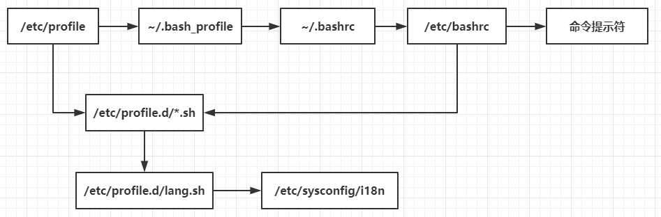

# Shell基础

# 1.简介

## 1.1.概念

Shell 是一个用 C 语言编写的程序，它是用户使用 Linux 的桥梁。Shell 既是一种命令语言，又是一种程序设计语言。

Shell 是指一种应用程序，这个应用程序提供了一个界面，用户通过这个界面访问操作系统内核的服务。

## 1.2.shell的分类

| Shell类别            | 易学性 | 可移植性 | 编辑性 | 快捷性 |
| -------------------- | ------ | -------- | ------ | ------ |
| Bourne Shell（sh）   | 容易   | 好       | 较差   | 较差   |
| Korn Shell（ksh）    | 较难   | 较好     | 好     | 较好   |
| Bourne Again（Bash） | 难     | 较好     | 好     | 好     |
| POSIX Shell（psh）   | 较难   | 好       | 好     | 较好   |
| C Shell（csh）       | 较难   | 差       | 较好   | 较好   |
| TC Shell（tcsh）     | 难     | 差       | 好     | 好     |

Shell的两种主要语法类型有 Bourne和C,这两种语法彼此不兼容。 Bourne家族主要包括sh、ksh、Bash、psh、zsh；C家族主要包括:csh、tcsh(Bash和zsh在不同程度上支持csh的语法)

我们可以通过/etc/shells文件来查询Linux支持的shell

```shell
[root@yifeng ~]# cat /etc/shells 
/bin/sh
/bin/bash
/sbin/nologin
/usr/bin/sh
/usr/bin/bash
/usr/sbin/nologin
/bin/tcsh
/bin/csh
```

## 1.3.shell语法

### 1.3.1.echo命令

```
echo [选项] [输出内容]
选项：
	-e：	支持反斜线控制的字符转换
	-n：	取消输出后行末的换行符号（内容输出后不换行）
```

```shell
[root@yifeng ~]# echo "hello world"
hello world
[root@yifeng ~]# echo -n "hello world"
hello world[root@yifeng ~]# 
```

使用“-e”时，“\”所支持的控制字符的作用如下

| 控制字符 | 作用                                                         |
| -------- | ------------------------------------------------------------ |
| \\       | 输出\本身                                                    |
| \a       | 输出警告音                                                   |
| \b       | 退格键                                                       |
| \c       | 取消输出行末的换行符，和“-n”选项一致                         |
| \e       | ESCAPE键                                                     |
| \f       | 换页符                                                       |
| \n       | 换行符                                                       |
| \r       | 回车键                                                       |
| \t       | 制表符                                                       |
| \v       | 垂直制表符                                                   |
| \0nnn    | 按照八进制ASCII码表输出字符。其中0位数字零，nnn是三维八进制数 |
| \xhh     | 按照16进制ASCII码表输出字符。其中hh是两位十六进制数          |

```
#输出颜色
#\e[1;开启颜色输出，\e[0m结束颜色输出,31m代表颜色
echo -e "\e[1;31m abcd \e[0m"
```

### 1.3.2.history命令

```
history [选项]
选项：
	-c：	清空历史命令
	-w：	把缓存中的历史命令写入历史命令保存文件。
```

历史命令保存在用户家目录下面的.bash_history文件中。

历史命令快捷方式：

- 使用上下箭头可以调用以前的历史命令
- 使用“!n”重复执行第n条历史命令
- 使用“!!”重复执行上一条命令
- 使用“!字符串”重复执行最后一条以改字符串开头的命令
- 使用“!$”重复上一条命令的最后一个参数

### 1.3.2.alias命令

别名

```
alias vi=vim'
```

永久生效需要写入用户家目录下面的.bashrc文件中

```
#直接使配置文件生效
source .bashrc
#或者使用.，单独使用.相当于source的效果
. .bashrc
```

别名的优先级：

1、第一顺位执行用绝对路径或相对路径执行的命令
2、第二顺位执行别名
3、第三顺位执行Bash的内部命令
4、第四顺位执行按照$PATH环境变量定义的目录查找顺序找到的第一个命令

### 1.3.3.Bash常用快捷键

| 快捷键 | 作用                         |
| ------ | ---------------------------- |
| ctrl+A | 把光标移动到命令开头         |
| ctrl+E | 把光标移动到命令结尾         |
| ctrl+C | 强制终止当前的命令           |
| ctrl+L | 清屏，相当于clear命令        |
| ctrl+U | 剪切光标之前的内容           |
| ctrl+K | 剪切光标之后的内容           |
| ctrl+Y | 粘贴ctrl+U或ctrl+K剪切的内容 |
| ctrl+R | 在历史命令中搜索             |
| ctrl+D | 退出当前终端                 |
| ctrl+Z | 暂停，并放入后台             |
| ctrl+S | 暂停屏幕输出                 |
| ctrl+Q | 恢复屏幕输出                 |


### 1.3.3.输入输出重定向

1.Bash的标准输入输出

| 设备   | 设备文件名  | 设备描述符 | 类型         |
| ------ | ----------- | ---------- | ------------ |
| 键盘   | /dev/stdin  | 0          | 标准输入     |
| 显示器 | /dev/stdout | 1          | 标准输出     |
| 显示器 | /dev/stderr | 2          | 标准错误输出 |

2.输出重定向

| 类型                           | 符号                   | 作用                                                     |
| ------------------------------ | ---------------------- | -------------------------------------------------------- |
| 标准输出重定向                 | 命令 > 文件            | 以 覆盖的方式将命令的正确输出输出到指定的文件或设备中    |
|                                | 命令 >> 文件           | 以 追加的方式将命令的正确输出输出到指定的文件或设备中    |
| 标准错误输出重定向             | 错误命令 2> 文件       | 以 覆盖的方式将命令的正确输出输出到指定的文件或设备中    |
|                                | 错误命令 2>> 文件      |                                                          |
| 正确输出和错误<br>输出同时保存 | 命令 > 文件 2>&1       | 以覆盖的方式，把正确输出和错误输出都保存到同一个文件当中 |
|                                | 命令 >> 文件 2>&1      | 以追加的方式，把正确输出和错误输出都保存到同一个文件当中 |
|                                | 命令 &> 文件           | 以覆盖的方式，把正确输出和错误输出都保存到同一个文件当中 |
|                                | 命令 &>> 文件          | 以追加的方式，把正确输出和错误输出都保存到同一个文件当中 |
|                                | 命令 >> 文件1 2>>文件2 | 把正确输出追加到文件1中，把错误输出追加到文件2中         |

3.输入重定向

```
[root@yifeng ~]# wc abc
 49  61 629 abc
[root@yifeng ~]# wc < abc
 49  61 629
```

### 1.3.4.多命令顺序执行

| 多命令执行符 | 格式             | 作用                                                         |
| ------------ | ---------------- | ------------------------------------------------------------ |
| ;            | 命令1 ; 命令2    | 多个命令顺序执行，命令之间没有任何逻辑关系                   |
| &&           | 命令1 && 命令2   | 当命令1正确执行，则命令2才会执行<br>当命令1执行不正确，则命令2不会执行 |
| \|\|         | 命令1 \|\| 命令2 | 当命令1执行不正确，则命令2才会执行<br/>当命令1正确执行，则命令2不会执行 |

多命令中间加分号

```
[root@yifeng etc]# ls;date;cd /etc
```

### 1.3.5.管道符

grep

```
grep [选项] "搜索内容" 文件名
选项：
	-A 数字：列出符合条件的行，并列出后续的n行
	-B 数字：列出符合条件的行，并列出掐面的n行
	-c：	   统计找到的符合条件的字符串的次数
	-i：	   忽略大小写
	-n：	   输出行号
	-v：	   反向查找
	-color=auto：搜索出的关键字用颜色显示
```

```
#查找用户信息文件/etc/passwd中，有多少可以登录的用户
grep "/bin/bash" /etc/passwd
#查找root所在行的后续3行
grep -A 3 "root" /etc/passwd
```

|

```
#查找正处于连接状态的tcp连接信息
netstat -an | grep "ESTABLISHED"
```

### 1.3.6.通配符

| 通配符 | 作用                                                         |
| ------ | ------------------------------------------------------------ |
| ?      | 匹配一个任意字符                                             |
| *      | 匹配0个或多个任意字符                                        |
| []     | 匹配中括号中任意一个字符。如[abc]代表匹配a或b或c             |
| [-]    | 匹配中括号中任意一个字符，-代表一个范围。例如[a-z]代表匹配a到z中的任意一个小写字母 |
| [^]    | 逻辑非，表示匹配不是中括号内的一个字符。                     |

### 1.3.7.Bash中的其他特殊符号

| 符号 | 作用                                                         |
| ---- | ------------------------------------------------------------ |
| ' '  | 单引号。在单引号中所有的特殊符号，如“$”和“`”（反引号）都没有特殊含义 |
| “ ”  | 双引号。在双引号中特殊符号都没有特殊含义，但是"$"、“`”和“\”是例外 |
| ``   | 反引号。反引号括起来的内容是系统命令，在Bash中先会执行它。   |
| $()  | 和反引号作用一样，来引用系统命令                             |
| ()   | 用于一串命令执行时，()中的命令会在子shell中执行              |
| {}   | 用于一串命令执行时，{}中的命令会在当前shell中执行。也可以用于变量变形与替换 |
| []   | 用于变量的测试                                               |
| #    | 注释                                                         |
| $    | 调用变量的值                                                 |
| \    | 转义符                                                       |

```
#小括号
[root@yifeng ~]# echo $name
jxc
[root@yifeng ~]# (name=tom;echo $name)
tom
[root@yifeng ~]# echo $name
jxc
#大括号，左大括号前面必须有空格，后面以分号结尾
[root@yifeng ~]# { name=kevin;echo $name; }
kevin
[root@yifeng ~]# echo $name
kevin
```

### 1.3.8.变量

分类：

- 用户自定义变量
- 环境变量
- 位置参数变量
- 预定义变量

**用户自定义变量**

```
#定义
name=kevin
#调用
$name
```

变量查看

```
set [选项]
选项：
	-u：	如果设定此选项，调用未声明变量时会报错（默认无任何提示）
	-x：	如果设定此选项，在命令执行之前，会把命令先输出一次
```

```
[root@yifeng ~]# echo $aaa

[root@yifeng ~]# set -u
[root@yifeng ~]# echo $aaa
-bash: aaa: unbound variable
```

删除变量

```
unset 变量名
```

**环境变量**

用户自定义变量只能在当前shell中生效，环境变量可在子shell中生效

环境变量声明

```
export 变量名
export age=18
```

环境变量查询和删除

set可以查看所有变量，env只能查看环境变量

```
set | grep age
env | grep age
```

删除

```
unset age
```

PATH环境变量：

系统查找命令的路径，各路径之间用冒号“:”进行分割

```
[root@yifeng ~]# echo $PATH
/usr/local/java/jdk1.8.0_201/bin:/usr/local/sbin:/usr/local/bin:/usr/sbin:/usr/bin:/root/bin
```

PS1环境变量：命令提示符设置

```
[root@yifeng ~]# echo $PS1
[\u@\h \W]\$
#\u当前登录的用户 \h简写主机名 \W最后一个目录，\w完整目录
```

PS1可以支持以下这些选项：

```
\d：显示日期，格式为“星期 月 日”
\H：显示完整的主机名
\h：显示简写主机名
\t：显示24小时制时间,格式为“HH:MM:SS”
\T：显示12小时制时间,格式为“HH:MM:SS”
\A：显示24小时制时间,格式为“HH:MM”
\@：显示12小时制时间,格式为“HH:MM am/pm”
\u：显示当前用户名
\v：显示Bash版本信息
\w：显示当前所在目录的完整名
\W：显示当前所在目录的最后一个目录
\#：执行的第几个命令
\$：提示符。root提示“#”,普通用户提示“$”
```

配置文件在：/etc/bashrc

LANG环境变量：语系变量

```
[root@yifeng ~]# echo $LANG
en_US.utf8
```

查看支持的所有语系

```
locale -a
```

**位置参数变量**

| 位置参数变量 | 作用                                                         |
| ------------ | ------------------------------------------------------------ |
| $n           | n为数字，$0代表命令本身，$1-$9代表第一到第九个参数，10以上的参数需要用大括号包含如${10} |
| $*           | 这个变量代表命令行中所有的参数，$*把所有的参数看出一个整体   |
| $@           | 这个变量也代表命令行中所有的参数，不过$@把每个参数区分对待   |
| $#           | 这个变量代表命令行中所有参数的个数                           |

**预定义变量**

| 变量 | 作用                                                         |
| ---- | ------------------------------------------------------------ |
| $?   | 最后一次执行的命令的返回状态。如果这个变量的值为0,证明上个命令正确执行;如果这个变量的值为非0(具体是哪个数,由命令自己来决定),则证明上一个命令执行不正确了。 |
| $$   | 当前进程的进程号(PID)                                        |
| $!   | 后台运行的最后一个进程的进程号(PID)                          |

### 1.3.9.键盘接收输入

```
read [选项] [变量名]
选项：
	-p "提示信息"
	-t 秒数 read命令会一直等待用户输入，使用此选项可以指定等待时间
	-n 字符数 read命令只接收指定的字符数，就会执行
	-s 隐藏输入的数据，适用于密码的输入
变量名：
	变量名可以自定义,如果不指定变量名,会把输入保存入默认变量 REPLY
	如果只提供了一个变量名,则整个输入行赋予该变量
	如果提供了一个以上的变量名,则输入行分为若干字，一个接一个地赋予各个变量,而命令行
```

```
vim count2.sh
#!/bin/bash

read -n 5 -t 30 -p "please input the number1:" num1
read -n 5 -t 30 -p "please input the number2:" num2
sum=$(( $num1 + $num2 ))
echo $sum

chmod 755 count2.sh
[root@yifeng ~]# ./count2.sh 
please input the number1:22
please input the number2:33
55
```

### 1.3.10.shell运算符

**declare声明变量类型**

```
declare [+/-][选项] 变量名
选项：
	-：	给变量设定类型属性
	+：	取消变量的类型属性
	-a:	将变量声明为数组型
	-i：	将变量声明为整数型
	-r：	将变量声明为只读变量
	-x：	将变量声明为环境变量
	-p：	显示指定变量的被声明的类型
a=1
b=2
declare -i c=$a+$b
echo c
3
#数组
[root@yifeng ~]# name[0]=kevin
[root@yifeng ~]# name[1]=tom
[root@yifeng ~]# echo ${name[*]}
kevin tom
declare -x test=123 （等价于export test=123）
```

数字运算的三种方式：

1.使用declare

```
[root@yifeng ~]# a=11
[root@yifeng ~]# b=22
[root@yifeng ~]# declare -i c=$a+$b
[root@yifeng ~]# echo $c
33
```

2.使用expr或let

expr

```
#注意+左右两边都有空格
[root@yifeng ~]# d=$(expr $a + $b)
[root@yifeng ~]# echo $d
33
```

let

```
[root@yifeng ~]# let e=$a+$b
[root@yifeng ~]# echo $e
33
```

3.使用“$((运算式))”或“$[运算式]”方式运算

```
[root@yifeng ~]# f=$(($a+$b))
[root@yifeng ~]# echo $f
33
```

```
[root@yifeng ~]# g=$[$a+$b]
[root@yifeng ~]# echo $g
33
```

推荐使用$((运算式))方式

shell常用运算符

| 优先级 | 运算符                             | 说明                           |
| ------ | ---------------------------------- | ------------------------------ |
| 13     | -,+                                | 单目负、单目正                 |
| 12     | !,~                                | 逻辑非、按位取反或补码         |
| 11     | *,/,%                              | 乘、除、取模                   |
| 10     | +,-                                | 加、减                         |
| 9      | <<,>>                              | 按位左移、按位右移             |
| 8      | <=,>=,<,>                          | 小于等于、大于等于、小于、大于 |
| 7      | ==,!=                              | 等于、不等于                   |
| 6      | &                                  | 按位与                         |
| 5      | ^                                  | 按位异或                       |
| 4      | \|                                 | 按位或                         |
| 3      | &&                                 | 逻辑与                         |
| 2      | \|\|                               | 逻辑或                         |
| 1      | =,+=,-=,*=,/=,%=,&=,^=,\|=,<<=,>>= | 赋值、运算且赋值               |

### 1.3.11.变量的测试与内容置换

| 变量置换方式 | 变量y没有设置          | 变量y为空值            | 变量y设置值   |
| ------------ | ---------------------- | ---------------------- | ------------- |
| x=${y-新值}  | x=新值                 | x为空                  | x=$y          |
| x=${y:-新值} | x=新值                 | x=新值                 | x=$y          |
| x=${y+新值}  | x为空                  | x=新值                 | x=新值        |
| x=${y:+新值} | x为空                  | x为空                  | x=性子        |
| x=${y=新值}  | x=新值，y=新值         | x为空，y值不变         | x=$y,y值不变  |
| x=${y:=新值} | x=新值，y=新值         | x=新值，y=新值         | x=$y，y值不变 |
| x=${y?新值}  | 新值输出到标准错误输出 | x为空                  | x=$y          |
| x=${y:?新值} | 新值输出到标准错误输出 | 新值输出到标准错误输出 | x=$y          |

### 1.3.12.环境变量配置文件

source命令：使配置文件立即生效

```
source 配置文件
或
. 配置文件
```

环境变量配置文件

```
/etc/profile
/etc/profile.d/*.sh
~/.bash_profile
~/.bashrc
/etc/bashrc
```

etc目录下面的是对所有用户有效的，用户家目录下面的只针对当前用户有效

环境变量配置文件调用过程



**在登录过程会优先调用/etc/profile文件**，

在这个环境变量配置文件中会定义这些默认环境变量：

- USER变量：根据登录的用户，给这个变量赋值
- LOGNAME变量：根据USER变量的值，给这个变量赋值
- MAIL变量：根据登录的用户，定义用户的邮箱为/var/spool/mail/用户名
- PATH变量：根据登录用户的UID是否为0，判断PATH变量是否包含/sbin、/usr/sbin和/usr/local/sbin这三个系统命令目录
- HOSTNAME变量：主机名，给主机名变量赋值
- HOSTSIZE变量：定义历史命令的保存条数
- umask：定义umask默认权限。注意这里的usmask权限是在有用户登录过程（输入了用户名和密码）时才会生效
- 调用/etc/profile.d/*.sh文件，调用/etc/profile.d目录下面所有以.sh结尾的文件

由/etc/profile文件调用~/.bash_profile文件

~/.bash_profile主要实现了两个功能：

- 调用~/.bashrc文件
- 在PATH变量后面加入了“:HOME/bin”这个目录，也就是说，如果在家目录中建立bin目录，然后把自己的脚本放入这个额bin目录中，就可以直接执行而不用通过目录执行

由~/.bash_profile文件调用~/.bashrc文件：

~/.bashrc文件主要实现了：

- 定义默认别名
- 调用/etc/bashrc

由~/.bashrc调用了/etc/bashrc文件

在etc/bashrc文件中主要实现了这些内容：

- PS1变量：用户提示符
- umask：定义umask默认权限。这个文件中额umask是针对“没有登录过程”时生效的，比如一个终端切换到另一个终端，切换到子shell中等。
- PATH变量：给PATH变量追加值，也是在没有登录过程时才生效
- 调用/etc/profile.d/*.sh文件，这也是在没有登录过程时才调用

综上所述：如果是对所有用户生效可以放在/etc/profile中，如果只对用户有效，则可以放在~/.bash_profile或者~/.bashrc中

**注销时生效的环境变量配置文件**

用户退出登录树，~/.bash_logout文件生效，默认该文件里面什么都没有写入。

**其他配置文件**

.bash_history记录历史命令的文件

**欢迎信息设置**

本地登录欢迎信息，/etc/issue

远程登录欢迎信息，/etc/issue.net，同时需要在/etc/ssh/sshd_config中打开Banner设置

```
Banner /etc/issue.net
```

上面两个是在成功登录之前显示的，用户成功登录之后的欢迎信息，在/etc/motd文件中

**Bash快捷键：**

查询所有快捷键

```
stty -a
```

更改快捷键

```
stty 关键字 快捷键

stty intr ^p
#定义ctrl+p快捷键为强制终止，默认是ctrl+c
```

## 1.4.shell编程

### 1.4.1.基础正则表达式

| 元字符    | 作用                                                         |
| --------- | ------------------------------------------------------------ |
| *         | 前一个字符匹配0次或任意多次                                  |
| .         | 匹配除了换行符外任意一个字符                                 |
| ^         | 匹配行首。例如^hello会匹配以hello开头的行                    |
| $         | 匹配行尾                                                     |
| []        | 匹配中括号中的任意一个字符，只匹配一个字符                   |
| [^]       | 匹配除中括号的字符以外的任意一个字符。                       |
| \         | 转义符                                                       |
| \\{n\\}   | 表示其前面的字符恰好出现n次。例如：[0-9]\\{4\\}匹配4位数字。 |
| \\{n,\\}  | 表示前面的字符出现不小于n次。例如[0-9]\\{2,\\}表示2位及以上的数字 |
| \\{n,m\\} | 表示前面的字符至少出现n次最多出现m次                         |

```
#匹配包含aa的所有行
grep "aa" test.txt
#匹配saad,其中a出现两次以上
grep "aaa*" test.txt
#匹配s.d,s和d之间有两个任意字符
grep "s..d" test.txt
#匹配a开头的所有行
grep "^a" test.txt
#匹配s结尾的所有行
grep "s$" test.txt
#匹配所有以a开头并且以s结尾的行
grep "^a.*s$" test.txt
#匹配以.结尾的所有行
grep "\.$" test.txt
#匹配空白行
grep "^$" test.txt
#匹配said或soid或seid
grep "s[aoe]id" test.txt
#匹配所有以数字开头的行
grep "^[0-9]" test.txt
#匹配所有非数字的行
grep "[^0-9]" test.txt

#匹配a出现三次的行
grep "a\{3\}" test.txt
#匹配三个任意数字
grep "[0-9]\{3\}" test.txt
#匹配a出现2次以上的行
grep "a\{2,\}" test.txt
#匹配a出现次数大于2小于5的所有行
grep "a\{2,5\}" test.txt
#查找系统中所有的普通用户
grep -v "root" /etc/passwd | grep "/bin/bash"
```

### 1.4.2.扩展正则表达式

扩展正则必须使用egrep命令或grep -E选项才能识别

| 扩展元字符 | 作用                                                         |
| ---------- | ------------------------------------------------------------ |
| +          | 前一个字符匹配1次或任意多次                                  |
| ?          | 前一个字符匹配0次或一次                                      |
| \|         | 匹配两个或多个分支选择，如was\|his既可以匹配was也可以匹配his |
| ()         | 匹配其整体为一个字符，即模式单元。如(dog)+会匹配dog、dogdog、dogdogdog等 |

```
#匹配a出现一次及以上said、saaid、saaaid等
egrep "sa+id" test.txt
#匹配a出现一次或0次，said、sid等
egrep "sa?id" test.txt
```

### 1.4.3.字符截取和替换

**1.cut列提取命令**

```
cut [选项] 文件名
选项：
	-f 列号：	提取第几列
	-d 分隔符	按照指定分隔符分割列
	-c 字符范围	不依赖分隔符区分列，而是通过字符范围来进行字段提取。"n-"表示从第n个字符到行尾；“n-m”表示从第n个字符到第m个字符；“-m”表示从第一个字符到第m个字符
```

例子：

新建一个文本文件student.txt，列中间是制表符不是空格

```
ID      Name    gender  Mark
1       Liming  M       86
2       Sc      M       90
3       Tg      M       83
```

提取文本中的所有名字

```
grep -v "Name" student.txt | cut -f 2
```

提取多列中间用逗号隔开，提取所有学生名字和分数

```
grep -v "Name" student.txt | cut -f 2,4
```

提取/etc/passwd中所有普通用户的用户名

```shell
[root@yifeng ~]# grep -v "root" /etc/passwd | grep "/bin/bash" | cut -d ":" -f 1
user1
test2
user3
yifeng
```

注意：cut不能使用空格作为分隔符

**2.awk编程**

截取列，可以使用空格

printf格式化输出

```
printf ‘输出类型输出格式’ 输出内容
输出类型：
	%ns：	输出字符串。n是数字指代输出几个字符
	%ni：	输出整数。n是数字指代输出几个数字
	%m.nf：	输出浮点数。m代表证书位数n代表小数位数
	
输出格式：
	\a：	输出警告声音
	\b：	输出退格键
	\f：	清除屏幕
	\n：	换行
	\r：	回车
	\t：	水平输出退格键，也就是Tab键
	\v：	垂直输出退格键，也就是Tab键
	
```

新建文件score.txt，并填入以下内容

```
ID      Name    PHP     Linux   MySQL   Average
1       Lm  82      95      86      87.66
2       Sc      74      96      87      85.66
3       Tg      99      83      93      91.66
```

```
#格式化输出
[root@yifeng ~]# printf '%s\t %s\t %s\t %s\t %s\t %s\t \n' $(cat score.txt)
ID	 Name	 PHP	 Linux	 MySQL	 Average	 
1	 Lm	 82	 95	 86	 87.66	 
2	 Sc	 74	 96	 87	 85.66	 
3	 Tg	 99	 83	 93	 91.66	
```

**awk基本使用**：

```
awk '条件1{动作1} 条件2{动作2}...' 文件名
条件：
	一般使用关系表达式作为条件，如：
	x > 10
	x == y
	A~B 判断字符串A中是否包含匹配字符串B
	A!~B 判断字符串A中是否不包含匹配字符串B
动作：
	格式化输出
	流程控制语句
```

```
#输出score.txt的第二列和第四列
[root@yifeng ~]# awk '{printf $2 "\t" $6 "\n"}' score.txt 
Name	Average
Lm	87.66
Sc	85.66
Tg	91.66
#这里也可以使用print，不写换行符
[root@yifeng ~]# awk '{print $2 "\t" $6}' score.txt 
Name	Average
Lm	87.66
Sc	85.66
Tg	91.66
#查看磁盘中每个分区的使用百分比
[root@yifeng ~]# df -h | grep -v Use | awk '{print $1 "\t" $5}' | cut -d '%' -f 1
/dev/vda1	17
devtmpfs	0
tmpfs	1
tmpfs	1
tmpfs	0
tmpfs	0
```

**awk的条件**

| 条件的类型 | 条件   | 说明                                                         |
| ---------- | ------ | ------------------------------------------------------------ |
| awk保留字  | BEGIN  | 在awk程序开始时,尚未读取任何数据之前执行。BEGIN后的动作只在程序开始时执行一次 |
|            | END    | 在awk程序处理完所有数据,即将结束时执行。END后的动作只在程序结束时执行一次 |
| 关系运算符 | >      | 大于                                                         |
|            | <      | 小于                                                         |
|            | >=     | 大于等于                                                     |
|            | <=     | 小于等于                                                     |
|            | ==     | 等于                                                         |
|            | !=     | 不等于                                                       |
|            | A~B    | 判断字符串A中是否包含能匹配B表达式的子字符串                 |
|            | A!~B   | 判断字符串A中是否包含不能匹配B表达式的子字符串               |
| 正则表达式 | /正则/ | 如果在"//"中可以写入字符，也可以支持正则表达式               |

```
[root@yifeng ~]# awk 'BEGIN{print "start-------------"} {print $2 "\t" $6} END{print "end-------------"}' score.txt 
start-------------
Name	Average
Lm	87.66
Sc	85.66
Tg	91.66
end-------------
```

```
#打印平均成绩大于等于87的学生姓名
[root@yifeng ~]# grep -v "Name" score.txt | awk '$6>=87 {print $2}'
Lm
Tg
```

```
#打印姓名中包含Sc的学生
[root@yifeng ~]# awk '$2 ~ /Sc/ {print $6}' score.txt 
85.66
#使用正则表达式
[root@yifeng ~]# awk '/Sc/ {print $6}' score.txt 
85.66
```

**awk的内置变量**

| awk内置变量 | 作用                                                         |
| ----------- | ------------------------------------------------------------ |
| $0          | 代表目前awk所读入的整行数据。我们已知awk是一行一行读入数据的,$0就代表当前读入行的整行数据。 |
| $n          | 代表目前读入行的第n个字段                                    |
| NF          | 当前行拥有的字段(列)总数。                                   |
| NR          | 当前awk所处理的行,是总数据的第几行。                         |
| FS          | 用户定义分隔符。awk的默认分隔符是任何空格,如果想要使用其他分隔符(如“:”),就需要FS变量定义 |
| ARGC        | 命令行参数个数。                                             |
| ARGV        | 命令行参数数组。                                             |
| FNR         | 当前文件中的当前记录数(对输入文件起始为1)。                  |
| OFMT        | 数值的输出格式(默认为%.6g)                                   |
| OFS         | 输出字段的分隔符(默认为空格)。                               |
| ORS         | 输出记录分隔符(默认为换行符)。                               |
| RS          | 输入记录分隔符(默认为换行符)。                               |

```
#查看所有能够登陆的用户
[root@yifeng ~]# cat /etc/passwd | grep "/bin/bash" | awk 'BEGIN{FS=":"} {print $1}'
root
user1
test2
user3
yifeng
#查询id为550的能够登陆的用户
[root@yifeng ~]# cat /etc/passwd | grep "/bin/bash" | awk 'BEGIN{FS=":"} $3=="550" {print $1}'
test2
#打印行号和字段总数(列的总数)
[root@yifeng ~]# cat /etc/passwd | grep "/bin/bash" | awk 'BEGIN{FS=":"}  {print $1 "\t" $3 "\t 行号：" NR "\t字段数：" NF}'
root	0	 行号：1	字段数：7
user1	1000	 行号：2	字段数：7
test2	550	 行号：3	字段数：7
user3	1004	 行号：4	字段数：7
yifeng	1005	 行号：5	字段数：7
```

**3.sed命令**

sed主要是用来将数据进行选取、替换、刑除、新增的命令,我们看看命令的语法:

```shell
sed [选项] '[动作]' 文件名
选项：
	-n：	般sed命令会把所有数据都输出到屏幕,如果加入此选择,则只会把经过sed命令处理的行输出到屏幕。
	-e：	允许对输入数据应用多条sed命令编辑。
	-f 脚本文件名：从sed脚本中读入sed操作。和awk命令的f非常类似
	-r：在sed中支持扩展正则表达式。
	-i：用sed的修改结果直接修改读取数据的文件,而不是由屏幕输出
动作：
	a \：追加,在当前行后添加一行或多行。添加多行时,除最后一行外,每行末尾需要用“\”代表数据未完结。
	c \：行替换,用c后面的字符串替换原数据行,替换多行时,除最后一行外,每行末尾需用“\”代表数据未完结。
	i \：插入,在当期行前插入一行或多行。插入多行时,除最后一行外,,每行末尾需用“\”代表数据未完结。
	d：	删除，删除指定的行
	p：	打印，输出指定的行
	s：	字串替换,用一个字符串替换另外一个字符串。格式为“行范围s/旧字串/新字串/g“，和vim中的替换格式类似
```

```
#打印第二行
[root@yifeng ~]# sed -n '2p' score.txt 
1	Lm	82	95	86	87.66
#删除第二行到第四行，并没有写入文件
[root@yifeng ~]# sed -n '2,4d' score.txt 
#删除第二行到第四列，并写入文件
[root@yifeng ~]# sed -i '2,4d' score.txt 
#向文件中的第二行后面写入一行数据，如果不加2则代表在每一行后面都写入一行
[root@yifeng ~]# sed -i '2a1111111111' score.txt
#替换第三行
[root@yifeng ~]# sed -i '3c 4 cc 88 97 93' score.txt
#删除多行，中间用分号隔开，前面加-e选项
[root@yifeng ~]# sed -i -e '3d;4d' score.txt
#将Lm替换成kevin
[root@yifeng ~]# sed 's/Lm/kevin/g' score.txt 
ID	Name	PHP	Linux	MySQL	Average
1	kevin	82	95	86	87.66
2	Sc	74	96	87	85.66
3	Tg	99	83	93	91.66
```

### 1.4.4.字符串处理命令

**1.排序命令sort**

```
sort [选项] 文件名
选项：
	-f：	忽略大小写
	-b：	忽略每行前面的空白部分
	-n：	以数值型进行排序，默认使用字符串型排序
	-r：	反向排序
	-u：	删除重复行。就是uniq命令
	-t：	指定分隔符，默认分隔符是制表符
	-k n[,m]：	按照指定的字段范围排序。从第n字段开始，m字段结束（默认到行尾）
```

sort命令默认是用每行开头第一个字符来进行排序的

```
#按字母的从小到大顺序查看passwd文件
[root@yifeng ~]# sort /etc/passwd
#按字母从大到小
[root@yifeng ~]# sort -r /etc/passwd
#按照用户id排序
[root@yifeng ~]# sort -n -t ":" -k 3,3 /etc/passwd
```

**2.uniq**

取消重复行，相当于“sort -u”

```
uniq [选项] 文件名
选项：
	-i：	忽略大小写
```

**3.wc**

```
wc [选项] 文件名
选项：
	-l：	只统计行数
	-w：	只统计单词数
	-m：	只统计字符数
```

### 1.4.5.条件判断

**1.按照文件类型进行判断**

| 测试选项 | 作用                                                         |
| -------- | ------------------------------------------------------------ |
| -b 文件  | 判断该文件是否存在，并且是否为块设备文件（是块设备文件为真） |
| -c 文件  | 判断该文件是否存在，并且是否为字符设备文件（是字符设备文件为真） |
| -d 文件  | 判断该文件是否存在，并且是否为目录文件（是目录文件为真）     |
| -e 文件  | 判断该文件是否存在（存在为真）                               |
| -f 文件  | 判断该文件是否存在，并且是否为普通文件（是普通文件为真）     |
| -L 文件  | 判断该文件是否存在，并且是否为符号链接文件（是符号链接文件为真） |
| -p 文件  | 判断该文件是否存在，并且是否为管道文件（是块管道文件为真）   |
| -s 文件  | 判断该文件是否存在，并且是否为空（非空为真）                 |
| -S 文件  | 判断该文件是否存在，并且是否为套接字文件（是套接字文件为真） |

```
#判断文件abc是否存在
test -e abc
#也可以使用[]，程序里边一般这样使用,注意两边都有空格
[ -e abc ]
```

**2.按照文件权限进行判断**

| 测试选项 | 作用                                                         |
| -------- | ------------------------------------------------------------ |
| -r 文件  | 判断该文件是否存在，并且是否该文件拥有读权限（有读权限为真） |
| -w 文件  | 判断该文件是否存在，并且是否该文件拥有写权限（有写权限为真） |
| -x 文件  | 判断该文件是否存在，并且是否该文件拥有执行权限（有执行权限为真） |
| -u 文件  | 判断该文件是否存在，并且是否该文件拥有SUID权限（有SUID权限为真） |
| -g 文件  | 判断该文件是否存在，并且是否该文件拥有SGID权限（有SGID权限为真） |
| -k 文件  | 判断该文件是否存在，并且是否该文件拥有SBit权限（有SBit权限为真） |

```
test -r abc
[ -r abc ]
```

**3.两个文件之间进行比较**

| 测试选项        | 作用                                                         |
| --------------- | ------------------------------------------------------------ |
| 文件1 -nt 文件2 | 判断文件1的修改时间是否比文件2的新(如果新则为真)             |
| 文件1 -ot 文件2 | 判断文件1的修改时间是否比文件2的旧(如果旧则为真)             |
| 文件1 -ef 文件2 | 判断文件1是否和文件2的 Inode号一致,可以理解为两个文件是否为同一个文件。这个判断用于判断硬链接是很好的方法 |

```
[root@yifeng ~]# ln abc /tmp/abc
[root@yifeng ~]# [ abc -ef /tmp/abc ]
[root@yifeng ~]# echo $?
0
```

**4.两个整数之间比较**

| 测试选项        | 作用                                     |
| --------------- | ---------------------------------------- |
| 整数1 -eq 整数2 | 判断整数1是否和整数2相等(相等为真)       |
| 整数1 -ne 整数2 | 判断整数1是否和整数2不相等(不相等为真)   |
| 整数1 -gt 整数2 | 判断整数1是否大于整数2(大于为真)         |
| 整数1 -lt 整数2 | 判断整数1是否小于整数2(小于为真)         |
| 整数1 -ge 整数2 | 判断整数1是否大于等于整数2(大于等于为真) |
| 整数1 -le 整数2 | 判断整数1是否小于等于整数2(小于等于为真) |

```
[root@yifeng ~]# [ 22 -lt 33 ]
[root@yifeng ~]# echo $?
0
[root@yifeng ~]# [ 22 -eq 33 ]
[root@yifeng ~]# echo $?
1
```

**5.字符串的判断**

| 测试选项           | 作用                                         |
| ------------------ | -------------------------------------------- |
| -z 字符串          | 判断字符串是否为空(为空返回真)               |
| -n 字符串          | 判断字符串是否为非空(非空返回真)             |
| 字符串1 == 字符串2 | 判断字符串1是否和字符串2相等(相等返回真)     |
| 字符串1 != 字符串2 | 判断字符串1是否和字符串2不相等(不相等返回真) |

```
[root@yifeng ~]# aa=11
[root@yifeng ~]# [ -z "$aa" ]
[root@yifeng ~]# echo $?
1
[root@yifeng ~]# [ -z "$bb" ]
[root@yifeng ~]# echo $?
0
```

**6.多重条件判断**

| 测试选项       | 作用                                           |
| -------------- | ---------------------------------------------- |
| 判断1 -a 判断2 | 逻辑与,判断1和判断2都成立,最终的结果才为真     |
| 判断1 -o 判断2 | 逻辑或,判断1和判断2有一个成立,最终的结果就为真 |
| !判断          | 逻辑非,使原始的判断式取反                      |

```
[root@yifeng ~]# [ -n "$aa" -a "$aa" -gt 30 ]
[root@yifeng ~]# echo $?
1
```

### 1.4.6.流程控制

**1.if条件判断**

单分支if

```
if [ 条件判断式 ];then
	程序
fi
或者
if [ 条件判断式 ]
	then
		程序
fi
```

```shell
#!/bin/bash
aa=$(df -h | grep /dev/vda1 | awk '{print $5}' | cut -d '%' -f 1)
if [ "$aa" -ge 10 ]
        then
                echo "11111111111"
fi
```

双分支if

```
if [ 条件判断式 ]
	then
		程序1
	else
		程序2
fi
```

```shell
#检查nginx服务是否正常运行，如果停了输出提示并且启动服务
#!/bin/bash
aa=$(netstat -tunl | awk '{print $4}' | grep ":80$")
if [ "$aa" == "" ]
        then
                echo "nginx is down,must restart"
                /usr/sbin/nginx
        else
                echo "nginx is ok"
fi
```

nmap命令：

```
nmap -sT 域名或IP
选项：
	-s：	扫描
	-T：	扫描所有开启的端口
#如果没有nmap命令可以使用 yum -y install nmap 进行安装
[root@yifeng ~]# nmap -sT 49.232.160.164

Starting Nmap 6.40 ( http://nmap.org ) at 2020-01-06 16:18 CST
Nmap scan report for yifeng (49.232.160.164)
Host is up (0.00035s latency).
Not shown: 997 closed ports
PORT   STATE    SERVICE
22/tcp open     ssh
25/tcp filtered smtp
80/tcp open     http

Nmap done: 1 IP address (1 host up) scanned in 1.25 seconds

```

上面的程序就可以使用nmap命令来改写,扫描所有开启的端口然后过滤tcp，过滤http，最后状态为open

```shell
#检查nginx服务是否正常运行，如果停了输出提示并且启动服务
#!/bin/bash
aa=$(nmap -sT 49.232.160.164 | grep tcp | grep http | awk '{print $2}')
if [ "$aa" != "open" ]
        then
                echo "nginx is down,must restart"
                /usr/sbin/nginx
        else
                echo "nginx is ok"
fi
```

多分支if

```
if [ 条件判断式 ]
	then
		程序1
elif [ 条件判断式2 ]
	then
		程序2
......
else
	程序n
fi
```

```shell
#!/bin/bash
#字符界面加减乘除

read -t 30 -p "please input num1: " num1
read -t 30 -p "please input num2: " num2
read -n1 -t 30 -p "please input operate[+-*/]: " oper
echo -e "\n"
if [ -n "$num1" -a -n "$num2" -a -n "$oper" ]
        then
                test1=$(echo $num1 | sed 's/[0-9]//g')
                test2=$(echo $num2 | sed 's/[0-9]//g')
                if [ -z "$test1" -a -z "$test2" ]
                        then
                                if [ "$oper" == '+' ]
                                        then
                                                value=$(( $num1+$num2 ))
                                elif [ "$oper" == '-' ]
                                        then
                                                value=$(( $num1-$num2 ))
                                elif [ "$oper" == '*' ]
                                        then
                                                value=$(( $num1*$num2 ))
                                elif [ "$oper" == '/' ]
                                        then
                                                value=$(( $num1/$num2 ))
                                else
                                        echo "Please enter a valid symbol"
                                        exit 10
                                fi
                else
                        echo "Please enter a valid value"
                        exit 11
                fi
else
        echo "qing shu ru nei rong"
        exit 12
fi
echo "$num1 $oper $num2 : $value"

```

**2.多分支case条件语句**

```
case $变量名 in
	“值1”）
		程序1
		;;
	“值2”）
		程序2
	......
	*)
		程序n
		;;
esac
```

```shell
#!/bin/bash

echo "want to beijing,please input 1"
echo "want to shanghai,please input 2"
echo "want to chengdu,please input 3"

read -t 30 -p "please input your choice: " cho

case $cho in
        "1")
                echo "beijing1111111"
                ;;
        "2")
                echo "shanghai222222222"
                ;;
        "3")
                echo "chengdu3333333333"
                ;;
        *)
                echo "error input"
                ;;
esac

```

**3.for循环**

```
#语法1
for 变量 in 值1 值2 值3...
	do
		程序
	done
#语法2
for (( 初始值;循环控制条件;变量变化))
	do
		程序
	done
```

```
#!/bin/bash
for i in 1 2 3 4
        do
                echo $i
        done
```

```shell
#!/bin/bash
sum=0
for (( i=1;i<=100;i=i+1 ))
        do
                sum=$(( $sum + $i ))
        done
echo "The sum of 1+2+...+100 is : $sum"
```

```shell
#批量解压缩
#!/bin/bash
cd /root/sh/tar
ls *.tar.gz > tar.log
ls *.tgz >> tar.log &> /dev/null

for i in $(cat tar.log)
	do
		tar -zxvf $i
	done
rm -rf tar.log
```

```
#判断合法IP

```

**4.while循环**

```
while [ 条件判断式 ]
	do
		程序
	done
```

```shell
#!/bin/bash
sum=0
i=1
while [ $i -le 100 ]
        do
                sum=$(($sum+$i))
                i=$(($i+1))
        done
echo "1+2+3+...+100：$sum"
```

**5.until循环**

until循环和while循环相反，until循环只要条件判断式不成立则进行循环，成立则终止循环

```
until [ 条件判断式 ]
	do
		程序
	done
```

```shell
#!/bin/bash
sum=0
i=1
until [ $i -gt 100 ]
        do
                sum=$(($sum+$i))
                i=$(($i+1))
        done
echo "1+2+3+...+100：$sum"
```

### 1.4.7.特殊流程控制语句

**1.exit语句**

系统的exit是退出当前用户，而在shell脚本中exit是退出当前脚本。只要遇到exit，后面的程序就不再执行

```
exit [返回值]
```

```shell
#!/bin/bash

read -t 30 -p "Please input num: " num
y=$( echo $num | sed 's/[0-9]//g' )
if [ -n "$y" ]
then
        echo "please input number!"
        exit 18
else
        echo $num
fi
```

**2.break语句**

退出整个循环

```shell
#!/bin/bash
for (( i=1;i<=10;i=i+1 ))
        do
                if [ "$i" -eq 4 ]
                        then
                                break
                fi
                echo $i
        done
```

执行程序打印1 2 3

2.continue语句

退出当前循环

```shell
#!/bin/bash
for (( i=1;i<=10;i=i+1 ))
        do
                if [ "$i" -eq 4 ]
                        then
                                continue
                fi
                echo $i
        done
```

程序执行打印 1 2 3 5 6 7 8 9 10

## 1.4.shell脚本

```
vim hello.sh
```

```
#!/bin/bash
echo "hello world! "
```

执行shell脚本：

1.赋予执行权限，然后输入脚本的路径

```
[root@yifeng ~]# vim hello.sh 
[root@yifeng ~]# chmod u+x hello.sh 
[root@yifeng ~]# ./hello.sh 
hello world! 
[root@yifeng ~]# /root/hello.sh 
hello world! 
```

2.bash加脚本的路径

```shell
[root@yifeng ~]# bash hello.sh 
hello world! 
```

