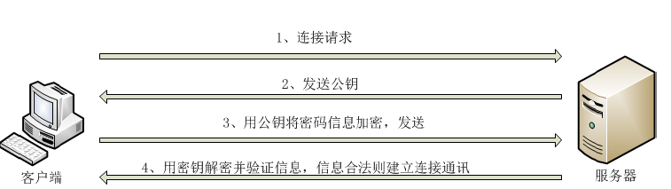
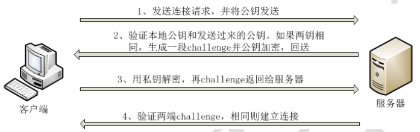
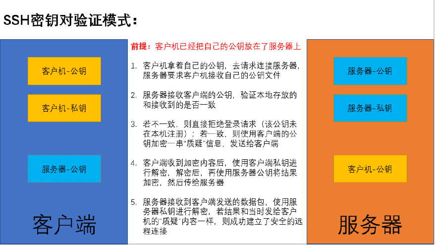
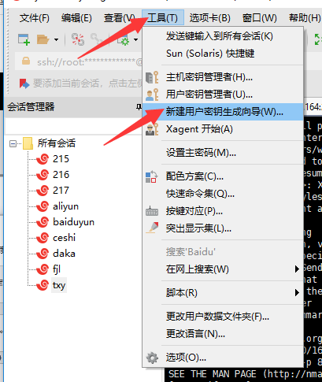
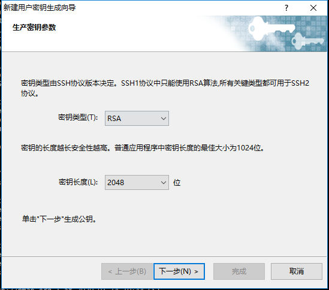
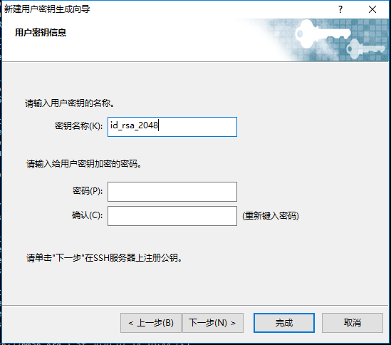
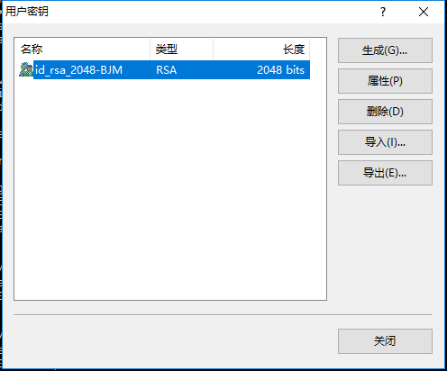
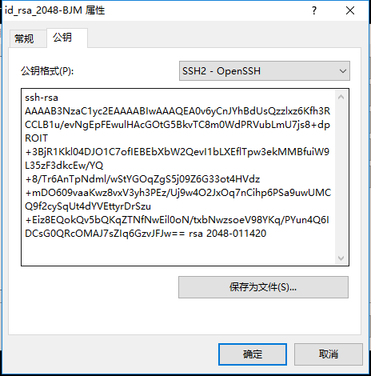
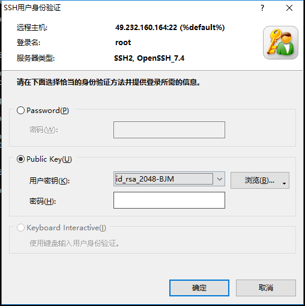

# 网络服务

# 1.网络服务基础

## 1.1.centos 6.x/7.x对比

### 1.1.1.文件系统

Centos 6.x: EXT4
Ext4的单个文件系统容量达到1EB,单个文件大小则达到16TB,
Centos 7.x: XES
XFS默认支持8EB减1字节的单个文件系统,最大可支持的文件大小为9EB,最大文件系统尺寸为18EB

### 1.1.2.防火墙、内核版本、默认数据库

Centos 6.x

防火墙：iptables

内核版本：2.6.x-x

默认数据库：MYSQL


Centos 7.x

防火墙：firewalld

内核版本：3.10.x-x

默认数据库：MariaDB

### 1.1.3.时间

Centos 6.x

时间同步：ntpq -p

修改时区：/etc/sysconfig/clock

修改语言：/etc/sysconfig/i18n


Centos 7.x

时间同步：chronyc sources

修改时区：timedatectl set-timezone Asia/Shanghai

修改语言：localectl set-locale LANG=zh_CN.UTF-8

### 1.1.4.主机名

Centos 6.x的配置文件为/etc/ sysconfig/network(永久设置)
Centos 7.x的配置文件为/etc/hostname(永久设置)
Centos 7.x还可以使用命令永久设置

```
[root@yifeng ~]# hostnamectl set-hostname yifeng
[root@yifeng ~]# cat /etc/hostname 
yifeng
```

### 1.1.5.网络服务管理

| 操作行为               | Centos 6.x             | Centos 7.x                |
| ---------------------- | ---------------------- | ------------------------- |
| 启动指定服务           | service 服务名 start   | systemctl start 服务名    |
| 关闭指定服务           | service 服务名 stop    | systemctl stop服务名      |
| 重启指定服务           | service 服务名 restart | systemctl restart 服务名  |
| 查看指定服务状态       | service 服务名 status  | systemctl status 服务名   |
| 查看所有服务状态       | service --status-all   | systemctl list-units      |
| 设置服务自启动         | chkconfig 服务名 on    | systemctl enable 服务名   |
| 设置服务不自启动       | chkconfig 服务名 off   | systemctl disable 服务名  |
| 查看所有服务自启动状态 | chkconfig --list       | systemctl list-unit-files |

### 1.1.6.网络设置

网卡名

Centos 6.x网卡名是：eth0	Centos 7.x网卡名是：ens33

网络配置命令

Centos 6.x中：ipconfig/setup	Centos 7.x中：ip/nmtui

网络服务

Centos 6.x默认使用 network服务

Centos 7.x默认使用 NetworkManager服务( network作为备用)

```
#开启NetworkManager服务
systemctl start NetworkManager
nmtui
```

### 1.1.7.centos7网络配置

配置文件目录：/etc/sysconfig/network-scripts/ifcfg-ens33

配置管理命令：ifconfig/ip address show

配置文件内容：

```shell
BOOTPROTO=dhcp	#连接方式（dhcp/static）
DEVICE=ens33		#设备名称
NAME=ens33		#网卡名称
HWADDR=52:54:00:69:96:0e #mac地址
ONBOOT=yes #是否开机加载
IPADDR=192.168.1.4	#IP地址
NETMASK=255.255.255.0	#子网掩码(也可以写成PREFIX=24)
GATEWAY=192.168.1.1	#网关
DNS1=8.8.8.8	#DNS
```

### 1.1.8.centos7修改网卡名

- 1.修改网卡配置文件名

  ```
  cp -a ifcfg-ens33 ifcfg-eth0
  ```

- 2.修改网卡配置文件内容

  ```
  NAME=eth0
  DEVICE=eth0
  ```

- 3.修改grub文件

  ```
  vim /etc/default/grub
  GRUB_CMDLINE_LINUX="crashkernel=auto console=ttyS0 console=tty0 panic=5 net.ifnames=0 biosdevname=0"
  #如果没有net.ifnames=0 biosdevname=0这两个参数就加入，有则不变，目的是关闭一致性命名规则
  ```

- 4.更新grub配置文件，并加载新的参数

  ```
  grub2-mkconfig -o /boot/grub2/grub.cfg
  ```

- 5.重启操作系统

## 1.2.常见网络协议和端口

### 1.2.1.网络地址和物理地址

**网络地址**:

互联网协议地址(IP地址)为互联网上每一个网络或主机分配一个逻辑地址,IP地址工作在网络层
IP的分类:IPV4 IPV6

**物理地址**:

物理地址(MAC地址)为每一个设备设置一个固定的硬件地址,MAC地址工作在链路层
MAC地址:00-23-5A-15-99-42

```
10.0.0.0-10.255.255 #局域网地址
172.16.0.0-172.31.255.255 #私有IP
192.168.0.0-192.168.255.255#局域网
```

### 1.2.2.TCP/IP常见协议

应用层协议：	FTP、HTTP、SMTP、Telnet、DNS等
传输层协议：	TCP、UDP等
网络层协议：	IP、ICMP、ARP等
数据链路层协议：	PPP协议等
物理层：	不常用

### 1.2.3.常见网络端口

端口配置文件：/etc/services

| 端口  | 服务                   | 说明           |
| ----- | ---------------------- | -------------- |
| 20/21 | ftp服务                | 文件共享       |
| 22    | ssh服务                | 安全远程管理   |
| 23    | telnet服务             | 不安全远程管理 |
| 25    | smtp：简单邮件传输协议 | 发信           |
| 465   | smtp(ssl)              | 发信           |
| 110   | pop3:邮局协议          | 收信           |
| 143   | imap4                  | 收信           |
| 993   | imap4(ssl)             | 收信           |
| 80    | www服务(http://)       | 网页访问       |
| 443   | www服务(https://)      | 加密网页访问   |
| 3306  | mysql端口              | 数据库连接端口 |
| 53    | DNS端口                | 域名解析端口   |

## 1.3.Linux下网关路由配置

**路由：**

- 不同网段数据转发
- 路由选择

**网关：**

- 不同网段数据转发
- 路由选择
- 默认路由
- NAT转换

**查看系统中的路由表信息**

```shell
[root@yifeng ~]# route -n
Kernel IP routing table
Destination     Gateway         Genmask         Flags Metric Ref    Use Iface
0.0.0.0         172.21.0.1      0.0.0.0         UG    0      0        0 eth0
169.254.0.0     0.0.0.0         255.255.0.0     U     1002   0        0 eth0
172.21.0.0      0.0.0.0         255.255.240.0   U     0      0        0 eth0
```

网关配置

```
#添加
route add default gw ip
#删除
route del default gw ip
#想要永久生效需要修改网络配置文件ifcfg-ens33
```

## 1.4.Linux下网络管理命令

**nslookup**：域名解析测试命令

```
[root@yifeng ~]# nslookup www.baidu.com
Server:		183.60.83.19
Address:	183.60.83.19#53

Non-authoritative answer:
www.baidu.com	canonical name = www.a.shifen.com.
Name:	www.a.shifen.com
Address: 220.181.38.149
Name:	www.a.shifen.com
Address: 220.181.38.150
Name:	www.a.shifen.com
Address: 240e:83:205:58:0:ff:b09f:36bf
Name:	www.a.shifen.com
Address: 240e:83:205:59:0:ff:b09b:159e
```

DNS配置：

局部：在ifcfg-ens33文件中进行配置(只对当前网卡生效)

全局：修改/etc/resolv.conf(优先级高于ifcfg-ens33文件)

nameserver	ip

相关配置文件：/etc/hosts，可以直接配置域名对应的IP(优先级最高)

**netstat：**网络查看命令

常用选项：

```
-a：	显示所有活动链接
-n：	以数字形式显示
-t：	查看tcp协议相关信息
-u：	查看udp协议先关信息
-p：	显示pid和进程名
-l：	监听
netstat -an
```

**traceroute：**测试从当前主机到目的主机之间经过的网络节点数,用于追踪数据包在网络上传输

时的全部路径,它默认发送的数据包大小是40字节,默认使用ICMP协议

常用选项：

```
-p：	使用UDP端口进行测试,默认端口为33434
-q 3：	指定测试时发送的数据包个数(即测试次数)
-n：	以IP的方式进行连接测试,避开DNS的解析
注意:该命令在使用NAT模式时无法实现效果,请切换桥接模式(官方回复)
不过由于现在大多数的服务器都做了相关的安全设置导致这条路由追踪命令显示的大多数都是“*”
```

**ping：**测试网络连通性

常见选项：

```
-i：	指定时间间隔
-c：	指定ping的次数
-s：	指定数据包大小
ping -i 1 -c 3 www.baidu.com
```

**arp：**地址解析协议，将ip地址解析成MAC地址

常见选项：

```
-a：	查看所有
-d：	ip地址，删除某条ARP记录
arp -a
```

**nmap：**网络探测扫描命令（需要安装yum -y install nmap）

```
-sP：	探测某网段内有哪些主机是存活的
-sT：	探测某主机上开启了哪些TCP端口
```

## 1.5.ssh安全远程管理

### 1.5.1.ssh基本概念

ssh是 Secure Shell的缩写,是一个建立在应用层上的安全远程管理协议。ssh是目前较为可靠的传输协议,专为远程登录会话和其他网络服务提供安全性。利用ssh协议可以有效防止远程管理过程中的信息泄露问题。ssh可用于大多数UNIX和类UNIX操作系统中,能够实现字符界面的远程登录管理,它默认使用22端口,采用密文的形式在网络中传输数据,相对于通过明文传输的 Telnet协议,具有更高的安全性

### 1.5.2.ssh的登录验证模式

ssh提供了基于账户密码(口令)和密钥对两种登录验证方式,这两者都是通过密文传输数据的。

**账户密码验证：**



账户密码登录认证过程中传输的是用户的账户名和密码,密码具有足够的复杂度才能具有更高的安全性
Linux主机之间的远程管理工具是ssh命令,所以我们直接使用ssh进行远程登录
格式
ssh用户名@IP地址
ssh root@192.168.0.4
windows远程登录Linux主机一般使用第三方工具,比如 Shell等工具

**密钥对验证：**



1.首先需要在 Client上创建一对密钥,并且需要把公钥放在需要访问的 Server上
2.当Client需要连接Server时, Client端的软件就会向 Server端发出登录请求,请求使用密钥对中的的公钥进行安全验证
3.Server收到请求之后,会在该用户的家目录下查询公钥文件,拿 Client发送过来的公钥和自己家目录下的公钥进行比较
4.如果两个公钥一致, Server就用公钥加密“ challenge(质疑)”,并把它发送给Client软件。Client收到加密内容之后,使用本地的私钥进行解密,再把解密结果发送给 Server端, Server端验证成功后,允许登录
注意:若第3个步骤对比结果失败,则 Server端会通知 Client端此公钥未在本机注册,无法验证登录



### 1.5.3.配置ssh服务

**前期准备：**

准备两台主机

关闭防护功能

```
#临时关闭
iptables -F
setenforce 0
#永久关闭
chkconfig iptables off 或 systemctl disable iptables
vim /etc/selinux/config
SELINUX=disable
selinux需要重启才能生效
```

**账户密码验证：**

```
ssh root@192.168.1.4 #这里的root可以省略，默认就是以root身份进行登录，如果使用其他用户就西药加上用户名
```

**密钥对验证：**

**Linux主机之间的密钥对登录验证：**

1.客户端生成密钥对文件：

```
ssh-keygen -t rsa -b 2048
-t：	指定加密类型（rsa/dsa等）
-b：	指定密钥对加密长度
```

询问1:执行过程中会询问保存位置,一般默认保存在当前用户家目录下的.ssh/目录下
询问2:是否对密钥文件进行加密
加密:若加密,则在调用密钥文件时需要先验证密钥的密码,密码正确才能使用密钥文件・
不加密:若不加密,则密钥文件可以直接被调用,整个登录验证过程无需输入任何密码,即为免密登录

2.将公钥文件上传至服务器端：

```
ssh-copy-id 用户名@服务器IP地址
#该用户名和要用来登录服务器的用户名一致
```

3.客户端尝试登录服务器：

```
ssh 用户名@服务器IP地址
#密钥对验证优先级大于账户密码验证
```

**Windows主机之间的密钥对登录验证：**

这里以xshell为例

1.点击工具，然后点击新建用户密钥生成向导



2.选择密钥类型和密钥长度，长度最好大于1024位



3.输入密钥名称，如果对密钥进行加密就输入密码，否则就直接点击完成



4.点击完成之后会列出所有的用户密钥，选择自己的密钥文件，点击属性



5.在密钥属性中，点击公钥，然后复制这个公钥到服务器的文件中



6.编辑服务器家目录下面的.ssh目录下面的authorized_keys文件,将公钥内容复制到这个文件中，如果里面有其他的公钥信息，则新建一行将其粘贴进去即可，如果没有这个文件和目录手动创建即可。

```
vim /root/.ssh/authorized_keys
```

7.再次使用ssh登录,然后在弹出的身份验证界面中选择public key，选择刚才我们的密钥就行了。

```
ssh root@192.168.1.4
```



### 1.5.4.禁止使用密码登录

当我们学会了使用密钥对进行验证后,建议生产环境下将账户密码登录功能关掉
配置文件:/etc/ssh/sshd_config
选项：
PasswordAuthentication no
注意:ssh的配置文件中,并不是注释掉的就是不生效的,有些是默认生效,需要修改时一定要取消注释再修改

```
vim /etc/ssh/sshd_config
PasswordAuthentication no
service sshd restart
```

### 1.5.5.禁止使用root远程登录

root在系统中是一个可以为所欲为的角色,我们可以在平时的操作中用普通用户操作,在有需要修改一些系统设置的
时候再从普通用户切换到root用户,这样可以最大限度的避免因为误操作而对系统造成破坏,同时也可以避免黑客在
暴力破解后直接使用root用户登录系统,一般在远程登录管理上我们会禁止直接使用root用户登录
配置文件:/etc/ ssh/sshd_config
选项：
PermitRootLogin no

```
vim /etc/ssh/sshd_config
PermitRootLogin no
service sshd restart
```

### 1.5.6.修改默认端口、限制ssh监听IP

**修改认端口:**ssh作为一个用来远程管理服务器的工具,需要特别的安全,默认情况下使用TCP的22端口,若不进行
修改,很容易被利用遭到攻击,所以我们一般都会修改端口,尽量修改一个高位端口(范围1-65535)
配置文件:/etc/sh/shd_config

选项：

​	Port 59527

​	ssh -p 端口 用户名@IP

```
vim /etc/ssh/sshd_config
Port 59527
service sshd restart
```

```
ssh -p59527 root@192.168.1.4
或者
ssh root@192.168.1.4 59527
```

**限制ssh监听IP:**有些服务器则安全级别更高一些,不允许使用外网直接登录,只有通过局域网才能登录,我们可以在
机房里设置其中一台能够被外网远程连接,其他的主机都通过这个机器进行远程连接即可
配置文件:/etc/sh/shd_config
Listenaddress 192.168.1.4

```
vim /etc/ssh/sshd_config
ListenAddress 192.168.1.4
service sshd restart
```

### 1.5.7.ssh服务相关命令

**scp：安全的远程文件复制命令**

scp是 secure Copy的简写,用于在 Linux下进行远程拷贝文件的命令,类似于命令有cp,scp传输是加密的,所以可能
会稍微影响一点速度。另外,scp还非常不占资源,不会提高多少系统负荷

```
scp 源地址	目标地址
scp 本地文件 用户名@服务器IP:目录
scp /root/test.txt root@192.168.1.4:/tmp
-P 端口 #若端口不是22，则需要指定端口
scp -P 59527 root@192.168.1.4:/data/tomcat20/webapps/eomsctl.war /data/tomcat50/webapps/
```

**sftp：安全的文件传输协议**

ftp是 Secure Filetransferprotocol的缩写,安全文件传送协议。sftp与ftp有着几乎一样的语法和功能。由于这种
传输方式使用了加密/解密技术,所以sftp比ftp更安全一些,但传输效率比普通的FTP要低得多

```
sftp 用户名@服务器IP
-oPort=端口 #若端口不是22，则需要指定端口
sftp root@192.168.1.4（默认端口22）
sftp -oPort=59527 root@192.168.1.4
```

交互命令:

- help:查看在交互模式下支持哪些命令
- pwd/lpwd:pwd是查看服务器所在路径:lpwd是查看客户端所在路径
- ls/lls:ls是查看服务器当前目录下的文件列表:lls是查看客户机当前所在路径的所有文件列表
- put:将客户机中的指定文件上传到服务器端
- get:将服务器端的指定文件下载到客户机的当前所在目录
- rm:刪除掉服务器端的指定文件
- quit:退出sftp的交互模式,断开和服务器之间的连接